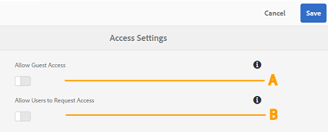
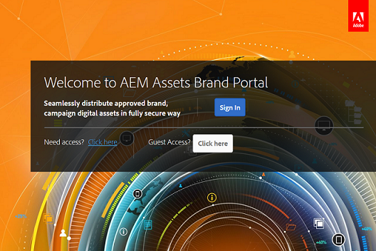

# Verwalten des Benutzerzugriffs auf Brand Portal {#administer-user-access-on-brand-portal}

Ab Adobe Experience Manager Assets Brand Portal 6.4.2 können Administratoren den Gastzugriff konfigurieren und es Benutzern ermöglichen, Zugriff auf die Brand Portal ihres Unternehmens anzufordern. Diese Konfigurationen sind über die Konfigurationen **[!UICONTROL Zugriffseinstellungen]** im Verwaltungsbereich möglich. Beide Einstellungen sind standardmäßig deaktiviert.

**A** - Konfiguration, über die Gäste über den **[!UICONTROL `Guest Access?`]** auf dem Brand Portal-Willkommensbildschirm auf Brand Portal zugreifen können. (Die Option ist standardmäßig deaktiviert.)

**B** - Konfiguration, damit Benutzende über den **[!UICONTROL `Need access?`]** Link auf dem Brand Portal-Willkommensbildschirm Zugriff auf Brand Portal anfordern können. (Die Option ist standardmäßig deaktiviert.)

## Zulassen des Gastzugangs {#allow-guest-access}

Durch die Gewährung von Gastzugriff können Benutzer auf die öffentlichen Assets zugreifen, ohne sich bei Brand Portal anmelden zu müssen.
Um den Gastzugang zuzulassen, muss der Administrator die folgenden Schritte ausführen:

1. Wählen Sie oben in der Symbolleiste das AEM-Logo aus, um die Admin-Tools aufzurufen.
1. Wählen Sie im Admin-Tools-Bereich die Option **[!UICONTROL Zugriff]** aus, um die Seite **[!UICONTROL Zugriffseinstellungen]** zu öffnen.
1. Aktivieren Sie die Konfiguration **[!UICONTROL Gastzugang erlauben]**.
1. **[!UICONTROL Speichern]** Sie die Änderungen.
1. Melden Sie sich ab, damit die Änderungen wirksam werden.

## Erlauben der Zugriffsanfrage durch Benutzer {#allow-users-to-request-access}

Administratoren können Benutzern von Organisationen erlauben, auf dem Willkommensbildschirm den Zugriff auf Brand Portal anzufordern. Admins müssen jedoch die Konfiguration **[!UICONTROL Benutzern Zugriff erteilen]** aktivieren, damit der Link Zugriff anfordern auf dem Willkommensbildschirm angezeigt wird.

Damit Organisationsbenutzer Zugriff auf Brand Portal anfordern können, müssen Administratoren folgende Schritte durchführen:

1. Wählen Sie oben in der Symbolleiste das AEM-Logo aus, um die Admin-Tools aufzurufen.
1. Wählen Sie im Admin-Tools-Bereich die Option **[!UICONTROL Zugriff]** aus, um die Seite **[!UICONTROL Zugriffseinstellungen]** zu öffnen.
1. Aktivieren Sie die Konfiguration **[!UICONTROL Zugriffsanfrage durch Benutzer zulassen]**.
1. **[!UICONTROL Speichern]** Sie die Änderungen.
1. Melden Sie sich ab, damit die Änderungen wirksam werden.
