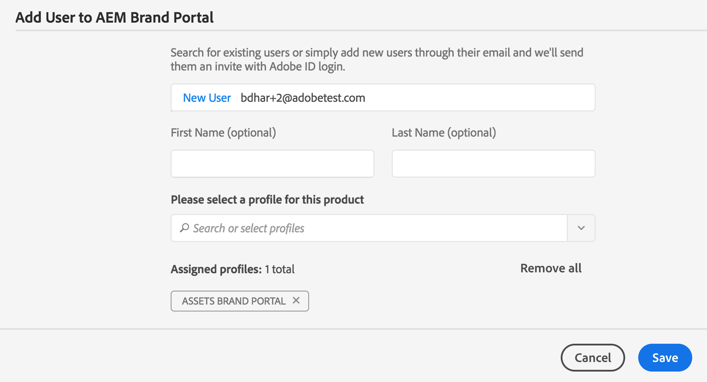
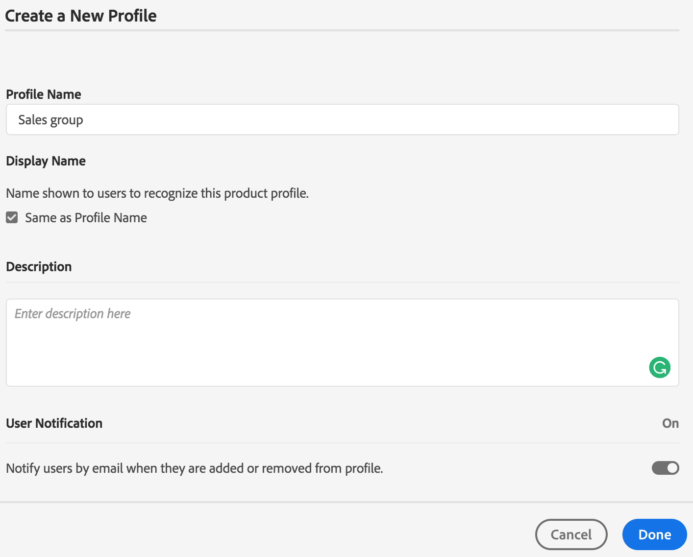
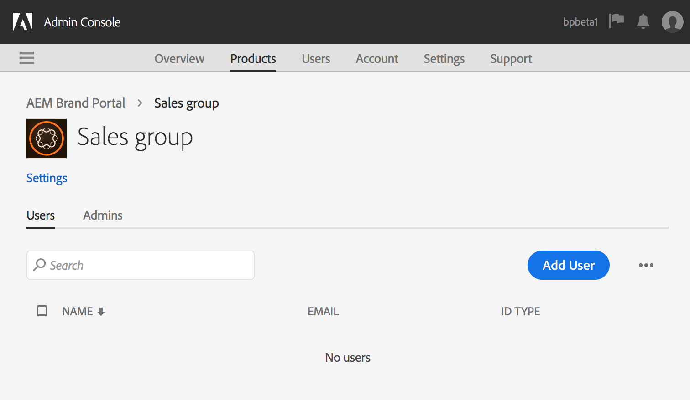

# Verwalten von Benutzern, Gruppen und Benutzerrollen {#manage-users-groups-and-user-roles}

Administratoren können Adobe Admin Console verwenden, um Experience Manager Assets Brand Portal-Benutzer und Produktprofile zu erstellen und ihre Rollen über die Brand Portal-Benutzeroberfläche zu verwalten. Diese Berechtigung ist für Betrachter und Bearbeiter nicht verfügbar.

In der [[!UICONTROL Admin Console]](https://adminconsole.adobe.com/enterprise/overview) können Sie alle Produkte anzeigen, die mit Ihrem Unternehmen verbunden sind. Bei diesen Produkten kann es sich um beliebige Experience Cloud-Lösungen handeln, z. B. Adobe Analytics, Adobe Target oder Experience Manager Assets Brand Portal. Wählen Sie das AEM Brand Portal-Produkt aus und erstellen Sie Produktprofile.

<!--
Comment Type: draft

<note type="note">

Product profiles (formerly known as product configurations*). 

* The nomenclature has changed from product configurations to Product Profiles in the new Adobe Admin Console.

</note>
-->

Diese Produktprofile werden alle 8 Stunden mit der Brand Portal-Benutzeroberfläche synchronisiert und in Brand Portal als Gruppen angezeigt. Nachdem Sie Benutzer hinzugefügt, Produktprofile erstellt und Benutzer zu diesen Produktprofilen hinzugefügt haben, können Sie Benutzern und Gruppen in Brand Portal Rollen zuweisen.

>[!NOTE]
>
>Um in Brand Portal Gruppen zu erstellen, wählen Sie in der [!UICONTROL Adobe Admin Console] die Seite **[!UICONTROL Produkte > Produktprofile]** (nicht **[!UICONTROL Benutzer > Benutzergruppen]**) aus. Die Funktion „Produktprofile“ in der [!UICONTROL Adobe Admin Console] wird zum Erstellen von Gruppen in Brand Portal verwendet.

## Hinzufügen von Benutzern {#add-a-user}

Wenn Sie Produktadministrator sind, verwenden Sie Adobe [[!UICONTROL Admin Console]](https://adminconsole.adobe.com/enterprise/overview), um Benutzer zu erstellen und diese Produktprofilen (*ehemals &quot;Produktkonfigurationen&quot;*) zuzuweisen, die in Brand Portal als Gruppen angezeigt werden. Sie können über Gruppen Massenvorgänge wie Rollenverwaltung und Asset-Freigabe durchführen.

>[!NOTE]
>
>Neue Benutzer ohne Zugriff auf Brand Portal können über den Anmeldebildschirm von Brand Portal Zugriff anfordern. Weitere Informationen finden Sie unter [Zugriff auf Brand Portal anfordern](../using/brand-portal.md#request-access-to-brand-portal). Wenn Sie im Benachrichtigungsbereich eine Benachrichtigung über eine Zugriffsanforderung erhalten, klicken Sie auf die entsprechende Benachrichtigung und dann auf **[!UICONTROL Zugriff erlauben]**. Alternativ können Sie auch auf den Link in der eingegangenen E-Mail mit der Zugriffsanforderung klicken. Anschließend wird der Benutzer über die [Adobe [!UICONTROL Admin Console]](https://adminconsole.adobe.com/enterprise/overview) hinzugefügt. Befolgen Sie dazu die unten beschriebenen Schritte 4 bis 7.

>[!NOTE]
>
>Sie können sich bei [Adobe [!UICONTROL Admin Console]](https://adminconsole.adobe.com/enterprise/overview) direkt oder aus Brand Portal anmelden. Wenn Sie sich direkt anmelden, führen Sie die folgenden Schritte 4 bis 7 aus, um einen Benutzer hinzuzufügen.

1. Klicken Sie oben in der AEM-Symbolleiste auf das Adobe-Logo, um auf die Admin-Tools zuzugreifen.

   

1. Klicken Sie im Admin-Tools-Bereich auf **[!UICONTROL Benutzer]**.

   

1. Klicken Sie auf der Seite [!UICONTROL Benutzerrollen] auf die Registerkarte **[!UICONTROL Verwaltung]** und klicken Sie dann auf **[!UICONTROL Admin Console starten]**.

   

1. Führen Sie in der Admin Console einen der folgenden Schritte aus, um einen neuen Benutzer zu erstellen:

   * Klicken Sie oben in der Symbolleiste auf **[!UICONTROL Überblick]**. Klicken Sie auf der Seite [!UICONTROL Überblick] auf der Produktkarte „Brand Portal“ auf **[!UICONTROL Benutzer zuweisen]**.

   

   * Klicken Sie oben in der Symbolleiste auf **[!UICONTROL Benutzer]**. Auf der Seite [!UICONTROL Benutzer] sind in der linken Leiste standardmäßig [!UICONTROL Benutzer] ausgewählt. Klicken Sie auf **[!UICONTROL Benutzer hinzufügen]**.

   

1. Geben Sie im Dialogfeld Benutzer hinzufügen die E-Mail-Adresse des Benutzers ein, den Sie hinzufügen möchten, oder wählen Sie den Benutzer aus der Liste mit Vorschlägen aus, die beim Eingeben angezeigt wird.

   

1. Weisen Sie den Benutzer mindestens einem Produktprofil (ehemals „Produktkonfiguration“) zu, damit der Benutzer auf Brand Portal zugreifen kann. Wählen Sie im Feld **[!UICONTROL Profil für dieses Produkt auswählen]** das entsprechende Produktprofil aus.
1. Klicken Sie auf **[!UICONTROL Speichern]**. Eine Begrüßungs-E-Mail wird an den neu hinzugefügten Benutzer gesendet. Der eingeladene Benutzer kann auf den Link in der Begrüßungs-E-Mail klicken, um auf Brand Portal zuzugreifen. Der Benutzer kann sich mit der in der Admin Console konfigurierten E-Mail-ID ([!UICONTROL Adobe ID], [!UICONTROL Enterprise ID] oder [!UICONTROL Federated ID]) anmelden. Weitere Informationen finden Sie unter [Schritte bei der ersten Anmeldung](../using/brand-portal-onboarding.md).

   >[!NOTE]
   >
   >Wenn sich ein Benutzer nicht bei Brand Portal anmelden kann, sollte der Administrator des Unternehmens die Adobe [!UICONTROL Admin Console] aufrufen. Überprüfen Sie, ob der Benutzer vorhanden ist und zu mindestens einem Produktprofil hinzugefügt wurde.

   Informationen zum Gewähren von Administratorrechten für Benutzer finden Sie unter [Bereitstellen von Administratorrechten für Benutzer](../using/brand-portal-adding-users.md#provideadministratorprivilegestousers).

## Hinzufügen von Produktprofilen {#add-a-product-profile}

Produktprofile (ehemals „Produktkonfigurationen“) in der [!UICONTROL Admin Console] werden zum Erstellen von Gruppen in Brand Portal verwendet, mit deren Hilfe Sie Massenvorgänge wie Rollenverwaltung und Asset-Freigabe durchführen können. **Brand Portal** ist das standardmäßig verfügbare Produktprofil. Sie können weitere Produktprofile erstellen und Benutzer zu den neuen Produktprofilen hinzufügen.

>[!NOTE]
>
>Sie können sich direkt bei [[!UICONTROL Admin Console]](https://adminconsole.adobe.com/enterprise/overview) oder von Brand Portal aus anmelden. Wenn Sie sich direkt bei [!UICONTROL Admin Console] anmelden, befolgen Sie die unten beschriebenen Schritte 4 bis 7, um ein Produktprofil hinzuzufügen.

1. Klicken Sie oben in der AEM-Symbolleiste auf das Adobe-Logo, um auf die Admin-Tools zuzugreifen.

   

1. Klicken Sie im Admin-Tools-Bereich auf **[!UICONTROL Benutzer]**.

   

1. Klicken Sie auf der Seite [!UICONTROL Benutzerrollen] auf die Registerkarte **[!UICONTROL Verwaltung]** und klicken Sie dann auf **[!UICONTROL Admin Console starten]**.

   

1. Klicken Sie oben in der Symbolleiste auf **[!UICONTROL Produkte]**.
1. Auf der Seite [!UICONTROL Produkte] sind standardmäßig [!UICONTROL Produktprofile] ausgewählt. Klicken Sie auf **[!UICONTROL Neues Profil]**.

   

1. Geben Sie auf der Seite [!UICONTROL Neues Profil erstellen] den Profilnamen, den Anzeigenamen und die Profilbeschreibung ein. Wählen Sie aus, ob Benutzer per E-Mail benachrichtigt werden sollen, wenn sie zum Profil hinzugefügt oder daraus entfernt werden.

   

1. Klicken Sie auf **[!UICONTROL Fertig]**. Die Produktkonfigurationsgruppe. Beispielsweise wird die **[!UICONTROL Vertriebsgruppe]** zu Brand Portal hinzugefügt.

   

## Hinzufügen von Benutzern zu Produktprofilen {#add-users-to-a-product-profile}

Um Benutzer zu einer Brand Portal-Gruppe hinzuzufügen, fügen Sie sie zum entsprechenden Produktprofil (ehemals &quot;Produktkonfigurationen&quot;) in der [!UICONTROL Admin Console] hinzu. Sie können Benutzer einzeln oder mehrere Benutzer auf einmal hinzufügen.

>[!NOTE]
>
>Sie können sich direkt bei [[!UICONTROL Admin Console]](https://adminconsole.adobe.com/enterprise/overview) oder von Brand Portal aus anmelden. Wenn Sie sich direkt bei der Admin Console anmelden, befolgen Sie die unten beschriebenen Schritte 4 bis 7, um Benutzer zu einem Produktprofil hinzuzufügen.

1. Klicken Sie in der Symbolleiste oben auf das Experience Manager-Logo, um auf die Admin-Tools zuzugreifen.

   

1. Klicken Sie im Admin-Tools-Bereich auf **[!UICONTROL Benutzer]**.

   

1. Klicken Sie auf der Seite [!UICONTROL Benutzerrollen] auf die Registerkarte **[!UICONTROL Verwaltung]** und klicken Sie dann auf **[!UICONTROL Admin Console starten]**.

   ![Starten [!DNL Admin Console]](assets/launch_admin_console.png)

1. Klicken Sie oben in der Symbolleiste auf **[!UICONTROL Produkte]**.
1. Auf der Seite [!UICONTROL Produkte] sind standardmäßig [!UICONTROL Produktprofile] ausgewählt. Öffnen Sie das Produktprofil, zu dem ein Benutzer hinzugefügt werden soll, zum Beispiel [!UICONTROL Vertriebsgruppe].

   

1. Gehen Sie wie folgt vor, um einzelne Benutzer zum Produktprofil hinzuzufügen:

   * Klicken Sie auf **[!UICONTROL Benutzer hinzufügen]**.

   

   * Geben Sie auf der Seite [!UICONTROL Benutzer zu Vertriebsgruppe hinzufügen] die E-Mail-Adresse des Benutzers ein, den Sie hinzufügen möchten, oder wählen Sie den Benutzer aus der Liste mit Vorschlägen aus, die eingeblendet wird, wenn Sie mit der Eingabe beginnen.

   

   * Klicken Sie auf **[!UICONTROL Speichern]**.

1. Gehen Sie wie folgt vor, um mehrere Benutzer zum Produktprofil hinzuzufügen:

   * Wählen Sie **[!UICONTROL die Auslassungszeichen (...) > Benutzer über CSV hinzufügen]** aus.

   

   * Laden Sie auf der Seite **[!UICONTROL Benutzer über CSV hinzufügen]** eine CSV-Vorlage herunter oder fügen Sie eine CSV-Datei per Drag-and-Drop hinzu.

   

   * Klicken Sie auf **[!UICONTROL Hochladen]**.

   Wenn Sie Benutzer zum standardmäßigen Produktprofil Brand Portal hinzufügen, sendet das System eine Begrüßungs-E-Mail an die E-Mail-IDs. Die eingeladenen Benutzer können dann auf Brand Portal zugreifen, indem sie auf den Link in der Begrüßungs-E-Mail klicken und sich mit ihrer [!UICONTROL Adobe ID] anmelden. Siehe [ Schritte bei der ersten Anmeldung](../using/brand-portal-onboarding.md).

   Benutzer, die zu einem benutzerdefinierten oder neuen Produktprofil hinzugefügt wurden, erhalten keine E-Mail-Benachrichtigungen.

## Bereitstellen von Administratorrechten für Benutzer {#provide-administrator-privileges-to-users}

Sie können einem Brand Portal-Benutzer entweder Systemadministrator- oder Produktadministrator-Berechtigungen erteilen. Vermeiden Sie jedoch die Zuweisung anderer in der [!UICONTROL Admin Console] verfügbarer Administratorrollen. Beispiel: Produktprofiladministrator, Benutzergruppenadministrator und Support-Administrator. Siehe [Administratorrollen](https://helpx.adobe.com/de/enterprise/using/admin-roles.html).

>[!NOTE]
>
>Sie können sich direkt bei [[!UICONTROL Admin Console]](https://adminconsole.adobe.com/enterprise/overview) oder von Brand Portal aus anmelden. Wenn Sie sich direkt bei der [!UICONTROL Admin Console] anmelden, befolgen Sie die unten beschriebenen Schritte 4 bis 8, um einem Produktprofil einen Benutzer hinzuzufügen.

1. Klicken Sie oben in der AEM-Symbolleiste auf das Adobe-Logo, um auf die Admin-Tools zuzugreifen.

   

1. Klicken Sie im Admin-Tools-Bereich auf **[!UICONTROL Benutzer]**.

   

1. Klicken Sie auf der Seite [!UICONTROL Benutzerrollen] auf die Registerkarte **[!UICONTROL Verwaltung]** und klicken Sie dann auf **[!UICONTROL Admin Console starten]**.

   

1. Klicken Sie oben in der Symbolleiste auf **[!UICONTROL Benutzer]**.
1. Auf der Seite [!UICONTROL Benutzer] in der linken Leiste sind standardmäßig [!UICONTROL Benutzer] ausgewählt. Klicken Sie auf den Benutzernamen des Benutzers, dem Sie Administratorrechte gewähren möchten.

   

1. Klicken Sie auf der Benutzerprofilseite unten im Bereich **[!UICONTROL Administratorrechte]** auf **[!UICONTROL die Auslassungszeichen (...) > Administratorrechte bearbeiten]**.
   

1. Wählen Sie auf der Seite [!UICONTROL Administratorrechte bearbeiten] die Option „Systemadministrator“ bzw. „Produkt-Administrator“ aus.

   

   >[!NOTE]
   >
   >Brand Portal unterstützt nur die Rollen „Systemadministrator“ und „Produkt-Administrator“.
   >
   >Adobe empfiehlt, die Rolle „Systemadministrator“ zu vermeiden, da sie für alle Produkte des jeweiligen Unternehmens unternehmensweite Administratorrechte gewährt. Beispielsweise verfügt ein Systemadministrator einer Organisation, die drei Cloud-Produkte für das Marketing umfasst, über die gesamten Berechtigungen für alle drei Produkte. Nur ein Systemadministrator kann Experience Manager Assets so konfigurieren, dass Assets aus Experience Manager Assets in Brand Portal veröffentlicht werden können. Weitere Informationen finden Sie unter [Konfigurieren von Experience Manager Assets mit Brand Portal](../using/configure-aem-assets-with-brand-portal.md).
   >
   >Im Gegensatz dazu gewährt die Rolle „Produkt-Administrator“ ausschließlich Administratorrechte für ein bestimmtes Produkt. Wenn Sie detaillierte Zugriffssteuerungen innerhalb von Brand Portal umsetzen möchten, verwenden Sie die Rolle „Produkt-Administrator“ und wählen Sie als Produkt Brand Portal aus.

   >[!NOTE]
   >
   >Brand Portal unterstützt keine Produktprofil-Administratorberechtigungen (ehemals &quot;Konfigurationsadministrator&quot;). Vermeiden Sie es, Benutzern die Administratorrolle „Produktprofil-Administrator“ zuzuweisen.

1. Überprüfen Sie die Auswahl des Administratortyps und klicken Sie auf **[!UICONTROL Speichern]**.

   >[!NOTE]
   >
   >Um die Administratorrechte für einen Benutzer zu widerrufen, nehmen Sie auf der Seite **[!UICONTROL Administrator bearbeiten]** die entsprechenden Änderungen vor und klicken Sie auf **[!UICONTROL Speichern]**.

## Verwalten von Benutzerrollen {#manage-user-roles}

Administratoren können die Benutzerrollen in Brand Portal ändern.

Zusätzlich zur Administratorrolle unterstützt Brand Portal die folgenden Rollen:

* [!UICONTROL Betrachter:] Benutzer mit dieser Rolle können Dateien und Ordner anzeigen, die ein Administrator für sie freigegeben hat. Betrachter können zudem nach Assets suchen und diese herunterladen. Sie können jedoch keine Inhalte (Dateien, Ordner, [!UICONTROL Sammlungen]) für andere Benutzer freigeben.
* [!UICONTROL Bearbeiter]: Benutzer mit dieser Rolle verfügen über alle Berechtigungen eines Betrachters. Zusätzlich können Bearbeiter Inhalte (Ordner, [!UICONTROL Sammlungen], Links) für andere Benutzer freigeben.

1. Klicken Sie oben in der AEM-Symbolleiste auf das Adobe-Logo, um auf die Admin-Tools zuzugreifen.

   

1. Klicken Sie im Admin-Tools-Bereich auf **[!UICONTROL Benutzer]**.

   

1. Auf der Seite [!UICONTROL Benutzerrollen] ist die Registerkarte [!UICONTROL Benutzer] standardmäßig ausgewählt. Für den Benutzer, dessen Rolle Sie ändern möchten, wählen Sie **[!UICONTROL Bearbeiter]** oder **[!UICONTROL Betrachter]** aus der Dropdown-Liste **[!UICONTROL Rolle]**.

   

   Wenn Sie gleichzeitig die Rollen mehrerer Benutzer ändern möchten, wählen Sie die entsprechenden Benutzer aus und wählen Sie die gewünschte Rolle in der Dropdown-Liste **[!UICONTROL Rolle]** aus.

   >[!NOTE]
   >
   >Die Liste [!UICONTROL Rolle] für Administrator-Benutzer ist deaktiviert. Sie können diese Benutzer nicht auswählen, um ihre Rollen zu ändern.

   >[!NOTE]
   >
   >Die Benutzerrolle ist auch dann deaktiviert, wenn der Benutzer Mitglied der Editor-Gruppe ist. Um die Bearbeitungsberechtigungen des Benutzers zu widerrufen, entfernen Sie den Benutzer aus der Gruppe &quot;Bearbeiter&quot;oder ändern Sie die Rolle der gesamten Gruppe in &quot;Betrachter&quot;.

1. Klicken Sie auf **[!UICONTROL Speichern]**. Die Rolle wird für den entsprechenden Benutzer geändert. Wenn Sie mehrere Benutzer ausgewählt haben, werden die Rollen für alle ausgewählten Benutzer gleichzeitig geändert.

   >[!NOTE]
   >
   >Änderungen in den Benutzerberechtigungen werden auf der Seite **[!UICONTROL Benutzerrollen]** erst dann angezeigt, wenn sich die Benutzer erneut bei Brand Portal anmelden.

## Verwalten von Gruppenrollen und -berechtigungen {#manage-group-roles-and-privileges}

Ein Administrator kann einer [Gruppe](../using/brand-portal-adding-users.md#main-pars-title-278567577) von Benutzern in Brand Portal bestimmte Berechtigungen zuweisen. Auf der Registerkarte **[!UICONTROL Gruppen]** der Seite **[!UICONTROL Benutzerrollen]** können Administratoren Folgendes tun:

* Sie können Benutzergruppen Rollen zuweisen.
* Schränken Sie Benutzergruppen ein, die Original-Ausgabedarstellungen von Bilddateien (.jpeg, .tiff, .png, .bmp, .gif, .pjpeg, x-portable-anymap, x-portable-bitmap, x-portable-graymap, x-portable-pixmap, x-rgb, x-xbitmap, x-xpixmap, x-icon, image/photoshop, image/x-photoshop, .psd, image/vnd.adobe.photoshop) aus Brand Portal herunterladen können.

>[!NOTE]
>
>Für die Assets, die als Link freigegeben werden, gilt die Berechtigung zum Zugriff auf Original-Ausgabeformate von Bilddateien basierend auf den Berechtigungen des Benutzers, der die Assets freigegeben hat.

Führen Sie die folgenden Schritte aus, um die Rolle und die Berechtigung für den Zugriff auf die Originalwiedergaben für bestimmte Gruppenmitglieder zu ändern:

1. Navigieren Sie auf der Seite **[!UICONTROL Benutzerrollen]** zur Registerkarte **[!UICONTROL Gruppen]**.
1. Wählen Sie die Gruppen aus, deren Rollen geändert werden sollen.
1. Wählen Sie die entsprechende Rolle in der Dropdown-Liste **[!UICONTROL Rolle]** aus.

   Damit Gruppenmitglieder auf Original-Ausgabeformate von Bilddateien zugreifen können, die sie über das Portal oder den freigegebenen Link herunterladen, behalten Sie die Option **[!UICONTROL Zugriff auf Original]** bei, die für diese Gruppe ausgewählt ist. Dieser Ansatz umfasst Dateitypen wie die folgenden:

   * .jpeg
   * .tiff
   * .png
   * .bmp
   * .gif
   * .pjpeg
   * .psd
   * x-portable-anymap
   * x-portable-bitmap
   * x-portable-graymap
   * x-portable-pixmap
   * x-rgb
   * x-xbitmap
   * x-xpixmap
   * x-icon
   * image/photoshop
   * image/x-photoshop
   * image/vnd.adobe.photoshop

   Standardmäßig ist die Option **[!UICONTROL Zugriff auf Original]** für alle Benutzer ausgewählt. Möchten Sie verhindern, dass eine Benutzergruppe auf Original-Ausgabedarstellungen zugreifen kann, heben Sie die Auswahl der Option für diese Gruppe auf.

   

   >[!NOTE]
   >
   >Wenn ein Benutzer mehreren Gruppen hinzugefügt wird und eine dieser Gruppen über Einschränkungen verfügt, gelten die Einschränkungen für diesen Benutzer.
   >
   >Außerdem gelten alle Einschränkungen für den Zugriff auf die Original-Ausgabeformate von Bilddateien nicht für Administratoren, auch wenn sie Mitglieder eingeschränkter Gruppen sind.

1. Klicken Sie auf **[!UICONTROL Speichern]**. Die Rolle wird für die entsprechenden Gruppen geändert.

   >[!NOTE]
   >
   >Die Benutzer-Gruppen-Zuordnung oder die Gruppenmitgliedschaft eines Benutzers wird alle 8 Stunden mit Brand Portal synchronisiert. Änderungen bei Benutzer- oder Gruppenrollen treten nach Abschluss der nächsten Synchronisierung in Kraft.
