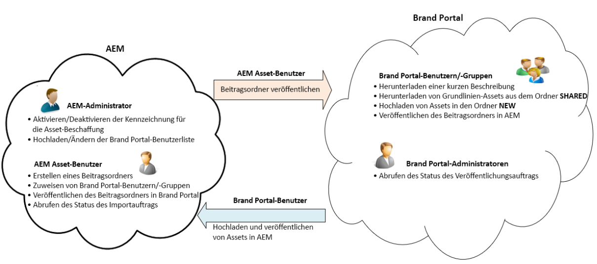
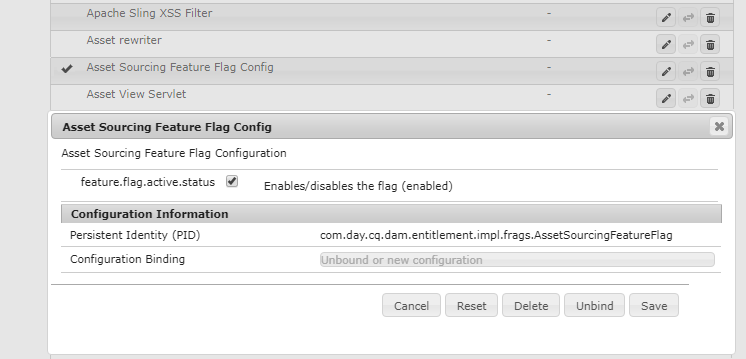
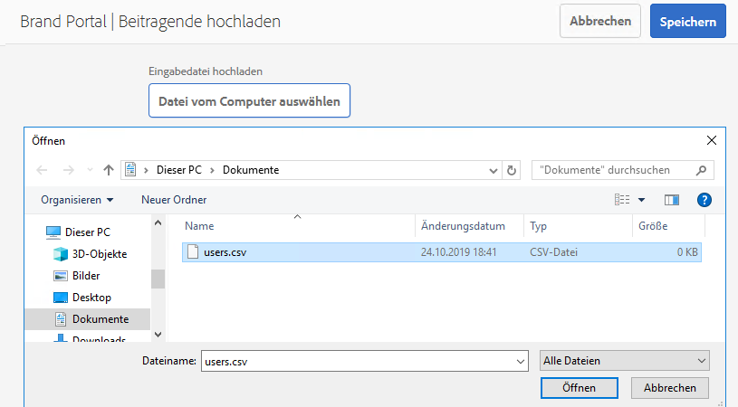

# Überblick über die Asset-Beschaffung {#overview-asset-sourcing-in-bp}

Mit der **Asset-Beschaffung** können Experience Manager-Benutzer (Administratoren/Benutzer ohne Administratorrechte) neue Ordner mit der zusätzlichen Eigenschaft **Asset-Beitrag** erstellen, um sicherzustellen, dass die neu erstellten Ordner von Brand Portal-Benutzern für die Übermittlung von Assets nutzbar sind. Dadurch wird automatisch ein Workflow Trigger, mit dem zwei weitere Unterordner namens **SHARED** und **NEW** im neu erstellten Ordner **Contribution** erstellt werden. Der Administrator definiert die Anforderung, indem er eine Zusammenfassung der Asset-Typen hochlädt, die zum Beitragsordner hinzugefügt werden sollen. Sie laden eine Reihe von Grundlinien-Assets in den Ordner **FREIGEGEBEN** hoch und stellen Brand Portal-Benutzern die erforderlichen Referenzinformationen zur Verfügung. Der Administrator kann aktiven Brand Portal-Benutzern anschließend Zugriff auf den Beitragsordner gewähren, bevor der neu erstellte **Beitragsordner** in Brand Portal veröffentlicht wird. Wenn der/die Benutzende mit dem Hinzufügen von Inhalten im Ordner **NEU** fertig ist, kann er/sie den Beitragsordner wieder in der Experience Manager-Autorenumgebung veröffentlichen. Beachten Sie, dass es einige Minuten dauern kann, bis der Import abgeschlossen ist und die neu veröffentlichten Inhalte in Experience Manager Assets angezeigt werden.

Darüber hinaus bleiben alle vorhandenen Funktionen unverändert. Brand Portal-Benutzer können Assets aus dem Beitragsordner sowie aus anderen Ordnern anzeigen, suchen und herunterladen, für die sie über entsprechende Berechtigungen verfügen. Administratoren können außerdem den Beitragsordner freigeben, Eigenschaften ändern und Assets zu Sammlungen hinzufügen.

>[!VIDEO](https://video.tv.adobe.com/v/32999/?captions=ger&quality=12)

## Voraussetzungen {#prerequisites}

* Experience Manager Assets as a Cloud Service-Instanz, Experience Manager Assets 6.5.2 oder höher.
* Stellen Sie sicher, dass Ihre Experience Manager Assets-Instanz mit Brand Portal konfiguriert ist. Weitere Informationen finden Sie in [Konfigurieren von Experience Manager Assets mit Brand Portal](../using/configure-aem-assets-with-brand-portal.md).

<!--
* Ensure that your Brand Portal tenant is configured with one AEM Assets author instance.
-->

>[!NOTE]
>
>Die Funktion zur Asset-Beschaffung ist in Experience Manager Assets as a Cloud Service, Experience Manager Assets 6.5.9 und höher standardmäßig aktiviert.
>
>Die vorhandenen Konfigurationen funktionieren weiterhin in früheren Versionen.

>[!NOTE]
>
>Es gibt ein bekanntes Problem in Experience Manager Assets 6.5.4. Brand Portal-Benutzende können bei der Aktualisierung auf Adobe Developer Console keine Assets des Beitragsordners in Experience Manager Assets veröffentlichen.
>
>Das Problem wurde in Experience Manager Assets 6.5.5. behoben. Sie können Ihre Experience Manager Assets-Instanz auf das neueste Service Pack aktualisieren und [Ihre Konfigurationen in Adobe Developer Console aktualisieren](https://experienceleague.adobe.com/de/docs/experience-manager-65/content/assets/brandportal/configure-aem-assets-with-brand-portal#upgrade-integration-65).

<!--

>For immediate fix on AEM 6.5.4, it is recommended to [download the hotfix](https://www.adobeaemcloud.com/content/marketplace/marketplaceProxy.html?packagePath=/content/companies/public/adobe/packages/cq650/hotfix/cq-6.5.0-hotfix-33041) and install on your author instance.
-->

<!--
## Configure Asset Sourcing {#configure-asset-sourcing}

**Asset Sourcing** is configured from within the AEM Assets author instance. The administrators can enable the Asset Sourcing feature flag configuration from the **AEM Web Console Configuration** and upload the active Brand Portal users list in **AEM Assets**.

>[!NOTE]
>
>Asset Sourcing is by default enabled on AEM Assets as a Cloud Service. The AEM administrator can directly upload the active Brand Portal users to allow them access to the Asset Sourcing feature.

>[!NOTE]
>
>Before you begin with the configuration, ensure that your AEM Assets instance is configured with Brand Portal. See, [Configure AEM Assets with Brand Portal](../using/configure-aem-assets-with-brand-portal.md). 

The following video demonstrates, how to configure Asset Sourcing on your AEM Assets author instance:

>[!VIDEO](https://video.tv.adobe.com/v/29771)
-->

<!--
### Enable Asset Sourcing {#enable-asset-sourcing}

AEM administrators can enable the Asset Sourcing feature flag from within the AEM Web Console Configuration (a.k.a Configuration Manager).

>[!NOTE]
>
>This step is not applicable for AEM Assets as a Cloud Service.

**To enable Asset Sourcing:**
1. Log in to your AEM Assets author instance and open Configuration Manager. 
Default URL: http:// localhost:4502/system/console/configMgr.
1. Search using the keyword **Asset Sourcing** to locate **[!UICONTROL Asset Sourcing Feature Flag Config]**.
1. Click **[!UICONTROL Asset Sourcing Feature Flag Config]** to open the configuration window.
1. Select the **[!UICONTROL feature.flag.active.status]** check box.
1. Click **[!UICONTROL Save]**.

-->

### Hochladen der Brand Portal-Benutzerliste {#upload-bp-user-list}

Experience Manager Assets-Administratoren können die Brand Portal-Benutzerkonfigurationsdatei (.csv) mit der Liste der aktiven Brand Portal-Benutzer in Experience Manager Assets hochladen, um ihnen den Zugriff auf die Asset-Beschaffungsfunktion zu ermöglichen.

Ein Beitragsordner kann nur für die aktiven Brand Portal-Benutzer freigegeben werden, die in der Benutzerliste definiert sind. Die Administratoren können der Konfigurationsdatei auch neue Benutzer hinzufügen und die geänderte Benutzerliste hochladen.

>[!NOTE]
>
>Stellen Sie sicher, dass Ihre Experience Manager Assets-Instanz mit Brand Portal konfiguriert ist. Weitere Informationen finden Sie in [Konfigurieren von Experience Manager Assets mit Brand Portal](../using/configure-aem-assets-with-brand-portal.md).

>[!NOTE]
>
>Das Format der CSV-Datei entspricht dem von Admin Console für den Massenimport von Benutzern unterstützten Format. E-Mail-Adresse, Vorname und Nachname sind obligatorisch.

Administratoren können neue Benutzer in der Admin Console hinzufügen. Unter [Benutzer verwalten](brand-portal-adding-users.md) finden Sie detaillierte Informationen. Nachdem Benutzer in der Admin Console hinzugefügt wurden, können diese Benutzer der Brand Portal-Benutzerkonfigurationsdatei hinzugefügt werden und dann die Berechtigung für den Zugriff auf den Beitragsordner zugewiesen werden.

**So laden Sie die Brand Portal-Benutzerliste hoch:**

1. Melden Sie sich bei Ihrer Experience Manager Assets-Instanz an.
1. Navigieren Sie [!UICONTROL &#x200B; Bedienfeld &#x200B;]Tools“ zu **[!UICONTROL Assets]** > **[!UICONTROL Brand Portal Users]**.

1. Das Fenster zum Hochladen von Beitragenden zu Brand Portal wird geöffnet.
Durchsuchen Sie den lokalen Computer und laden Sie eine **Konfigurationsdatei (.csv) hoch** die die Liste der aktiven Brand Portal-Benutzer enthält.
1. Klicken Sie auf **[!UICONTROL Speichern]**.

   

Administratoren können beim Konfigurieren eines Beitragsordners bestimmten Benutzern aus dieser Benutzerliste Zugriff gewähren. Nur die Benutzenden, die einem Beitragsordner zugewiesen sind, haben Zugriff auf den Beitragsordner und können Assets aus Brand Portal in Experience Manager Assets veröffentlichen.

## Siehe auch {#reference-articles}

* [Konfigurieren und Veröffentlichen eines Beitragsordners in Brand Portal](brand-portal-publish-contribution-folder-to-brand-portal.md)

* [Veröffentlichen des Beitragsordners in Experience Manager Assets](brand-portal-publish-contribution-folder-to-aem-assets.md)
