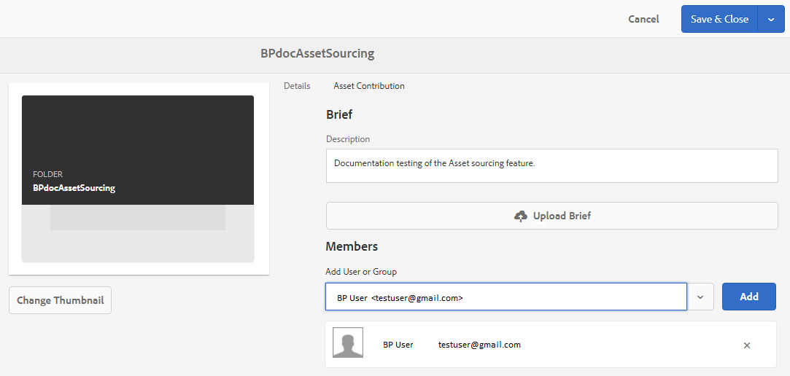

# Konfigurieren von Eigenschaften von Beitragsordnern {#configure-contribution-folder-properties}

Der AEM-Administrator führt beim Konfigurieren der Eigenschaften eines Beitragsordners die folgenden Aktivitäten aus.

* **Beschreibung hinzufügen**: Geben Sie eine allgemeine Beschreibung des Beitragsordners ein.
* **Kurzbeschreibung hochladen**: Laden Sie das Asset-Anforderungsdokument hoch, das Asset-bezogene Informationen enthält.
* **Beitragende hinzufügen**: Fügen Sie Brand Portal-Benutzer oder -Gruppen hinzu, um ihnen Zugriff auf den Beitragsordner zu gewähren.

Die Asset-Anforderung bezieht sich auf die Details, die von Administratoren bereitgestellt werden, um Beitragende (Brand Portal-Benutzer) dabei zu unterstützen, die Notwendigkeit und Anforderungen des Beitragsordners zu verstehen. Der Administrator lädt ein Asset-Anforderungsdokument hoch, das eine Kurzbeschreibung des Asset-Typs enthält, der dem Beitragsordner hinzugefügt werden soll, sowie Asset-bezogene Informationen, wie z. B. Zweck, Typ der Bilder, maximale Größe usw.

Der Administrator kann Brand Portal-Benutzern/-Gruppen anschließend Zugriff auf den Beitragsordner gewähren, bevor der neu erstellte Beitragsordner in Brand Portal veröffentlicht wird.

**Konfigurieren von Eigenschaften von Beitragsordnern:**
1. Melden Sie sich bei Ihrer AEM-Autoreninstanz an.
Standard-URL: http:// localhost:4502/aem/start.html
1. Navigieren Sie zu **[!UICONTROL Assets > Dateien]** und suchen Sie nach dem Beitragsordner.
1. Wählen Sie den Beitragsordner und klicken Sie auf **[!UICONTROL Eigenschaften]** . Das Fenster „Ordnereigenschaften“ wird geöffnet.
   
1. Navigieren Sie zur Registerkarte **[!UICONTROL Asset-Beitrag]**.
1. Geben Sie eine allgemeine **[!UICONTROL Beschreibung]** des Beitragsordners ein.
1. Klicken Sie auf **[!UICONTROL Kurzbeschreibung hochladen]**, um von Ihrem lokalen Computer aus zu navigieren und ein **Asset-Anforderungsdokument** hochzuladen.
1. In the **[!UICONTROL Add User or Group]** field, add Brand Portal users with whom you want to share the contribution folder. Benutzer können über die Oberfläche des Markenportals auf Inhalte zugreifen und diese in den Beitragsordner hochladen. Derzeit können Sie keinem Beitragsordner keine Gruppen hinzufügen.

1. Klicken Sie auf **[!UICONTROL Speichern]**.
   

>[!NOTE]
>
>Die Suchergebnisse basieren auf der in AEM Assets konfigurierten Brand Portal-Benutzerliste. Vergewissern Sie sich, dass Sie über die aktualisierte Brand Portal-Benutzerliste verfügen. Siehe [Hochladen der Brand Portal-Benutzerliste](brand-portal-configure-asset-sourcing.md).

