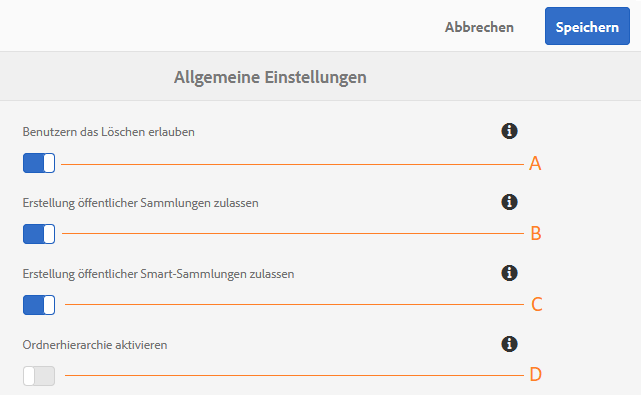

# Verwalten allgemeiner Mandantenkonfigurationen {#administer-general-tenant-configurations}

In Experience Manager Assetss Brand Portal können Unternehmen die folgenden Funktionen für bestimmte Mandanten konfigurieren:

* das Löschen von Assets durch Administratoren
* die Erstellung öffentlicher Sammlungen von Benutzern ohne Administratorrechte
* die Erstellung öffentlicher Smart-Sammlungen von Benutzern ohne Administratorrechte
* Die übergeordnete Hierarchie freigegebener Ordner ist für Benutzende ohne Administratorrechte sichtbar

Diese Konfigurationen sind über die Konfigurationen **[!UICONTROL Allgemeine Einstellungen]** im Admin-Tools-Bereich möglich.

**A** - Konfiguration, mit der Administratoren Assets aus Brand Portal löschen können. (Die Option ist standardmäßig aktiviert.)

**B** - Konfiguration, mit der Benutzende ohne Administratorrechte öffentliche Sammlungen erstellen können. (Die Option ist standardmäßig aktiviert.)

**C** - Konfiguration, mit der Benutzende ohne Administratorrechte öffentliche Smart-Sammlungen erstellen können. (Die Option ist standardmäßig aktiviert.)

**D** - Konfiguration zur Anzeige der Ordnerhierarchie (aus dem Stammverzeichnis) freigegebener Ordner für Benutzer ohne Administratorrechte (Bearbeiter, Betrachter, Gastbenutzer). (Die Option ist standardmäßig deaktiviert.)

## Aktivieren oder Deaktivieren von allgemeinen Konfigurationen {#enable-disable-general-configurations}

So aktivieren oder deaktivieren Sie jede dieser Konfigurationen:

1. Melden Sie sich mit Administratorrechten an.
1. Wählen Sie oben in der Symbolleiste das Experience Manager-Logo aus, um die Admin-Tools aufzurufen.
1. Wählen Sie im Admin-Tools-Bereich die Option **[!UICONTROL Allgemein]** aus, um die Seite **[!UICONTROL Allgemeine Einstellungen]** zu öffnen.
1. Verwenden Sie den entsprechenden Umschalter, um eine der allgemeinen Konfigurationen zu aktivieren oder zu deaktivieren.
1. **[!UICONTROL Speichern]** Sie die Änderungen.
1. Melden Sie sich ab, damit die Änderungen wirksam werden.

## Löschen von Assets in Brand Portal durch Administratoren zulassen {#allow-admin-users-to-delete-assets-from-brand-portal}

Mit der Konfiguration **[!UICONTROL Löschen von Assets in Brand Portal durch Administratoren zulassen]** können Unternehmen Administratoren erlauben, Assets und Ordner aus Brand Portal zu löschen.

## Zulassen der Erstellung öffentlicher Sammlungen durch Benutzer ohne Administratorrechte {#allow-public-collections-creation-by-non-admins}

Mit der Konfiguration [[!UICONTROL Zulassen der Erstellung öffentlicher Sammlungen durch Benutzer ohne Administratorrechte]](../using/brand-portal-share-collection.md#main-pars-text-1915052376) wird gesteuert, ob Benutzer ohne Administratorrechte öffentliche Sammlungen in Brand Portal erstellen können. Die Konfiguration ist standardmäßig aktiviert. Durch Deaktivieren der Konfiguration können Unternehmen verhindern, dass zahlreiche öffentliche Sammlungen auf ihrem Portal vorhanden sind, sodass Systemspeicher eingespart werden kann.

## Zulassen der Erstellung öffentlicher Smart-Sammlungen durch Benutzer ohne Administratorrechte {#allow-public-smart-collections-creation-by-non-admins}

Mit der Konfiguration [[!UICONTROL Zulassen der Erstellung öffentlicher Smart-Sammlungen durch Benutzer ohne Administratorrechte]](../using/brand-portal-searching.md#main-pars-header-500620467) wird gesteuert, ob Benutzer ohne Administratorrechte Suchen als Smart-Sammlungen speichern und sie für diesen Mandanten öffentlich machen können. Die Konfiguration ist standardmäßig aktiviert. Durch Deaktivieren der Konfiguration können Unternehmen verhindern, dass im Brand Portal des Unternehmens eine große Anzahl öffentlicher Smart-Sammlungen von Benutzenden ohne Administratorrechte erstellt wird.

<!-- 
## Allow download acceleration {#allow-download-acceleration}

[[!UICONTROL Allow download acceleration]](../using/accelerated-download.md) configuration lets the organizations to allow accelerated downloads of assets from Brand Portal and shared links, by integrating with IBM Aspera Connect that is an install-on-demand application. The application uses proprietary technology to remove TCP overheads.
-->

## Aktivieren der Ordnerhierarchie {#enable-folder-hierarchy}

Mit der Konfiguration [[!UICONTROL Ordnerhierarchie aktivieren]](../using/brand-portal-sharing-folders.md#non-admin-user-access-to-shared-folders) können Administratoren steuern, wie Benutzer ohne Administratorrechte (Bearbeiter, Betrachter und Gastbenutzer) die freigegebenen Ordner nach der Anmeldung sehen.
