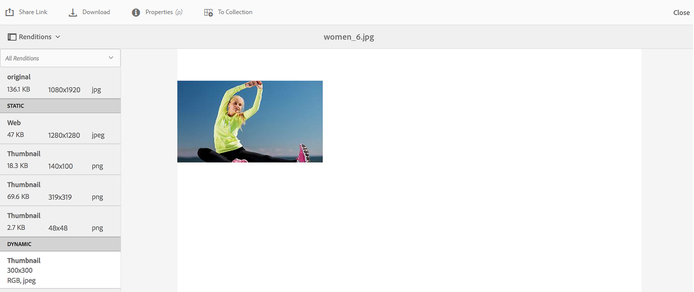
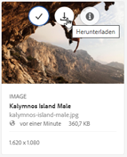

# Anwenden von Bildvorgaben oder dynamischen Ausgabedarstellungen {#apply-image-presets-or-dynamic-renditions}

Wie ein Makro ist eine Bildvorgabe eine vordefinierte Sammlung aus Größenangaben und Formatierungsbefehlen, die unter einem Namen gespeichert wird. Anhand von Bildvorgaben kann Experience Manager Assets Brand Portal Bilder unterschiedlicher Größe, Formate und Eigenschaften dynamisch bereitstellen.

Bildvorgaben werden verwendet, um dynamische Ausgabedarstellungen von Bildern zu generieren, die als Vorschau angezeigt oder heruntergeladen werden können. Wenn Sie eine Vorschau von Bildern und deren Ausgabedarstellungen anzeigen, können Sie eine Vorgabe auswählen, um Bilder gemäß den Spezifikationen Ihres Administrators umzuformatieren.

(*Wenn die Experience Manager Assets-Autoreninstanz im **Dynamic Media-Hybridmodus*** ausgeführt wird). Um dynamische Ausgabedarstellungen eines Assets in Brand Portal anzuzeigen, stellen Sie sicher, dass die Pyramid TIFF-Ausgabedarstellung in der Experience Manager Assets-Autoreninstanz vorhanden ist, von der aus Sie in Brand Portal veröffentlichen. Wenn Sie das Asset veröffentlichen, wird auch dessen PTIFF-Ausgabedarstellung in Brand Portal veröffentlicht.

>[!NOTE]
>
>Beim Herunterladen von Bildern und deren Ausgabedarstellungen gibt es keine Möglichkeit, aus den vorhandenen Vorgaben auszuwählen. Stattdessen können Sie die Eigenschaften einer benutzerdefinierten Bildvorgabe angeben. Weitere Informationen finden Sie unter [Anwenden von Bildvorgaben beim Herunterladen von Bildern](../using/brand-portal-image-presets.md#main-pars-text-1403412644).

Weitere Informationen zu den Parametern, die für das Erstellen von Bildvorgaben erforderlich sind, finden Sie unter [Verwalten von Bildvorgaben](../using/brand-portal-image-presets.md).

## Erstellen von Bildvorgaben {#create-an-image-preset}

Experience Manager Assets-Administratoren können Bildvorgaben erstellen, die auf der Asset-Detailseite als dynamische Ausgabedarstellungen angezeigt werden. Sie können eine Bildvorgabe von Grund auf neu erstellen oder eine vorhandene mit einem neuen Namen speichern. Wählen Sie beim Erstellen einer Bildvorgabe eine Größe für die Bildbereitstellung und die Formatierungsbefehle aus. Wenn ein Bild für die Anzeige bereitgestellt wird, wird die Darstellung entsprechend den ausgewählten Befehlen optimiert.

>[!NOTE]
>
>Dynamische Ausgabedarstellungen werden für Assets erstellt, für die PTIFF verfügbar ist. Wenn die Pyramid-TIFF für kein Asset verfügbar ist, können dynamische Ausgabeformate für dieses Asset nicht in Brand Portal abgerufen werden.
>
>Wenn die Experience Manager Assets-Autoreninstanz im **Dynamic Media-Hybridmodus** ausgeführt wird, werden die Pyramid-TIFF-Ausgabeformate von Bild-Assets im Experience Manager Assets-Repository erstellt und gespeichert.
>
>Wenn die Experience Manager Assets-Autoreninstanz hingegen im **Dynamic Media Scene7-Modus** ausgeführt wird, sind die Pyramid-TIFF-Ausgabeformate von Bild-Assets auf dem Scene7-Server vorhanden.
>
>Wenn solche Assets in Brand Portal veröffentlicht werden, werden Bildvorgaben angewendet und dynamische Ausgabeformate angezeigt.

1. Klicken Sie in der Symbolleiste oben auf das Experience Manager-Logo, um auf die Admin-Tools zuzugreifen.

1. Klicken Sie im Admin-Tools-Bereich auf **[!UICONTROL Bildvorgaben]**.

   

1. Klicken Sie auf der Seite „Bildvorgaben“ auf **[!UICONTROL Erstellen]**.

   

1. Geben Sie auf der Seite **[!UICONTROL Bildvorgabe bearbeiten]** auf den Registerkarten **[!UICONTROL Allgemein]** und **[!UICONTROL Erweitert]** die entsprechenden Werte (einschließlich eines Namens) ein. Vorgaben werden im linken Bereich angezeigt und können nur zusammen mit anderen Assets verwendet werden.

   

   >[!NOTE]
   >
   >Auf der Seite **[!UICONTROL Bildvorgabe bearbeiten]** können Sie auch Eigenschaften einer vorhandenen Bildvorgabe bearbeiten. Um eine Bildvorgabe zu bearbeiten, wählen Sie sie auf der Seite „Bildvorgaben“ aus und klicken Sie auf **[!UICONTROL Bearbeiten]**.

1. Klicken Sie auf **[!UICONTROL Speichern]**. Die Bildvorgabe wird erstellt und auf der Seite „Bildvorgaben“ angezeigt.
1. Um eine Bildvorgabe zu löschen, wählen Sie sie auf der Seite „Bildvorgaben“ aus und klicken Sie auf **[!UICONTROL Löschen]**. Klicken Sie auf der Bestätigungsseite auf **[!UICONTROL Löschen]**, um den Vorgang zu bestätigen. Die Bildvorgabe wird von der Seite &quot;Bildvorgaben&quot;entfernt.

## Anwenden von Bildvorgaben beim Anzeigen der Bildvorschau {#apply-image-presets-when-previewing-images}

Wenn Sie eine Vorschau von Bildern und deren Ausgabedarstellungen anzeigen, können Sie eine vorhandene Vorgabe auswählen, um Bilder gemäß den Spezifikationen Ihres Administrators umzuformatieren.

1. Klicken Sie in der Brand Portal-Benutzeroberfläche auf das Bild, um es zu öffnen.
1. Klicken Sie links auf das Überlagerungssymbol und dann auf **[!UICONTROL Ausgabedarstellungen]**.

   

1. Wählen Sie in der Liste **[!UICONTROL Ausgabedarstellungen]** die entsprechende dynamische Ausgabedarstellung aus, zum Beispiel **[!UICONTROL Miniaturansicht]**. Das Vorschaubild wird basierend auf Ihrer Auswahl der Ausgabedarstellung dargestellt.

   

## Anwenden von Bildvorgaben beim Herunterladen von Bildern {#apply-image-presets-when-downloading-images}

Beim Herunterladen von Bildern und deren Ausgabedarstellungen aus Brand Portal gibt es keine Möglichkeit, aus den vorhandenen Bildvorgaben auszuwählen. Sie können jedoch die Bildvorgabeneigenschaften anpassen, damit Sie die gewünschten Bilder neu formatieren können.

1. Führen Sie in der Brand Portal-Benutzeroberfläche einen der folgenden Schritte aus:

   * Bewegen Sie den Mauszeiger über das Bild, das Sie herunterladen möchten. Klicken Sie in den verfügbaren Schnellzugriff-Miniaturansichten auf das Symbol **[!UICONTROL Herunterladen]**.

   

   * Wählen Sie das Bild aus, das Sie herunterladen möchten. Klicken Sie oben in der Symbolleiste auf das Symbol **[!UICONTROL Herunterladen]**.

   

1. Wählen Sie im Dialogfeld **[!UICONTROL Herunterladen]** die erforderlichen Optionen aus, je nachdem, ob Sie das Asset mit oder ohne seine Ausgabedarstellungen herunterladen möchten.

   

1. Um dynamische Ausgabeformate des Assets herunterzuladen, wählen Sie die Option **[!UICONTROL Dynamische Ausgabeformate]** aus.
1. Passen Sie die Eigenschaften der Bildvorgabe an, um das Bild und seine Ausgabeformate während des Downloads dynamisch neu zu formatieren. Geben Sie Größe, Format, Farbraum, Auflösung und Bild-Modifikator an.

   

1. Klicken Sie auf **[!UICONTROL Herunterladen]**. Die dynamischen Ausgaben werden in einer ZIP-Datei zusammen mit dem Bild sowie dessen Ausgabedarstellungen, die Sie herunterladen möchten, heruntergeladen. Es wird jedoch keine ZIP-Datei erstellt, wenn ein einzelnes Asset heruntergeladen wird, was einen schnellen Download gewährleistet.
