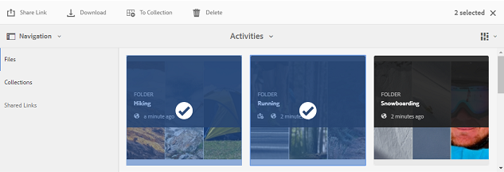
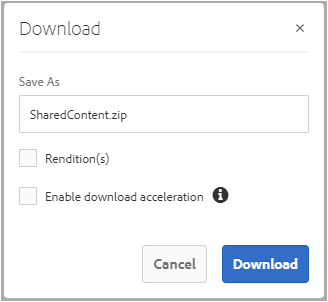

# Freigeben von Assets als Link {#share-assets-as-a-link}

AEM Assets Brand Portal-Administratoren können Links mehrerer Assets für autorisierte interne Benutzer und externe Einheiten (einschließlich Partnern und Anbietern) freigeben. Bearbeiter können nur die Assets anzeigen und freigeben, die für sie freigegeben wurden.

Die Freigabe von Assets über einen Link ist eine praktische Methode, um die Assets für externe Parteien verfügbar zu machen, ohne dass diese sich bei Brand Portal anmelden müssen.

Der Zugriff auf Linkfreigaben ist auf Bearbeiter und Administratoren beschränkt. Für weitere Informationen, siehe [Verwalten von Benutzern, Gruppen und Benutzerrollen](../using/brand-portal-adding-users.md#manage-user-roles).

>[!NOTE]
>
>Mit der Linkfreigabe-Funktion in Brand Portal können ZIP-Dateien mit bis zu 5 GB heruntergeladen werden.

Gehen Sie wie folgt vor, um Assets als Link freizugeben:

1. Klicken Sie links auf das Überlagerungssymbol und wählen Sie dann **[!UICONTROL Navigation]**.

   

1. Klicken Sie links in der Seitenleiste auf **[!UICONTROL Dateien], um Ordner oder Bilder freizugeben.** Um Sammlungen freizugeben, klicken Sie auf **[!UICONTROL Sammlungen]**.

   

1. Wählen Sie die Ordner oder Sammlungen aus, die Sie als Link freigeben möchten.

   

1. Klicken Sie oben in der Symbolleiste auf das Symbol **[!UICONTROL Link freigeben]**.

   Das Dialogfeld **[!UICONTROL Linkfreigabe]** wird angezeigt.

   

   >[!NOTE]
   >
   >Das Feld **[!UICONTROL Link freigeben]** zeigt einen automatisch erstellten Link zum Asset an. Standardmäßig läuft der Link nach sieben Tagen ab. Sie können den Link kopieren und separat an Benutzer weitergeben oder ihn über das Dialogfeld **[!UICONTROL Linkfreigabe]** freigeben.

1. Geben Sie im Feld „E-Mail-Adresse“ die E-Mail-Adresse des Benutzers ein, für den Sie den Link freigeben möchten. Sie können den Link für mehrere Benutzer freigeben.

   Wenn der Benutzer zu Ihrem Unternehmen gehört, wählen Sie die E-Mail-Adresse des Benutzers in den vorgeschlagenen Dropdown-Listeneinträgen aus. Wenn es sich um einen externen Benutzer handelt, geben Sie die vollständige E-Mail-Adresse ein und drücken Sie die **[!UICONTROL Eingabetaste]**. Die E-Mail-Adresse wird zur Liste der Benutzer hinzugefügt.

   

1. Geben Sie in das Feld **[!UICONTROL Betreff]** einen Betreff für das freizugebende Asset ein.
1. Geben Sie bei Bedarf eine Nachricht in das Feld **[!UICONTROL Nachricht]** ein.
1. Verwenden Sie im Feld **[!UICONTROL Ablauf]** die Datumsauswahl, um Ablaufdatum und -uhrzeit für den Link festzulegen. Standardmäßig ist das Ablaufdatum auf sieben Tage nach dem Datum der Linkfreigabe gesetzt.

   Die über den Link freigegebenen Assets laufen nach dem Datum und der Uhrzeit ab, die im Feld **[!UICONTROL Ablauf]** angegeben sind. Informationen zum Verhalten abgelaufener Assets und Änderungen bei den zulässigen Aktivitäten basierend auf den Benutzerrollen in Brand Portal finden Sie unter [Digital Rights Management für Assets](../using/manage-digital-rights-of-assets.md#asset-expiration).

1. Klicken Sie auf **[!UICONTROL Freigeben]**. Eine Meldung bestätigt, dass der Link für die Benutzer freigegeben wurde. Benutzer erhalten eine E-Mail mit dem Link.

   

   >[!NOTE]
   >
   >Administratoren können die E-Mail-Nachrichten anpassen. Dies umfasst das Anpassen von Logo, Beschreibung und Fußzeile mit der Funktion [Branding](../using/brand-portal-branding.md).

## Herunterladen von Assets von freigegebenen Links {#download-assets-from-shared-links}

Klicken Sie auf den Link in der E-Mail, um das freigegebene Asset anzuzeigen. Die Seite „AEM-Linkfreigabe“ wird geöffnet.

Gehen Sie wie folgt vor, um die freigegebenen Assets herunterzuladen:

1. Klicken Sie auf die Assets und dann auf das Symbol **[!UICONTROL Herunterladen]** in der Symbolleiste.

   

   >[!NOTE]
   >
   >Derzeit können Sie je nach dem jeweiligen Dateiformat nur für bestimmte Assets eine Vorschau und Miniaturen generieren. Weitere Informationen zu den unterstützen Dateiformaten finden Sie unter [Unterstützte Vorschauen und Miniaturen für Asset-Formate](#preview-thumbnail-support).

   >[!NOTE]
   >
   >Wenn die Assets, die Sie herunterladen, auch lizenzierte Assets enthalten, werden Sie zur Seite **[!UICONTROL Copyright-Management]** weitergeleitet. Wählen Sie auf dieser Seite die lizenzierten Assets aus, klicken Sie auf **[!UICONTROL Zustimmen]**, und klicken Sie dann auf **[!UICONTROL Herunterladen]**. Wenn Sie ablehnen, werden nur die nicht lizenzierten Assets heruntergeladen.\
   >Lizenzgeschützte Assets verfügen über eine [angehängte Lizenzvereinbarung](https://helpx.adobe.com/de/experience-manager/6-5/assets/using/drm.html#DigitalRightsManagementinAssets). Dies geschieht, indem die [Metadateneigenschaften des Assets](https://helpx.adobe.com/de/experience-manager/6-5/assets/using/drm.html#DigitalRightsManagementinAssets) in [!DNL AEM Assets] festgelegt werden.

   

   Das Dialogfeld [!UICONTROL Herunterladen] wird angezeigt.  
   

   * Wählen Sie zum Beschleunigen des Downloads der als Link freigegebenen Asset-Dateien die Option **[!UICONTROL Downloadbeschleunigung aktivieren]** und [befolgen Sie die Anweisungen des Assistenten](../using/accelerated-download.md#download-workflow-using-file-accelerator). Weitere Informationen zur Beschleunigung von Asset-Downloads in Brand Portal finden Sie in der [Anleitung zum Beschleunigen von Downloads von Brand Portal](../using/accelerated-download.md).
[!UICONTROL
1. Um die Ausgabeformate der Assets zusätzlich zu den Assets über den freigegebenen Link herunterzuladen, wählen Sie die Option **[!UICONTROL Ausgabeformat(e)]** aus. Wenn Sie dies tun, wird die standardmäßig aktivierte Option **Systemausgaben ausschließen]** angezeigt. Dies verhindert, dass vorkonfigurierte Ausgabeformate zusammen mit genehmigten Assets oder deren benutzerdefinierten Ausgabeformate heruntergeladen werden.

   Wenn Sie jedoch automatisch erzeugte Ausgabeformate zusammen mit benutzerdefinierten Ausgabeformaten herunterladen möchten, deaktivieren Sie die Option **[!UICONTROL Systemausgaben ausschließen]**.

   >[!NOTE]
   >
   >Original-Ausgabeformate werden nicht über den freigegebenen Link heruntergeladen, wenn der Benutzer, der die Assets als Link freigegeben hat, nicht [vom Administrator autorisiert wurde, auf die Original-Ausgabeformate zuzugreifen](../using/brand-portal-adding-users.md#manage-group-roles-and-privileges).

   

1. Tippen bzw. klicken Sie auf **[!UICONTROL Herunterladen]**. Die Assets (und Ausgabeformate, sofern ausgewählt) werden als ZIP-Datei in Ihren lokalen Ordner heruntergeladen. Es wird jedoch keine ZIP-Datei erstellt, wenn ein einzelnes Asset ohne eines der Ausgabeformate heruntergeladen wird. Dies gewährleistet einen schnellen Download.

>[!NOTE]
>
>Brand Portal verhindert das Herunterladen von Assets mit einer Dateigröße von mehr als 5 GB.

## Unterstützte Vorschauen und Miniaturen für Asset-Formate {#preview-thumbnail-support}

Die folgende Matrix listet die Asset-Formate auf, für die Brand Portal Miniaturen und Vorschauen unterstützt:

| Asset-Format | Miniatur-Unterstützung | Vorschau-Unterstützung |
|--------------|-------------------|-----------------|
| PNG | ✓ | ✓ |
| GIF | ✓ | ✓ |
| TIFF | ✓ | ✕ |
| JPEG | ✓ | ✓ |
| BMP | ✓ | ✕ |
| PNM* | nicht vorhanden | nicht vorhanden |
| PGM* | nicht vorhanden | nicht vorhanden |
| PBM* | nicht vorhanden | nicht vorhanden |
| PPM* | nicht vorhanden | nicht vorhanden |
| PSD | ✓ | ✕ |
| EPS | nicht vorhanden | ✕ |
| DNG | ✓ | ✕ |
| PICT | ✓ | ✕ |
| PSB* | ✓ | ✕ |
| JPG | ✓ | ✓ |
| AI | ✓ | ✕ |
| DOC | ✕ | ✕ |
| DOCX | ✕ | ✕ |
| ODT* | ✕ | ✕ |
| PDF | ✓ | ✕ |
| HTML | ✕ | ✕ |
| RTF | ✕ | ✕ |
| TXT | ✓ | ✕ |
| XLS | ✕ | ✕ |
| XLSX | ✕ | ✕ |
| ODS | ✕ | ✕ |
| PPT | ✓ | ✕ |
| PPTX | ✕ | ✕ |
| ODP | ✕ | ✕ |
| INDD | ✓ | ✕ |
| PS | ✕ | ✕ |
| QXP | ✕ | ✕ |
| EPUB | ✓ | ✕ |
| AAC | ✕ | ✕ |
| MIDI | ✕ | ✕ |
| 3GP | ✕ | ✕ |
| MP3 | ✕ | ✕ |
| MP4 | ✕ | ✕ |
| OGA | ✕ | ✕ |
| OGG | ✕ | ✕ |
| RA | ✕ | ✕ |
| WAV | ✕ | ✕ |
| WMA | ✕ | ✕ |
| DVI | ✕ | ✕ |
| FLV | ✕ | ✕ |
| M4V | ✕ | ✕ |
| MPG | ✕ | ✕ |
| OGV | ✕ | ✕ |
| MOV | ✕ | ✕ |
| WMV | ✕ | ✕ |
| SWF | ✕ | ✕ |
| TGZ | nicht vorhanden | ✕ |
| JAR | ✓ | ✕ |
| RAR | nicht vorhanden | ✕ |
| TAR | nicht vorhanden | ✕ |
| ZIP | ✓ | ✕ |

Die folgende Legende erläutert die in der Matrix verwendeten Symbole:

| Symbol | Bedeutung |
|---|---|
| ✓ | Dieses Dateiformat unterstützt diese Funktion |
| ✕ | Dieses Dateiformat unterstützt diese Funktion nicht |
| nicht vorhanden | Diese Funktion kann auf dieses Dateiformat nicht angewendet werden |
| * | Nach der Veröffentlichung der Assets in Brand Portal ist für diese Funktion Add-on-Unterstützung für dieses Dateiformat in der AEM-Autoreninstanz erforderlich, jedoch nicht in Brand Portal |

## Aufheben der Freigabe von Assets als Link {#unshare-assets-shared-as-a-link}

Gehen Sie wie folgt vor, um die Freigabe eines Assets als Link aufzuheben:

1. Um die Assets anzuzeigen, die Sie als Links freigegeben haben, klicken Sie links auf das Überlagerungssymbol und wählen Sie **[!UICONTROL Navigation]** aus.

   

1. Klicken Sie in der Seitenleiste auf **[!UICONTROL Freigegebene Links]**.

   

1. Überprüfen Sie die freigegebenen Links, die in der Liste angezeigt werden.
1. Um die Freigabe eines Links aus der Liste aufzuheben, wählen Sie den Link aus und klicken Sie auf das Papierkorbsymbol neben dem Link oder oben in der Symbolleiste auf das Symbol **[!UICONTROL Freigabe aufheben]**.

   

   >[!NOTE]
   >
   >Die Anzeige der freigegebenen Links ist benutzerdefiniert. Die Funktion zeigt nicht alle Links an, die von allen Benutzern eines Mandanten freigegebenen werden.

1. Klicken Sie in der Warnmeldung auf **[!UICONTROL Weiter]**, um das Aufheben der Freigabe zu bestätigen. Der Eintrag für den Link wird aus der Liste freigegebener Links entfernt.
