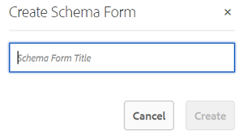

# Verwenden von Metadatenschema-Formularen {#use-the-metadata-schema-form}

Ein Metadatenschema beschreibt das Layout der Eigenschaftsseite und die für Assets angezeigten Metadateneigenschaften, die das betreffende Schema verwenden. Das Schema, das Sie auf ein Asset anwenden, bestimmt die Metadatenfelder, die auf der Seite Eigenschaften angezeigt werden.

Normalerweise werden auf der Seite **[!UICONTROL Eigenschaften]** für jedes Asset je nach MIME-Typ des Assets die standardmäßigen Metadateneigenschaften angezeigt. Mit dem Metadatenschema-Editor können Administratoren vorhandene Schemata ändern oder benutzerdefinierte Metadatenschemata hinzufügen. Experience Manager Assets Brand Portal bietet Standardformulare für Assets verschiedener MIME-Typen. Sie können jedoch auch benutzerdefinierte Formulare für solche Assets hinzufügen.

## Hinzufügen von Metadatenschema-Formularen {#add-a-metadata-schema-form}

Gehen Sie wie folgt vor, um ein neues Metadatenschema-Formular zu erstellen:

1. Klicken Sie in der Symbolleiste oben auf das Experience Manager-Logo, um auf die Admin-Tools zuzugreifen.

   

1. Klicken Sie im Admin-Tools-Bereich auf **[!UICONTROL Metadatenschemata]**.

   

1. Auf der Seite **[!UICONTROL Metadaten-Schemaformulare]** klicken Sie auf **[!UICONTROL Erstellen]**.

   

1. Geben Sie im Dialogfeld **[!UICONTROL Schemaformular erstellen]** den Titel des Schemaformulars an und klicken Sie dann auf **[!UICONTROL Erstellen]**, um den Formularerstellungsprozess abzuschließen.

   

## Bearbeiten von Metadatenschema-Formularen {#edit-a-metadata-schema-form}

Jedes hinzugefügte oder vorhandene Metadatenschema-Formular kann bearbeitet werden. Das Metadatenschema-Formular enthält Inhalte, die von seinem übergeordneten Element abgeleitet wurden, einschließlich Registerkarten und Formularelementen innerhalb von Registerkarten. Sie können diese Formularelemente einem Feld innerhalb eines Metadatenknotens zuordnen oder konfigurieren.

Sie können dem Metadatenschema-Formular neue Registerkarten oder Formularelemente hinzufügen. Die abgeleiteten Registerkarten und Formularelemente (des übergeordneten Elements) befinden sich im gesperrten Status. Sie können auf untergeordneter Ebene nicht geändert werden.

Gehen Sie wie folgt vor, um ein Metadatenschema-Formular zu bearbeiten:

1. Klicken Sie in der Symbolleiste oben auf das Experience Manager-Logo, um auf die Admin-Tools zuzugreifen.

   

1. Klicken Sie im Admin-Tools-Bereich auf **[!UICONTROL Metadatenschemata]**.
1. Wählen Sie auf der Seite **[!UICONTROL Metadaten-Schemaformulare]** ein Schemaformular zur Bearbeitung seiner Eigenschaften aus, beispielsweise **[!UICONTROL Sammlung]**.

   

   >[!NOTE]
   >
   >Nicht bearbeitete Vorlagen sind mit einem Sperrsymbol gekennzeichnet. Wenn Sie eine Vorlage anpassen, wird das Sperrsymbol vor der Vorlage ausgeblendet.

1. Klicken Sie oben in der Symbolleiste auf **[!UICONTROL Bearbeiten]**.

   Die **[!UICONTROL Metadatenschema-Editor]** wird geöffnet, wobei die Registerkarte **[!UICONTROL Allgemein]** auf der linken Seite geöffnet ist. Auf der rechten Seite wird die **[!UICONTROL Formular erstellen]** geöffnet.

1. Passen Sie auf **[!UICONTROL Seite &quot;]**-Editor“ die Seite **[!UICONTROL Eigenschaften]** des Assets an. Ziehen Sie einfach eine oder mehrere Komponenten aus einer Liste von Komponententypen auf die Registerkarte **[!UICONTROL Formular erstellen]**. Ziehen Sie sie auf die Registerkarte **[!UICONTROL Allgemein]**.

   

1. Um eine Komponente zu konfigurieren, wählen Sie diese aus und ändern Sie ihre Eigenschaften auf der Registerkarte **[!UICONTROL Einstellungen]**.

### Komponenten auf der Registerkarte„Formular erstellen“  {#components-in-the-build-form-tab}

Die Registerkarte **[!UICONTROL Formular erstellen]** enthält Formularelemente, die Sie im Schemaformular verwenden können. Die Registerkarte **[!UICONTROL Einstellungen]** enthält die Attribute für jedes Element, das Sie auf der Registerkarte **[!UICONTROL Formular erstellen]** auswählen. Die folgende Tabelle enthält die auf der Registerkarte **[!UICONTROL Formular erstellen]** verfügbaren Formularelemente:

| Komponentenname | Beschreibung |
|---------------------|--------------------------------------------------------------------------------------------------------------------------------------------------------------------------------------------------------------------------------------------------------------------------------------------|
| **[!UICONTROL Bereichs-Kopfzeile]** | Fügen Sie eine Abschnittsüberschrift für eine Liste allgemeiner Komponenten hinzu. |
| **[!UICONTROL Einzeilentext]** | Fügen Sie eine einzeilige Texteigenschaft hinzu. Diese wird als Zeichenfolge gespeichert. |
| **[!UICONTROL Text mit Mehrfachwerten]** | Fügen Sie eine Texteigenschaft mit mehreren Werten hinzu. Diese wird als Zeichenfolgen-Array gespeichert. |
| **[!UICONTROL Zahl]** | Fügen Sie eine Zahlenkomponente hinzu. |
| **[!UICONTROL Datum]** | Fügen Sie eine Datumskomponente hinzu. |
| **[!UICONTROL Dropdown]** | Fügen Sie eine Dropdown-Liste hinzu. |
| **[!UICONTROL Standard-Tags]** | Fügen Sie ein Tag hinzu. Administratoren müssen ggf. den Pfadwert ändern. `/etc/tags/mac/<tenant_id>/<custom_tag_namespace>`. B., wenn sie das Metadatenschema-Formular aus Experience Manager Assets veröffentlichen, wobei der Pfad keine Mandanteninformationen enthält, z. B. `/etc/tags/<custom_tag_namespace>`. |
| **[!UICONTROL Smart-Tags]** | Automatisch erkannte Tags, wenn Sie das Smart-Tags-Add-on für Experience Manager Assets erworben und konfiguriert haben. |
| **[!UICONTROL Ausgeblendetes Feld]** | Fügen Sie ein ausgeblendetes Feld hinzu. Dieses wird beim Speichern des Assets als POST-Parameter gesendet. |
| **[!UICONTROL Asset referenziert von]** | Fügen Sie diese Komponente hinzu, um eine Liste der Assets anzuzeigen, auf die das Asset verweist. |
| **[!UICONTROL Asset-Verweise]** | Fügen Sie dies hinzu, um eine Liste der Assets anzuzeigen, die das Asset referenzieren. |
| **[!UICONTROL Asset-Bewertung]** | Die durchschnittliche Bewertung eines Assets, die vor der Veröffentlichung in Brand Portal in Experience Manager Assets hinzugefügt wird. |
| **[!UICONTROL Kontextuelle Metadaten]** | Zur Steuerung der Anzeige anderer Metadaten auf der Eigenschaftenseite von Assets. |

>[!NOTE]
>
>Verwenden Sie nicht **[!UICONTROL Produktverweise]**, da diese Funktion nicht unterstützt wird.

#### Bearbeiten von Metadatenkomponenten {#edit-the-metadata-component}

Um die Eigenschaften einer Metadatenkomponente im Formular zu bearbeiten, klicken Sie auf die Komponente und bearbeiten Sie ihre Eigenschaften auf der Registerkarte **[!UICONTROL Einstellungen]**.

* **[!UICONTROL Feldbezeichnung]**: Der Name der Metadateneigenschaft, der auf der Eigenschaftsseite des Assets angezeigt wird.

* **[!UICONTROL Zu Eigenschaft zuordnen]**: Der Wert dieser Eigenschaft liefert den relativen Pfad/Namen zum Asset-Knoten für dessen Speicherort im CRX-Repository. Sie beginnt mit „**./**&quot;, da dies angibt, dass sich der Pfad unter dem Knoten des Assets befindet.

Im Folgenden finden Sie die gültigen Werte für diese Eigenschaft:

-- `./jcr:content/metadata/dc:title`: Speichert den Wert im Metadatenknoten des Assets als die Eigenschaft `dc:title`.

-- `./jcr:created`: Zeigt die Eigenschaft „jcr“ im Knoten des Assets an. Wenn Sie diese Eigenschaften in „Eigenschaften anzeigen“ konfiguriert haben, empfiehlt Adobe, sie als „Bearbeitung deaktivieren“ zu markieren, da sie geschützt sind. Andernfalls tritt der Fehler &quot;Assets konnte nicht geändert werden“ auf, wenn Sie die Eigenschaften des Assets speichern.

* **[!UICONTROL Platzhalter]**: Mit dieser Eigenschaft können Sie Benutzern relevante Informationen zur Metadateneigenschaft angeben.
* **[!UICONTROL Erforderlich]**: Mit dieser Eigenschaft können Sie eine Metadateneigenschaft auf der Eigenschaftsseite als obligatorisch markieren.
* **[!UICONTROL Bearbeitung deaktivieren]**: Mit dieser Eigenschaft können Sie verhindern, dass eine Metadateneigenschaft auf der Eigenschaftsseite bearbeitet werden kann.
* **[!UICONTROL Leeres Feld schreibgeschützt anzeigen]**: Markieren Sie diese Eigenschaft, um eine Metadateneigenschaft auch dann auf der Eigenschaftsseite anzuzeigen, wenn sie keinen Wert aufweist. Standardmäßig werden Metadateneigenschaften ohne Werte nicht auf der Eigenschaftsseite aufgeführt.
* **[!UICONTROL Beschreibung]**: Mit dieser Eigenschaft können Sie eine kurze Beschreibung für die Metadatenkomponente hinzufügen.
* **[!UICONTROL Löschsymbol]**: Klicken Sie auf dieses Symbol, um eine Komponente aus dem Schemaformular zu löschen.

>[!NOTE]
>
>Alle Metadaten-Felder sind im Asset-Editorformular für Metadaten schreibgeschützt. Die Metadaten des Assets müssen vor der Veröffentlichung in Brand Portal in Experience Manager Assets bearbeitet werden.

#### Hinzufügen oder Löschen von Registerkarten im Schemaformular {#add-or-delete-a-tab-in-the-schema-form}

Das Standardschemaformular enthält die Registerkarten **[!UICONTROL Allgemein]** und **[!UICONTROL Erweitert]**. Mit dem Schema-Editor können Sie Registerkarten hinzufügen oder löschen.

* Um einem Schemaformular eine neue Registerkarte hinzuzufügen, klicken Sie auf **[!UICONTROL +]**. Standardmäßig hat die neue Registerkarte den Namen „Unnamed-1“. Sie können den Namen auf der Registerkarte **[!UICONTROL Einstellungen]** ändern.

* Klicken Sie auf **[!UICONTROL x]**, um eine Registerkarte zu löschen. Klicken Sie auf **[!UICONTROL Speichern]**, um die Änderungen zu speichern.

## Anwenden eines Metadatenschemas auf Ordner {#apply-a-metadata-schema-to-a-folder}

Mit Brand Portal können Sie das Metadatenschema so anpassen und steuern, dass **[!UICONTROL Seite]** Eigenschaften“ eines Assets nur die spezifischen Informationen anzeigt, die Sie für die Anzeige auswählen. Um die auf der Seite **[!UICONTROL Eigenschaften]** angezeigten Metadaten zu steuern, entfernen Sie die erforderlichen Metadaten aus dem Metadatenschema-Formular und wenden Sie sie auf den jeweiligen Ordner an.

Gehen Sie wie folgt vor, um ein Metadatenschema-Formular auf einen Ordner anzuwenden:

1. Klicken Sie in der Symbolleiste oben auf das Experience Manager-Logo, um auf die Admin-Tools zuzugreifen.

   

1. Klicken Sie im Admin-Tools-Bereich auf **[!UICONTROL Metadatenschemata]**.

1. Wählen Sie auf der Seite **[!UICONTROL Metadatenschema-Formular]** das Schemaformular aus, das Sie auf ein Asset anwenden möchten, zum Beispiel **[!UICONTROL Kleidung]**.

   

1. Klicken Sie oben in der Symbolleiste auf **[!UICONTROL Auf Ordner anwenden]**.

1. Navigieren Sie auf der **[!UICONTROL Ordner auswählen]** zu dem Ordner, auf den Sie das Metadatenschema **[!UICONTROL Kleidung]** anwenden möchten, z. B. **[!UICONTROL Handschuhe]**.

   

1. Klicken Sie auf **[!UICONTROL Anwenden]**, um das Metadatenschema-Formular auf den Ordner anzuwenden.

   Die im Metadatenschema-Formular **[!UICONTROL Kleidung]** verfügbaren Metadaten werden auf den Ordner **[!UICONTROL Handschuhe]** angewendet und auf der Seite **[!UICONTROL Eigenschaften]** des Ordners angezeigt.

   

>[!NOTE]
>
>Wenn Sie ein Schema, das verschachtelte Schemata enthält, auf einen Ordner anwenden, der Videodateien enthält, werden die Metadateneigenschaften für die Videodateien möglicherweise nicht ordnungsgemäß gerendert. Um sicherzustellen, dass die Metadateneigenschaften korrekt gerendert werden, entfernen Sie die verschachtelten Schemata und wenden Sie nur das übergeordnete Schema auf den Ordner an.

## Löschen von Metadaten-Schemaformularen {#delete-a-metadata-schema-form}

Mit Brand Portal können Sie nur benutzerdefinierte Schemaformulare löschen. Die Standardschemaformulare/-vorlagen können nicht gelöscht werden. Sie können jedoch alle benutzerdefinierten Änderungen in diesen Formularen löschen.

Um ein Formular zu löschen, wählen Sie das Formular aus und klicken Sie auf das Symbol **[!UICONTROL Löschen]**.

>[!NOTE]
>
>Wenn Sie benutzerspezifische Änderungen an einem Standardformular löschen, wird das **[!UICONTROL Sperrsymbol]** wieder vor dem Formularnamen in der Metadatenschema-Benutzeroberfläche angezeigt, um zu kennzeichnen, dass das Formular wieder in den Standardzustand versetzt wurde.

## Schemaformulare für MIME-Typen {#schema-forms-for-mime-types}

### Hinzufügen neuer Formulare für MIME-Typen {#adding-new-forms-for-mime-types}

Zusätzlich zu den Standardformularen können Sie auch benutzerdefinierte Formulare für Assets mit verschiedenen MIME-Typen hinzufügen oder ein neues Formular unter dem entsprechenden Formulartyp erstellen. Beispiel: Um eine neue Vorlage für den Untertyp **[!UICONTROL image/png]** hinzuzufügen, erstellen Sie das Formular unter den „image“-Formularen. Der Titel für das Schemaformular ist der Name des Untertyps. In diesem Fall lautet der Titel „png“.

#### Verwenden einer vorhandenen Schemavorlage für verschiedene MIME-Typen {#using-an-existing-schema-template-for-various-mime-types}

Sie können eine vorhandene Vorlage für einen anderen MIME-Typ verwenden. Verwenden Sie beispielsweise das Formular **image/jpeg** für Assets vom MIME-Typ **image/png**.

Erstellen Sie in diesem Fall einen neuen Knoten unter [!UICONTROL `/etc/dam/metadataeditor/mimetypemappings`] im CRX-Repository. Geben Sie einen Namen für den Knoten an und definieren Sie die folgenden Eigenschaften:

| **Name** | **Typ** | **Wert** |
|---|---|---|
| exponierterMimeType | Zeichenfolge | image/jpeg |
| MIME-Typen | Zeichenfolge[] | image/png |

* **exposedmimetype**: Name des vorhandenen Formulars, das zugeordnet werden soll
* **mime types**: Liste der MIME-Typen, die das im Attribut **exponedmimetype** definierte Formular verwenden

Brand Portal ordnet die folgenden MIME-Typen und Schemaformulare zu:

| **Schemaformular** | **MIME-Typen** |
|---|---|
| image/jpeg | image/pjpeg |
| image/tiff | image/x-tiff |
| application/pdf | application/postscript |
| application/x-ImageSet | Multipart/Related; type=application/x-ImageSet |
| application/x-SpinSet | Multipart/Related; type=application/x-SpinSet |
| application/x-MixedMediaSet | Multipart/Related; type=application/x-MixedMediaSet |
| video/quicktime | video/x-quicktime |
| video/mpeg4 | video/mp4 |
| video/avi | video/avi, video/msvideo, video/x-msvideo |
| video/wmv | `video/x-ms-wmv` |
| video/flv | video/x-flv |

Im Folgenden finden Sie eine Liste mit standardmäßigen Metadateneigenschaften:

* `jcr:content/metadata/cq:tags`
* `jcr:content/metadata/dc:format`
* `jcr:content/metadata/dam:status`
* `jcr:content/metadata/videoCodec`
* `jcr:content/metadata/audioCodec`
* `jcr:content/metadata/dc:title`
* `jcr:content/metadata/dc:description`
* `jcr:content/metadata/xmpMM:InstanceID`
* `jcr:content/metadata/xmpMM:DocumentID`
* `jcr:content/metadata/dam:sha1`
* `jcr:content/metadata/dam:solutionContext`
* `jcr:content/metadata/videoBitrate`
* `jcr:content/metadata/audioBitrate`
* `jcr:content/usages/usedBy`
* `jcr:content/jcr:lastModified`
* `jcr:content/metadata/prism:expirationDate`
* `jcr:content/onTime`
* `jcr:content/offTime`
* `jcr:content/metadata/dam:size`
* `jcr:content/metadata/tiff:ImageWidth`
* `jcr:content/metadata/tiff:ImageLength`
