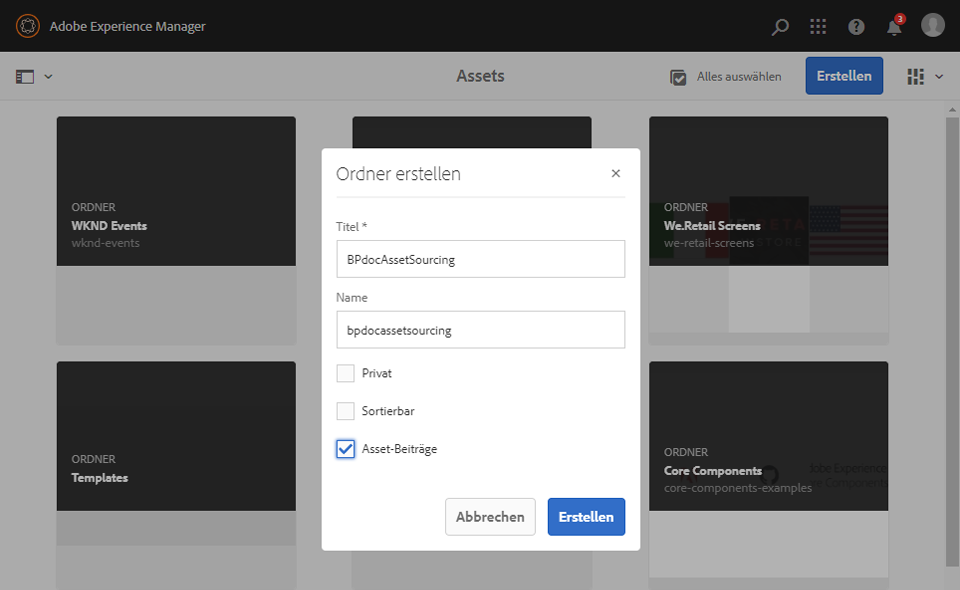
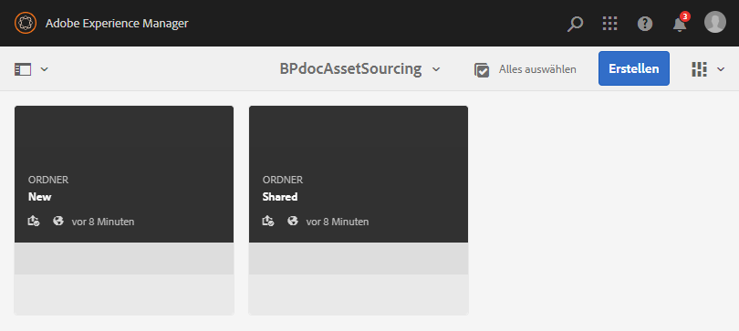
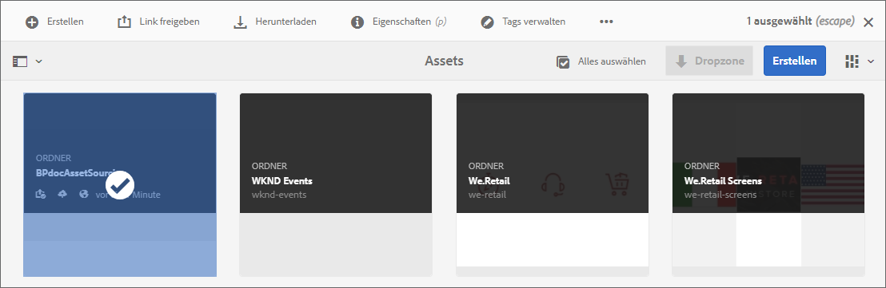
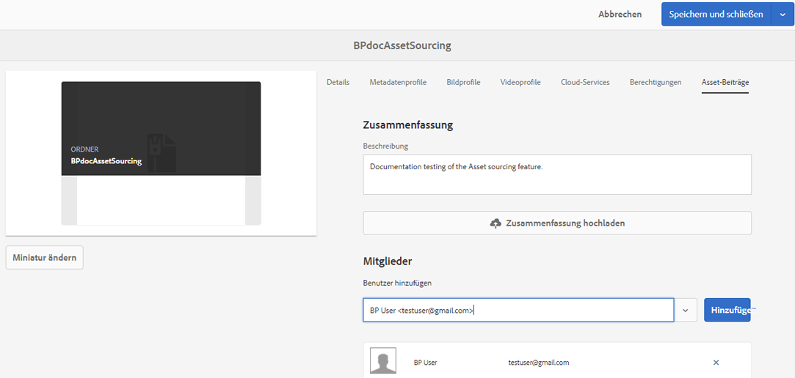
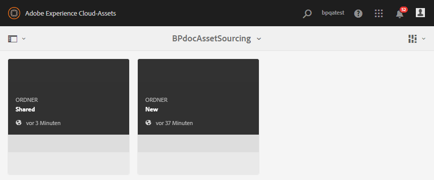
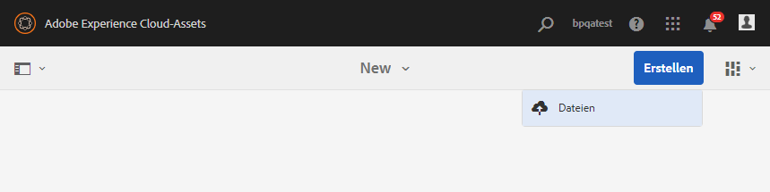
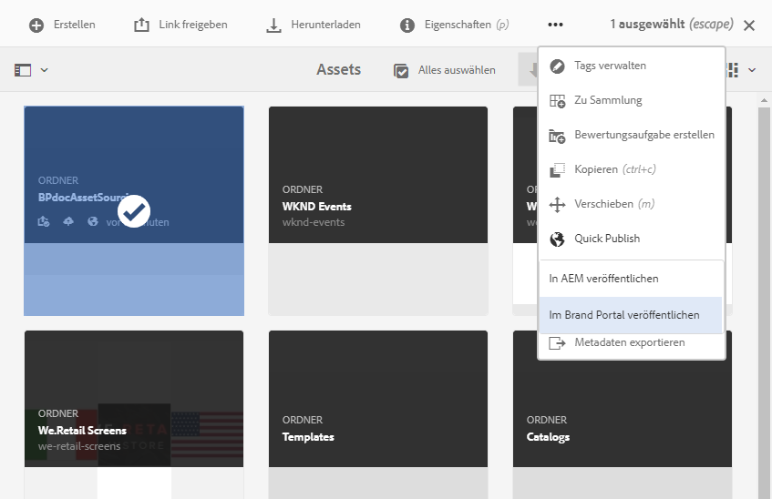

# Konfigurieren des Beitragsordners in Experience Manager Assets {#configure-contribution-folder}

Bei der gemeinsamen Asset-Beschaffung können Experience Manager Assets-Benutzer (Administratoren und Benutzer ohne Administratorrechte) Ordner des Typs **Asset-Beitrag** erstellen, um sicherzustellen, dass der erstellte Ordner von Brand Portal-Benutzern für die Übermittlung von Assets nutzbar ist.  Bei dieser Methode wird automatisch ein Workflow Trigger, der zwei weitere Unterordner namens **SHARED** und **NEW** im neu erstellten Ordner **Contribution** erstellt.

Der Experience Manager Assets-Benutzer definiert die Asset-Anforderungen, indem er eine Kurzbeschreibung der Asset-Typen hochlädt, die zum Beitragsordner hinzugefügt werden sollen. Außerdem laden sie eine Reihe von Grundlinien-Assets in den Ordner SHARED hoch, um sicherzustellen, dass Benutzer von Brand Portal über die benötigten Informationen verfügen. Der Administrator kann aktiven Brand Portal-Benutzern anschließend Zugriff auf den Beitragsordner gewähren, bevor der neu erstellte Beitragsordner in Brand Portal veröffentlicht wird.

Das folgende Video zeigt, wie Sie einen Beitragsordner in Experience Manager Assets konfigurieren:

>[!VIDEO](https://video.tv.adobe.com/v/30547)

Der Experience Manager Assets-Benutzer führt beim Konfigurieren eines Beitragsordners die folgenden Aktivitäten aus:

* [Erstellen eines Beitragsordners](#create-contribution-folder)
* [Hochladen von Asset-Anforderungen und Zuweisen von Beitragenden](#configure-contribution-folder-properties)
* [Hochladen von Grundlinien-Assets](#uplad-new-assets-to-contribution-folder)
* [Veröffentlichen des Beitragsordners aus Experience Manager Assets in Brand Portal](#publish-contribution-folder-to-brand-portal)

## Erstellen von Beitragsordnern {#create-contribution-folder}

Experience Manager Assets-Administratoren und Benutzer ohne Administratorrechte, die zum Erstellen eines neuen Ordners berechtigt sind, können in Experience Manager Assets einen Beitragsordner erstellen.
Erstellen Sie zum Erstellen eines Beitragsordners einen Ordner vom Typ Asset-Beitrag, um sicherzustellen, dass der erstellte Ordner von Brand Portal-Benutzern für die Übermittlung von Assets nutzbar ist. Bei dieser Methode wird automatisch ein Workflow Trigger, mit dem zwei weitere Unterordner namens SHARED und NEW im Beitragsordner erstellt werden.

>[!NOTE]
>
>Administratoren können mehrere Asset-Beitragsordner in einem Ordner erstellen.
>
>Ein Asset-Beitragsordner enthält die Ordner NEU und FREIGEGEBEN für Verteilung und Beitrag von Assets. Erstellen Sie keinen Asset- oder Beitragsordner in einem Beitragsordner.

Sie können die Eigenschaften des Beitragsordners sowohl separat als auch beim Erstellen des Beitragsordners konfigurieren. In diesem Beispiel werden die Eigenschaften separat konfiguriert.

**Erstellen eines Beitragsordners:**

1. Melden Sie sich bei Ihrer Experience Manager Assets-Instanz an.

1. Gehen Sie zu **[!UICONTROL Assets]** > **[!UICONTROL Dateien]**. Es werden alle vorhandenen Ordner im Experience Manager Assets-Repository aufgelistet.

1. Klicken Sie auf **[!UICONTROL Erstellen]**, um einen neuen Ordner zu erstellen. Das Dialogfeld **[!UICONTROL Ordner erstellen]** wird geöffnet.

1. Geben Sie den **[!UICONTROL Titel]** und den **[!UICONTROL Namen]** des Ordners ein und aktivieren Sie das Kontrollkästchen **[!UICONTROL Asset-Beitrag]** .
Adobe empfiehlt, Kleinbuchstaben ohne Leerzeichen zu verwenden, um den Ordner zu benennen.

1. Klicken Sie auf **[!UICONTROL Erstellen]**. Der Beitragsordner wird im Experience Manager Assets-Repository aufgelistet.

   >[!NOTE]
   >
   >Ein Benutzer ohne Administratorrechte kann einen Asset-Beitragsordner erstellen und freigeben, ihn jedoch nicht ändern oder löschen.

   

1. Öffnen Sie den Beitragsordner. Es werden zwei Unterordner angezeigt: **[!UICONTROL SHARED]** und **[!UICONTROL NEW]**. Diese werden automatisch im Beitragsordner erstellt.

   

## Konfigurieren von Eigenschaften von Beitragsordnern {#configure-contribution-folder-properties}

Der Experience Manager Assets-Administrator führt beim Konfigurieren der Eigenschaften eines Beitragsordners die folgenden Aktivitäten aus.

* **Beschreibung hinzufügen**: Geben Sie eine allgemeine Beschreibung des Beitragsordners ein.
* **Kurzbeschreibung hochladen**: Laden Sie ein Asset-Anforderungsdokument hoch, das Asset-bezogene Informationen enthält.
* **Beitragende hinzufügen**: Fügen Sie Brand Portal-Benutzer hinzu, um ihnen Zugriff auf den Beitragsordner zu gewähren.

Die Asset-Anforderung bezieht sich auf die Details, die von Administratoren bereitgestellt werden, um Beitragende (Brand Portal-Benutzer) dabei zu unterstützen, die Notwendigkeit und Anforderungen des Beitragsordners zu verstehen. Der Administrator lädt ein Asset-Anforderungsdokument hoch, in dem die Asset-Typen für den Beitragsordner detailliert beschrieben werden, einschließlich Zweck, Bildtypen und Maximalgröße.

**Konfigurieren von Eigenschaften von Beitragsordnern:**

1. Melden Sie sich bei Ihrer Experience Manager Assets-Instanz an.

1. Navigieren Sie zu **[!UICONTROL Assets > Dateien]** und suchen Sie nach dem Beitragsordner.
1. Wählen Sie den Beitragsordner aus und klicken Sie auf **[!UICONTROL Eigenschaften]**, um das Fenster „Ordnereigenschaften“ zu öffnen.

   

   

1. Navigieren Sie zur Registerkarte **[!UICONTROL Asset-Beitrag]** .
1. Geben Sie eine allgemeine **[!UICONTROL Beschreibung]** des Beitragsordners ein.
1. Klicken Sie auf **[!UICONTROL Zusammenfassung hochladen]**, um von Ihrem lokalen Computer aus zu navigieren und ein **Asset-Anforderungsdokument** hochzuladen.

   

1. Geben Sie im Feld **[!UICONTROL Benutzer hinzufügen]** Brand Portal-Benutzer an, für die Sie den Beitragsordner freigeben möchten. Diese Benutzer können über die Brand Portal-Oberfläche Inhalte in diesem Beitragsordner abrufen oder in ihn hochladen.
1. Klicken Sie auf **[!UICONTROL Speichern]**.

   

>[!NOTE]
>
>Die Suchergebnisse basieren auf der in Experience Manager Assets konfigurierten Brand Portal-Benutzerliste. Stellen Sie sicher, dass Sie über die aktualisierte Brand Portal-Benutzerliste verfügen.

Administratoren können die Datei `user.csv` aus der [!DNL Admin Console] nutzen und als Basisvorlage zum Hinzufügen von Brand Portal-Benutzern verwenden. Navigieren Sie zu [!UICONTROL Benutzer] und klicken Sie auf die Option [!UICONTROL Benutzerliste in CSV exportieren], um die Datei `users.csv` herunterzuladen. Die folgende Beispiel-Benutzerliste enthält die Attribute, die zum Hinzufügen der Benutzer erforderlich sind. Das einzige obligatorische Attribut für einen Benutzereintrag ist die `Email`. Alle anderen Attribute sind optional.

[Datei laden](assets/users.csv)

## Hochladen von Assets in den Beitragsordner {#uplad-new-assets-to-contribution-folder}

Experience Manager Assets-Benutzer lädt einen Satz von Grundlinien-Assets in den Ordner **SHARED** hoch, um sicherzustellen, dass Benutzer von Brand Portal über die benötigten Informationen verfügen.

**Hochladen von Grundlinien-Assets:**

1. Melden Sie sich bei Ihrer Experience Manager Assets-Instanz an.

1. Navigieren Sie zu **[!UICONTROL Assets > Dateien]** und suchen Sie nach dem Beitragsordner.

1. Wählen Sie den Beitragsordner aus und klicken Sie darauf, um ihn zu öffnen.

1. Klicken Sie auf den **[!UICONTROL Ordner NEU]**.

   

1. Klicken Sie auf **[!UICONTROL Erstellen]** > **[!UICONTROL Dateien]**, um einzelne Dateien oder Ordner (.zip) mit mehreren Assets hochzuladen.

   

1. Suchen Sie nach Assets (Dateien/Ordner) und laden Sie sie in den Ordner **[!UICONTROL NEU]** hoch.

   

Nachdem Sie alle Assets oder Ordner in den Ordner „NEU“ hochgeladen haben, veröffentlichen Sie den Beitragsordner in Experience Manager Assets.

## Veröffentlichen von Beitragsordnern in Brand Portal {#publish-contribution-folder-to-brand-portal}

Sobald der Beitragsordner konfiguriert ist, kann der Experience Manager Assets-Benutzer (Administratoren/Benutzer ohne Administratorrechte) den Beitragsordner aus Experience Manager Assets in Brand Portal veröffentlichen. Brand Portal-Benutzer, die zum Zugriff auf den Beitragsordner berechtigt sind, erhalten nach Abschluss der Veröffentlichungsaktion eine E-Mail- oder Pulsbenachrichtigung.

**So veröffentlichen Sie einen Beitragsordner:**

1. Melden Sie sich bei Ihrer Experience Manager Assets-Instanz an.

1. Navigieren Sie zu **[!UICONTROL Assets > Dateien]** und suchen Sie nach dem Beitragsordner, in dem Sie in Brand Portal veröffentlichen möchten.
1. Wählen Sie einen Beitragsordner aus und klicken Sie auf **[!UICONTROL Quick Publish]** > **[!UICONTROL Publish to Brand Portal]**.

   

   Sie erhalten eine Erfolgsmeldung, nachdem der Beitragsordner in Brand Portal veröffentlicht wurde.

Eine E-Mail-/Pulsbenachrichtigung wird an die Brand Portal-Benutzer gesendet, die dem Beitragsordner zugewiesen sind. Die Brand Portal-Benutzer können auf den Beitragsordner zugreifen und einen Beitrag starten. Weitere Informationen finden Sie unter [Hochladen von Assets in den Beitragsordner und Veröffentlichen in Experience Manager Assets](brand-portal-publish-contribution-folder-to-aem-assets.md).
