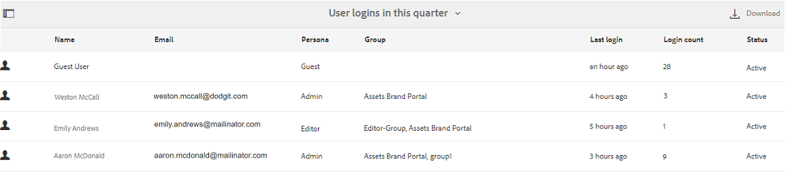

# Arbeiten mit Berichten {#work-with-reports}

Die Berichterstellungsfunktion ist hilfreich, um die Brand Portal-Nutzung zu bewerten und festzustellen, wie interne und externe Benutzer mit genehmigten Assets interagieren. Administratoren können den Brand Portal-Nutzungsbericht anzeigen, der immer auf der Seite &quot;Asset-Berichte&quot;verfügbar ist. Berichte für Benutzeranmeldungen und heruntergeladene, abgelaufene, veröffentlichte und über Links freigegebene Assets können jedoch über die Seite Asset-Berichte generiert und angezeigt werden. Diese Berichte sind hilfreich bei der Analyse der Ressourcenbereitstellung, mit deren Hilfe Sie wichtige Erfolgsmetriken ableiten können, um die Akzeptanz genehmigter Ressourcen innerhalb und außerhalb Ihrer Organisation zu messen.

Die Berichtverwaltungsoberfläche ist intuitiv und enthält detaillierte Optionen und Steuerungen, mit denen Sie auf gespeicherte Berichte zugreifen können. Über die Seite „Asset-Berichte“, auf der alle bisher erstellten Berichte aufgelistet werden, können Sie Berichte anzeigen, herunterladen oder löschen.

## Anzeigen von Berichten {#view-reports}

Gehen Sie wie folgt vor, um einen Bericht anzuzeigen:

1. Klicken Sie in der Symbolleiste oben auf das Experience Manager-Logo, um auf die Admin-Tools zuzugreifen.

   

1. Klicken Sie im Admin Tools-Bereich auf **[!UICONTROL Berichte erstellen/verwalten]** , um die Seite **[!UICONTROL Asset-Berichte]** zu öffnen.

   

1. Rufen Sie den Bericht **[!UICONTROL Nutzung]** und andere generierte Berichte auf der Seite &quot;Asset-Berichte&quot;auf.

   >[!NOTE]
   >
   >Der Verwendungsbericht ist ein Standardbericht, der in Brand Portal erstellt wird. Sie kann nicht erstellt oder gelöscht werden. Sie können jedoch die Berichte &quot;Download&quot;, &quot;Ablauf&quot;, &quot;Publish&quot;, &quot;`Link Share`&quot;und &quot;Benutzeranmeldungen&quot;erstellen, herunterladen und löschen.

   Um einen Bericht anzuzeigen, klicken Sie auf den Link zum Bericht. Wählen Sie alternativ den Bericht aus und klicken Sie in der Symbolleiste auf das Symbol Ansicht .

   Der **[!UICONTROL Nutzungsbericht]** enthält Informationen zur Anzahl der aktiven Brand Portal-Benutzer, zum belegten Speicherplatz aller Assets sowie zur Gesamtanzahl der Assets in Brand Portal. Die Brand Portal-Benutzer, die keinem Produktprofil in der Admin Console zugewiesen sind, gelten als inaktive Benutzer und werden nicht im **[!UICONTROL Nutzungsbericht]** angezeigt.
Der Bericht zeigt außerdem die zulässige Kapazität für jede dieser Informationsmetriken an.

   

   Der Bericht **[!UICONTROL Benutzeranmeldungen]** enthält Informationen zu den Benutzern, die sich bei Brand Portal angemeldet haben. Der Bericht enthält die Anzeigenamen, E-Mail-IDs, Rollen (Admin, Betrachter, Bearbeiter, Gast), Gruppen, Angaben zur letzten Anmeldung, den Aktivitätsstatus und die Anzahl der Anmeldungen von jedem Benutzer seit der Bereitstellung von Brand Portal 6.4.2 bis zum Zeitpunkt der Berichterstellung.

   

   Der Bericht **[!UICONTROL Download]** listet alle Assets auf und zeigt Details zu allen Assets an, die in einem bestimmten Zeitraum heruntergeladen wurden.

   

   >[!NOTE]
   >
   >Der Asset-Bericht **[!UICONTROL Download]** zeigt nur Assets an, die einzeln über Brand Portal ausgewählt und heruntergeladen wurden. Wenn ein Benutzer einen Ordner mit Assets heruntergeladen hat, werden der Ordner bzw. die Assets im Ordner nicht im Bericht angezeigt.

   Der Bericht **[!UICONTROL Ablauf]** listet alle Assets auf und zeigt sie im Detail an, die in einem bestimmten Zeitraum abgelaufen sind.

   

   Der Bericht **[!UICONTROL Veröffentlichen]** zeigt Informationen zu allen Assets an, die in einem bestimmten Zeitraum von Experience Manager Assets in Brand Portal veröffentlicht wurden.

   

   >[!NOTE]
   >
   >Der Bericht „Veröffentlichen“ zeigt keine Informationen zu Inhaltsfragmenten an, da diese nicht in Brand Portal veröffentlicht werden können.

   Der Bericht **[!UICONTROL Linkfreigabe]** listet alle Assets auf, die über Links von der Brand Portal-Oberfläche in einem bestimmten Zeitraum freigegeben wurden. Der Bericht zeigt an, wann das Asset über einen Link freigegeben wurde, welcher Benutzer es freigegeben hat und wie das Ablaufdatum des Links lautet. Außerdem wird die Anzahl der freigegebenen Links für den Mandanten und die Benutzer berichtet. Die Spalten des Berichts zur Linkfreigabe können nicht angepasst werden.

   

   >[!NOTE]
   >
   >Der Bericht zur Linkfreigabe zeigt keine Benutzer an, die Zugriff auf das über den Link freigegebene Asset haben oder das Asset über den Link heruntergeladen haben.
   >
   >Um Downloads über den freigegebenen Link verfolgen zu können, müssen Sie einen Download-Bericht nach der Auswahl der Option **[!UICONTROL Nur Downloads von Linkfreigaben]** auf der Seite **[!UICONTROL Bericht erstellen]** erstellen. Der Benutzer (heruntergeladen von) ist in diesem Fall jedoch anonym.

## Erzeugen von Berichten {#generate-reports}

Administratoren können die folgenden Standardberichte generieren und verwalten. Nach der Generierung werden die Berichte für [späteren Zugriff](../using/brand-portal-reports.md#main-pars-header) gespeichert.

* Benutzeranmeldungen
* Download
* Ablauf
* Veröffentlichen
* Link-Freigabe

Die Spalten im Bericht Download, Ablauf und Publish können für die Anzeige angepasst werden. Gehen Sie wie folgt vor, um einen Bericht zu erstellen:

1. Klicken Sie in der Symbolleiste oben auf das Experience Manager-Logo, um auf die Admin-Tools zuzugreifen.

1. Klicken Sie im Admin Tools-Bereich auf **[!UICONTROL Berichte erstellen/verwalten]** , um die Seite **[!UICONTROL Asset-Berichte]** zu öffnen.

   

1. Klicken Sie auf der Seite &quot;Asset-Berichte&quot;auf **[!UICONTROL Erstellen]**.
1. Wählen Sie auf der Seite **[!UICONTROL Bericht erstellen]** einen zu erstellenden Bericht aus und klicken Sie auf **[!UICONTROL Weiter]**.

   

1. Konfigurieren Sie die Berichtdetails. Geben Sie Titel, Beschreibung, Ordnerstruktur (wo der Bericht ausgeführt werden und Statistiken generieren muss) und Datumsbereich für die Berichte **[!UICONTROL Download]**, **[!UICONTROL Ablauf]** und **[!UICONTROL Publish]** an.

   

   Für den Bericht **[!UICONTROL Linkfreigabe]** sind nur die Parameter für Titel, Beschreibung und Datumsbereich erforderlich.

   

   >[!NOTE]
   >
   >Beim Generieren des Berichts werden die Sonderzeichen `#` und `%` im Titel durch einen Bindestrich (-) ersetzt.

1. Klicken Sie auf &quot;**[!UICONTROL Weiter]**&quot;, um die Spalten für die Berichte &quot;Download&quot;, &quot;Ablauf&quot;und &quot;Publish&quot;zu konfigurieren.
1. Aktivieren oder deaktivieren Sie dazu die entsprechenden Kontrollkästchen. Um beispielsweise die Namen der Benutzer (die Assets heruntergeladen haben) im Bericht **[!UICONTROL Download]** anzuzeigen, wählen Sie **[!UICONTROL Heruntergeladen von]** aus. Die folgende Abbildung zeigt die Auswahl der Standardspalten im Bericht Download .

   

   Sie können diesen Berichten auch benutzerdefinierte Spalten hinzufügen, um weitere Daten für Ihre benutzerdefinierten Anforderungen anzuzeigen.

   Gehen Sie wie folgt vor, um dem Bericht Download, Publish oder Ablauf benutzerdefinierte Spalten hinzuzufügen:

   1. Um eine benutzerdefinierte Spalte anzuzeigen, klicken Sie auf **[!UICONTROL Hinzufügen]** innerhalb von [!UICONTROL Benutzerdefinierte Spalten].
   1. Geben Sie den Namen der Spalte im Feld **[!UICONTROL Spaltenname]** an.
   1. Wählen Sie mit einer Eigenschaftsauswahl die Eigenschaft aus, der die Spalte zugeordnet werden soll.

      
Alternativ können Sie den Pfad im Feld „Eigenschaftspfad“ eingeben.

      

      Um weitere benutzerdefinierte Spalten hinzuzufügen, klicken Sie auf **Hinzufügen** und wiederholen Sie die Schritte 2 und 3.

1. Klicken Sie auf **[!UICONTROL Erstellen]**. Eine Meldung benachrichtigt Sie darüber, dass die Berichtserstellung startet.

## Herunterladen von Berichten {#download-reports}

Um einen Bericht als CSV-Datei zu speichern und herunterzuladen, führen Sie einen der folgenden Schritte aus:

* Wählen Sie auf der Seite &quot;Asset-Berichte&quot;einen Bericht aus und klicken Sie oben in der Symbolleiste auf **[!UICONTROL Download]** .

* Öffnen Sie auf der Seite „Asset-Berichte“ einen Bericht. Wählen Sie oben auf der Berichtsseite die Option **[!UICONTROL Download]** aus.

## Löschen von Berichten {#delete-reports}

Um einen vorhandenen Bericht zu löschen, wählen Sie den Bericht auf der Seite **[!UICONTROL Asset-Berichte]** aus und klicken Sie oben in der Symbolleiste auf **[!UICONTROL Löschen]** .

>[!NOTE]
>
>Der Bericht **[!UICONTROL Nutzung]** kann nicht gelöscht werden.
