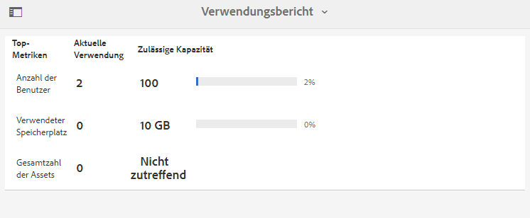
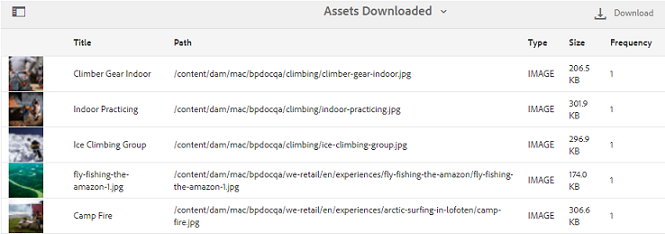

# Arbeiten mit Berichten {#work-with-reports}

Die Berichterstellungsfunktion ist hilfreich, um die Brand Portal-Nutzung zu bewerten und festzustellen, wie interne und externe Benutzer mit genehmigten Assets interagieren. Administratoren können den Nutzungsbericht für Brand Portal anzeigen, der immer auf der Seite „Asset-Berichte“ verfügbar ist. Berichte für Benutzeranmeldungen und heruntergeladene, abgelaufene, veröffentlichte und über Links freigegebene Assets können jedoch über die Seite Asset-Berichte generiert und angezeigt werden. Diese Berichte sind hilfreich bei der Analyse der Ressourcenbereitstellung, mit deren Hilfe Sie wichtige Erfolgsmetriken ableiten können, um die Akzeptanz genehmigter Ressourcen innerhalb und außerhalb Ihrer Organisation zu messen.

Die Berichtverwaltungsoberfläche ist intuitiv und enthält detaillierte Optionen und Steuerungen, mit denen Sie auf gespeicherte Berichte zugreifen können. Über die Seite „Asset-Berichte“, auf der alle bisher erstellten Berichte aufgelistet werden, können Sie Berichte anzeigen, herunterladen oder löschen.

## Anzeigen von Berichten {#view-reports}

Gehen Sie wie folgt vor, um einen Bericht anzuzeigen:

1. Klicken Sie in der Symbolleiste oben auf das Experience Manager-Logo, um auf die Admin-Tools zuzugreifen.

   

1. Klicken Sie im Admin-Tools-Bereich auf **[!UICONTROL Berichte erstellen/verwalten]**, um die Seite **[!UICONTROL Asset-Berichte]** zu öffnen.

   

1. Greifen Sie über **[!UICONTROL Seite Asset]** Berichte auf den Bericht „Nutzung“ und andere generierte Berichte zu.

   >[!NOTE]
   >
   >Der Verwendungsbericht ist ein Standardbericht, der in Brand Portal erstellt wird. Sie kann nicht erstellt oder gelöscht werden. Sie können jedoch die Berichte Download, Ablauf, Publish, `Link Share` und Benutzeranmeldungen erstellen, herunterladen und löschen.

   Um einen Bericht anzuzeigen, klicken Sie auf den Link zum Bericht. Wählen Sie alternativ den Bericht aus und klicken Sie auf der Symbolleiste auf das Symbol Ansicht .

   Der **[!UICONTROL Nutzungsbericht]** zeigt Informationen zur Anzahl der aktiven Brand Portal-Benutzenden, zum Speicherplatz, der von allen Assets belegt ist, und zur Gesamtzahl der Assets in Brand Portal an. Die Brand Portal-Benutzenden, die keinem Produktprofil in der Admin Console zugewiesen sind, gelten als inaktive Benutzende und werden im **[!UICONTROL Verwendungsbericht“ nicht]**.
Der Bericht zeigt außerdem die zulässige Kapazität für jede dieser Informationsmetriken an.

   

   Der Bericht **[!UICONTROL Benutzeranmeldungen]** enthält Informationen zu den Benutzenden, die sich bei Brand Portal angemeldet haben. Der Bericht zeigt Anzeigenamen, E-Mail-IDs, Personas (Admin, Betrachter, Editor, Gast), Gruppen, letzte Anmeldung, Aktivitätsstatus und die Anzahl der Anmeldungen jedes Benutzers aus der Brand Portal 6.4.2-Bereitstellung bis zum Zeitpunkt der Berichterstellung an.

   

   Der Bericht **[!UICONTROL Download]** listet alle Assets auf und zeigt Details zu allen Assets an, die in einem bestimmten Zeitraum heruntergeladen wurden.

   

   >[!NOTE]
   >
   >Der Asset-Bericht **[!UICONTROL Download]** zeigt nur Assets an, die einzeln über Brand Portal ausgewählt und heruntergeladen wurden. Wenn ein Benutzer einen Ordner mit Assets heruntergeladen hat, werden der Ordner bzw. die Assets im Ordner nicht im Bericht angezeigt.

   Der **[!UICONTROL Ablauf]**-Bericht listet alle Assets auf, die in einem bestimmten Zeitrahmen abgelaufen sind, und zeigt sie detailliert an.

   

   Der Bericht **[!UICONTROL Veröffentlichen]** zeigt Informationen zu allen Assets an, die in einem bestimmten Zeitraum von Experience Manager Assets in Brand Portal veröffentlicht wurden.

   

   >[!NOTE]
   >
   >Der Bericht „Veröffentlichen“ zeigt keine Informationen zu Inhaltsfragmenten an, da diese nicht in Brand Portal veröffentlicht werden können.

   Der Bericht **[!UICONTROL Linkfreigabe]** listet alle Assets auf, die über Links von der Brand Portal-Benutzeroberfläche in einem bestimmten Zeitrahmen freigegeben wurden. Der Bericht beschreibt, wann das Asset über einen Link freigegeben wurde, von welchem Benutzer es freigegeben wurde und bis zu welchem Ablaufdatum der Link gültig war. Außerdem wird die Anzahl der freigegebenen Links für den Mandanten und die Benutzer angezeigt. Die Spalten des Berichts Linkfreigabe sind nicht anpassbar.

   

   >[!NOTE]
   >
   >Der Bericht Linkfreigabe zeigt keine Benutzer an, die Zugriff auf das über den Link freigegebene Asset haben oder das Asset über den Link heruntergeladen haben.
   >
   >Zum Nachverfolgen von Downloads über den freigegebenen Link müssen Sie einen Bericht zum Herunterladen generieren, nachdem Sie die Option **[!UICONTROL Nur Downloads über Link-Freigabe]** auf der Seite **[!UICONTROL Bericht erstellen]** ausgewählt haben. Der Benutzer (heruntergeladen von) ist in diesem Fall jedoch anonym.

## Erzeugen von Berichten {#generate-reports}

Administratoren können die folgenden Standardberichte erstellen und verwalten. Nach der Generierung werden die Berichte für den [&#x200B; Zugriff gespeichert](../using/brand-portal-reports.md#main-pars-header).

* Benutzeranmeldungen
* Download
* Ablauf
* Veröffentlichen
* Link-Freigabe

Die Spalten im Bericht „Download“, „Gültigkeit“ und &quot;Publish&quot; können zur Anzeige angepasst werden. Gehen Sie wie folgt vor, um einen Bericht zu erstellen:

1. Klicken Sie in der Symbolleiste oben auf das Experience Manager-Logo, um auf die Admin-Tools zuzugreifen.

1. Klicken Sie im Admin-Tools-Bereich auf **[!UICONTROL Berichte erstellen/verwalten]**, um die Seite **[!UICONTROL Asset-Berichte]** zu öffnen.

   

1. Klicken Sie auf der Seite Asset-Berichte auf **[!UICONTROL Erstellen]**.
1. Wählen Sie auf **[!UICONTROL Seite Bericht erstellen]** zu erstellenden Bericht aus und klicken Sie auf **[!UICONTROL Weiter]**.

   

1. Konfigurieren Sie die Berichtdetails. Geben Sie Titel, Beschreibung, Ordnerstruktur (wo der Bericht ausgeführt und Statistiken generiert werden muss) und Datumsbereich für die Berichte **[!UICONTROL Download]**, **[!UICONTROL Expiration]** und **[!UICONTROL Publish]** an.

   

   Der **[!UICONTROL Linkfreigabe]**-Bericht benötigt nur die Parameter Titel, Beschreibung und Datumsbereich.

   

   >[!NOTE]
   >
   >Beim Erstellen des Berichts werden die Sonderzeichen `#` und `%` im Titel durch einen Bindestrich (-) ersetzt.

1. Klicken Sie **[!UICONTROL Weiter]**, um die Spalten der Berichte Download, Ablauf und Publish zu konfigurieren.
1. Aktivieren oder deaktivieren Sie dazu die entsprechenden Kontrollkästchen. Um beispielsweise die Namen von Benutzern (die Assets heruntergeladen haben) im Bericht &quot;**[!UICONTROL &quot; anzuzeigen]** wählen Sie **[!UICONTROL Heruntergeladen von]**. Die folgende Abbildung zeigt die Auswahl der Standardspalten im Download-Bericht.

   

   Sie können diesen Berichten auch benutzerdefinierte Spalten hinzufügen, um weitere Daten für Ihre benutzerdefinierten Anforderungen anzuzeigen.

   Gehen Sie wie folgt vor, um dem Download-, Publish- oder Gültigkeitsbericht benutzerdefinierte Spalten hinzuzufügen:

   1. Um eine benutzerdefinierte Spalte anzuzeigen, klicken Sie auf **[!UICONTROL Hinzufügen]** unter [!UICONTROL Benutzerdefinierte Spalten].
   1. Geben Sie den Namen der Spalte im Feld **[!UICONTROL Spaltenname]** an.
   1. Wählen Sie mithilfe einer Eigenschaftenauswahl die Eigenschaft aus, der die Spalte zugeordnet werden soll.

      
Alternativ können Sie den Pfad im Feld „Eigenschaftspfad“ eingeben.

      

      Um weitere benutzerdefinierte Spalten hinzuzufügen, klicken Sie auf **Hinzufügen** und wiederholen Sie die Schritte 2 und 3.

1. Klicken Sie auf **[!UICONTROL Erstellen]**. Eine Meldung benachrichtigt Sie darüber, dass die Berichtserstellung startet.

## Herunterladen von Berichten {#download-reports}

Führen Sie einen der folgenden Schritte aus, um einen Bericht als CSV-Datei zu speichern und herunterzuladen:

* Wählen Sie auf der Seite Asset-Berichte einen Bericht aus und klicken **[!UICONTROL oben in]** Symbolleiste auf „Herunterladen“.

* Öffnen Sie auf der Seite „Asset-Berichte“ einen Bericht. Wählen Sie **[!UICONTROL Option]** Herunterladen“ oben auf der Berichtseite aus.

## Löschen von Berichten {#delete-reports}

Um einen vorhandenen Bericht zu löschen, wählen Sie den Bericht auf der Seite **[!UICONTROL Asset-Berichte]** aus und klicken Sie oben in **Symbolleiste auf** Löschen“.

>[!NOTE]
>
>Der Bericht **[!UICONTROL Nutzung]** kann nicht gelöscht werden.
