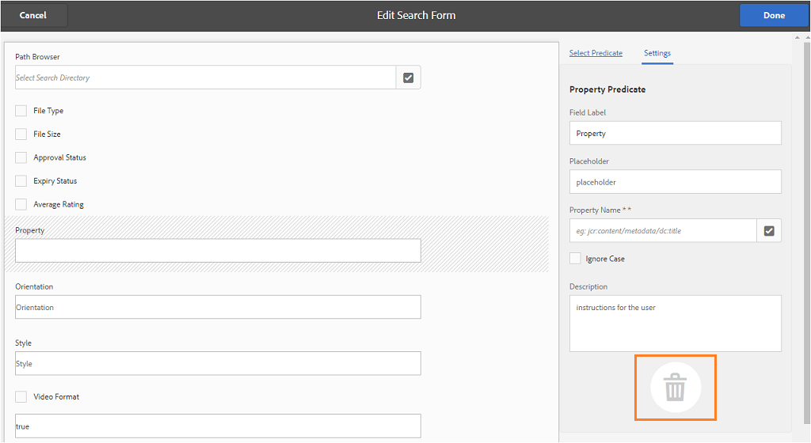

# Verwenden benutzerdefinierter Suchfacetten {#use-custom-search-facets}

Administratoren können Sucheigenschaften zum Bereich [!UICONTROL Filter] hinzufügen, um die Suche anzupassen und die Suchfunktion auf diese Weise vielseitiger zu gestalten.

Brand Portal unterstützt [Facettensuche](../using/brand-portal-searching.md#search-using-facets-in-filters-panel) für die granulare Suche nach genehmigten Marken-Assets, die aufgrund des Bedienfelds [**Filter** möglich ](../using/brand-portal-searching.md#search-using-facets-in-filters-panel). Suchfacetten sind im Bereich „Filter“ über das **[!UICONTROL Suchformular]** in den Admin-Tools verfügbar. Ein standardmäßiges Suchformular mit dem Namen Asset-Admin-Suchleiste ist auf der Seite Forms durchsuchen in den Admin Tools vorhanden. Administratoren können jedoch das Bedienfeld „Standardfilter“ anpassen. Sie können das Standardsuchformular (Asset-Admin-Suchleiste) bearbeiten, indem sie Sucheigenschaften hinzufügen, bearbeiten oder entfernen, was die Suchfunktion vielseitiger macht.

Sie können verschiedene Sucheigenschaften verwenden, um den Bereich **[!UICONTROL Filter]** anzupassen. Fügen Sie beispielsweise das Eigenschaftsprädikat hinzu, um nach Assets zu suchen, die einer einzelnen Eigenschaft entsprechen, die Sie in diesem Prädikat angeben. Fügen Sie das Optionsprädikat hinzu, um nach Assets zu suchen, die einem oder mehreren Werten entsprechen, die Sie für eine bestimmte Eigenschaft angeben. Fügen Sie das Datumsbereichsprädikat hinzu, um nach Assets zu suchen, die innerhalb eines bestimmten Datumsbereichs erstellt wurden.

>[!NOTE]
>
>In Experience Manager Assets können Unternehmen [die angepassten Suchformulare aus der AEM-Autoreninstanz](../using/publish-schema-search-facets-presets.md#publish-search-facets-to-brand-portal) in Brand Portal veröffentlichen, anstatt dieselben Formulare noch einmal in Brand Portal zu erstellen.

## Hinzufügen von Sucheigenschaften zum Bedienfeld „Filter“ {#add-a-search-predicate}

1. Klicken Sie auf das Experience Manager-Logo oben in der Symbolleiste, um auf weitere Admin-Tools zuzugreifen.

   

1. Klicken Sie im Admin-Tools-Bereich auf **[!UICONTROL Suchformulare]**.

   

1. Wählen Sie auf der Seite **[!UICONTROL Suchformulare]** die Option **[!UICONTROL Asset-Admin-Suchschiene]** aus.

   

1. Klicken Sie in der Symbolleiste oben auf **[!UICONTROL Bearbeiten]**, um das Suchformular zu öffnen und zu bearbeiten.

   

1. Ziehen Sie auf der Seite [!UICONTROL Suchformular bearbeiten] eine Eigenschaft von der Registerkarte [!UICONTROL Eigenschaft auswählen] in den Hauptbereich. Ziehen Sie beispielsweise **[!UICONTROL Eigenschaftsprädikat]**.

   Das Feld **[!UICONTROL Eigenschaft]** wird im Hauptbereich angezeigt und die Registerkarte **[!UICONTROL Einstellungen]** auf der rechten Seite zeigt die Eigenschaftsprädikate an.

   

   >[!NOTE]
   >
   >Die Kopfzeilenbeschriftung auf der Registerkarte **[!UICONTROL Einstellungen]** gibt den von Ihnen ausgewählten Eigenschaftstyp an.

1. Geben Sie auf der Registerkarte **[!UICONTROL Einstellungen]** eine Beschriftung, Platzhaltertext und eine Beschreibung für das Eigenschaftsprädikat ein.

   * Wählen Sie **[!UICONTROL Teilsuche]**, wenn Sie eine Teilphrasensuche (und Platzhaltersuche) für Assets basierend auf dem angegebenen Eigenschaftswert zulassen möchten. Das Prädikat unterstützt standardmäßig die Volltextsuche.
   * Wählen Sie **[!UICONTROL Groß-/Kleinschreibung ignorieren]**, wenn bei der auf dem Eigenschaftswert basierenden Asset-Suche nicht zwischen Groß- und Kleinschreibung unterschieden werden soll. Bei der Suche nach Eigenschaftswerten im Suchfilter wird standardmäßig zwischen Groß- und Kleinschreibung unterschieden.

   >[!NOTE]
   >
   >Wenn Sie das Kontrollkästchen **[!UICONTROL Teilsuche]** aktivieren, wird **[!UICONTROL Groß-/Kleinschreibung ignorieren]** standardmäßig aktiviert.

1. Öffnen Sie **[!UICONTROL Feld &quot;]**&quot; die Eigenschaftenauswahl und wählen Sie die Eigenschaft aus, auf deren Grundlage die Suche durchgeführt werden soll. Alternativ können Sie einen Namen für die Eigenschaft eingeben. Geben Sie beispielsweise `jcr :content/metadata/dc:title` oder `./jcr:content/metadata/dc:title` ein.

   >[!NOTE]
   >
   >In Brand Portal werden alle Zeichenfolgen-Eigenschaften (mit Ausnahme der Eigenschaften, die mit `xmp` beginnen) in `jcrcontent/metadata` von `dam:asset` standardmäßig indiziert. Alle anderen benutzerdefinierten Eigenschaften eines beliebigen Typs werden standardmäßig nicht indiziert.
   >
   >Jede indizierte Eigenschaft kann beim Erstellen eines Eigenschaftsprädikats verwendet werden. Wenn eine nicht indizierte Eigenschaft konfiguriert ist, liefert die Suchanfrage für eine nicht indizierte Eigenschaft möglicherweise kein Suchergebnis.

   

1. Klicken Sie auf **[!UICONTROL Fertig]**, um die Einstellungen zu speichern.
1. Klicken Sie in der Benutzeroberfläche von [!UICONTROL Assets] auf das Überlagerungssymbol und wählen Sie **[!UICONTROL Filter]**, um zum Bereich **[!UICONTROL Filter]** zu wechseln. Das Prädikat **[!UICONTROL Eigenschaft]** wird dem Bereich hinzugefügt.

   

1. Geben Sie in das Textfeld **[!UICONTROL Eigenschaft]** einen Titel für das Asset ein, das gesucht werden soll. Beispiel: &quot;Adobe.“ Wenn Sie eine Suche durchführen, werden Assets, deren Titel „Adobe“ entspricht, in den Suchergebnissen angezeigt.

## Liste der Sucheigenschaften {#list-of-search-predicates}

Sie können die folgenden Prädikate auf ähnliche Weise wie **[!UICONTROL Eigenschaftsprädikate]** zum Bereich **[!UICONTROL Filter]** hinzufügen:

| **Prädikatsname** | **Beschreibung** | **Eigenschaften** |
|-------|-------|----------|
| **[!UICONTROL Pfadbrowser]** | Das Suchprädikat zum Suchen von Assets an einem bestimmten Speicherort. **Hinweis:** *Für angemeldete Benutzende zeigt der Pfad-Browser im Filter nur die Inhaltsstruktur der Ordner (und deren Vorgänger) an, die für die Benutzenden freigegeben sind.*   Administratoren können nach Assets in einem beliebigen Ordner suchen, indem sie mit dem Pfadbrowser zu diesem Ordner navigieren.   Benutzer ohne Administratorrechte können Assets in einem Ordner suchen (auf den sie zugreifen können), indem sie im Pfad-Browser zu diesem Ordner navigieren. | <ul><li>Feldbezeichnung</li><li>Pfad</li><li>Beschreibung</li></ul> |
| **[!UICONTROL Eigenschaft]** | Sucht nach Assets basierend auf einer bestimmten Metadaten-Eigenschaft. **Hinweis:** *Nach Aktivierung der Teilsuche wird standardmäßig „Groß-/Kleinschreibung ignorieren“ aktiviert*. | <ul><li>Feldbezeichnung</li><li>Platzhalter</li><li>Eigenschaftsname</li><li>Teilsuche</li><li>Groß-/Kleinschreibung ignorieren</li><li> Beschreibung</li></ul> |
| **[!UICONTROL Mehrwert-Eigenschaft]** | Ähnelt einem Eigenschaftsprädikat, lässt jedoch mehrere Eingabewerte zu, die durch ein Trennzeichen getrennt sind (Standard ist ein Komma). Assets, die mit einem der Eingabewerte übereinstimmen, werden in den Ergebnissen zurückgegeben. | <ul><li>Feldbezeichnung</li><li>Platzhalter</li><li>Eigenschaftsname</li><li>Unterstützung von Trennzeichen</li><li>Groß-/Kleinschreibung ignorieren</li><li>Beschreibung</li></ul> |
| **[!UICONTROL Tags]** | Das Suchprädikat zum Suchen von Assets basierend auf Tags. Sie können die Pfadeigenschaft konfigurieren, um verschiedene Tags in der Tag-Liste zu füllen. Administratoren müssen ggf. den Pfadwert ändern, z. B. [!UICONTROL /`etc/tags/mac/<tenant_id>/<custom_tag_namespace>`]. Sie müssen das Suchformular aus AEM veröffentlichen, wobei der Pfad keine Mandanteninformationen enthält, z. B. [!UICONTROL `/etc/tags/<custom_tag_namespace>`]. | <ul><li>Feldbezeichnung</li><li>Eigenschaftsname</li><li>Pfad</li><li>Beschreibung</li></ul> |
| **[!UICONTROL Pfad]** | Das Suchprädikat zum Suchen von Assets an einem bestimmten Speicherort. | <ul><li>Feldbezeichnung</li><li>Pfad</li><li>Beschreibung</li></ul> |
| **[!UICONTROL Relatives Datum]** | Das Suchprädikat , um Assets basierend auf dem relativen Erstellungsdatum zu suchen. | <ul><li>Feldbezeichnung</li><li>Eigenschaftsname</li><li>Relatives Datum</li></ul> |
| **[!UICONTROL Bereich]** | Das Suchprädikat zum Suchen nach Assets, die innerhalb eines bestimmten Bereichs von Eigenschaftswerten liegen. Im Bereich „Filter“ können Sie den Mindest- und den Höchstwert für den Bereich angeben. | <ul><li>Feldbezeichnung</li><li>Eigenschaftsname</li><li>Beschreibung</li></ul> |
| **[!UICONTROL Datumsbereich]** | Das Suchprädikat zum Suchen von Assets, die innerhalb eines angegebenen Bereichs für eine Datumseigenschaft erstellt wurden. Im Bereich „Filter“ können Sie das Start- und das Enddatum angeben. | <ul><li>Feldbezeichnung</li><li>Platzhalter</li><li>Eigenschaftsname</li><li>Textbereich (von)</li><li>Textbereich (bis)</li><li>Beschreibung</li></ul> |
| **[!UICONTROL Datum]** | Sucheigenschaft für eine Schieberegler-basierte Suche nach Assets basierend auf einer Datumseigenschaft | <ul><li>Feldbezeichnung</li><li>Eigenschaftsname</li><li>Beschreibung</li></ul> |
| **[!UICONTROL Dateigröße]** | Das Suchprädikat , um Assets basierend auf ihrer Größe zu suchen. | <ul><li>Feldbezeichnung</li><li>Eigenschaftsname</li><li>Pfad</li><li>Beschreibung</li></ul> |
| **[!UICONTROL Asset zuletzt geändert]** | Das Suchprädikat, um Assets basierend auf dem Datum der letzten Änderung zu suchen. | <ul><li>Feldbezeichnung</li><li>Eigenschaftsname</li><li>Beschreibung</li></ul> |
| **[!UICONTROL Genehmigungsstatus]** | Das Suchprädikat, um Assets basierend auf der Genehmigungsmetadaten-Eigenschaft zu suchen. Der standardmäßige Eigenschaftsname ist **`dam:status`**. | <ul><li>Feldbezeichnung</li><li>Eigenschaftsname</li><li>Beschreibung</li></ul> |
| **[!UICONTROL Checkout-Status]** | Das Suchprädikat zum Suchen von Assets basierend auf dem Checkout-Status eines Assets zum Zeitpunkt seiner Veröffentlichung in AEM Assets. | <ul><li>Feldbezeichnung</li><li>Eigenschaftsname</li><li>Beschreibung</li></ul> |
| **[!UICONTROL Ausgecheckt von]** | Das Suchprädikat zum Suchen von Assets basierend auf dem Benutzer, der das Asset ausgecheckt hat. | <ul><li>Feldbezeichnung</li><li>Eigenschaftsname</li><li>Beschreibung</li></ul> |
| **[!UICONTROL Gültigkeitsstatus]** | Das Suchprädikat, um Assets basierend auf dem Ablaufstatus zu suchen. | <ul><li>Feldbezeichnung</li><li>Eigenschaftsname</li><li>Beschreibung</li></ul> |
| **[!UICONTROL Mitglied der Sammlung]** | Das Suchprädikat, um Assets basierend darauf zu suchen, ob ein Asset Teil einer Sammlung ist. | Beschreibung |
| **[!UICONTROL Ausgeblendet]** | Dieses Prädikat ist für die Endbenutzer nicht explizit sichtbar und wird für ausgeblendete Einschränkungen verwendet, die normalerweise dazu dienen, den Suchergebnistyp auf **`dam:Asset`** zu beschränken. | <ul><li>Feldbezeichnung</li><li>Eigenschaftsname</li><li>Beschreibung</li></ul> |

>[!NOTE]
>
>* Verwenden Sie nicht die Eigenschaften **[!UICONTROL Optionen]**, **[!UICONTROL Status veröffentlichen]** oder **[!UICONTROL Bewertung]**, da diese Eigenschaften in Brand Portal nicht funktionsfähig sind.
>* Die Ordnertyp-Eigenschaft `(nt:folder type)` wird in Brand Portal nicht unterstützt und kann Leistungsprobleme verursachen. Wenn es in einem veröffentlichten benutzerdefinierten Suchformular vorhanden ist, kann es gelöscht werden, indem das Suchformular bearbeitet wird.

## Löschen von Sucheigenschaften {#delete-a-search-predicate}

Um eine Eigenschaft zu löschen, gehen Sie folgendermaßen vor:

1. Klicken Sie auf das Adobe-Logo, um auf die Admin-Tools zuzugreifen.

   

1. Klicken Sie im Admin-Tools-Bereich auf **[!UICONTROL Suchformulare]**.

   

1. Wählen Sie auf der Seite **[!UICONTROL Suchformulare]** die Option **[!UICONTROL Asset-Admin-Suchschiene]** aus.

   

1. Klicken Sie in der Symbolleiste oben auf **[!UICONTROL Bearbeiten]**, um das Suchformular zu öffnen und zu bearbeiten.

   

1. Wählen Sie auf der Seite [!UICONTROL Suchformular bearbeiten] im Hauptbereich die Eigenschaft aus, die Sie löschen möchten. Wählen Sie beispielsweise **[!UICONTROL Eigenschaftsprädikat]**.

   Die Registerkarte **[!UICONTROL Einstellungen]** auf der rechten Seite zeigt die Eigenschaftsprädikat-Felder an.

1. Klicken Sie zum Löschen des Eigenschaftsprädikats auf das Papierkorbsymbol. Klicken Sie im Dialogfeld **[!UICONTROL Feld löschen]** auf **[!UICONTROL Löschen]**, um die Löschaktion zu bestätigen.

   Das Feld **[!UICONTROL Eigenschaftsprädikat]** wird vom Hauptbereich entfernt und die Registerkarte **[!UICONTROL Eigenschaften]** wird leer angezeigt.

   

1. Klicken Sie zum Speichern der Änderungen in der Symbolleiste auf **[!UICONTROL Fertig]**.
1. Klicken Sie in der Benutzeroberfläche von **[!UICONTROL Assets]** auf das Überlagerungssymbol und wählen Sie **[!UICONTROL Filter]**, um zum Bereich **[!UICONTROL Filter]** zu wechseln. Das Prädikat **[!UICONTROL Eigenschaft]** wurde aus dem Bereich entfernt.

   
