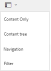

# Suchen von Assets in Brand Portal {#search-assets-on-brand-portal}

Mit der Suchfunktion von Brand Portal können Sie mithilfe von Omnisearch schnell nach relevanten Assets suchen. Die Facettensuche verwendet Filter, um die Suche weiter einzugrenzen. Sie können Elemente auf Dateien- oder Ordnerebene suchen und Ihre Suchergebnisse als Smart-Sammlungen speichern.

>[!NOTE]
>
>Brand Portal unterstützt keine Sammlungssuche mit Omnisearch.
>
>Sie können jedoch [Suchfilter zum Abrufen der Liste relevanter Sammlungen](#search-collection) verwenden.

## Suchen von Assets mithilfe von Omnisearch {#search-assets-using-omnisearch}

Gehen Sie wie folgt vor, um in Brand Portal nach Assets zu suchen:

1. Klicken Sie in der Symbolleiste auf das Symbol **[!UICONTROL Suchen]** oder drücken Sie die Taste **[!UICONTROL /]** (Schrägstrich), um Omnisearch zu starten.

   

1. Geben Sie in das Suchfeld einen Suchbegriff für die Assets ein, die Sie suchen möchten.

   

   >[!NOTE]
   >
   >* In Omnisearch sind mindestens 3 Zeichen erforderlich, damit Suchvorschläge angezeigt werden.
   >* Wenn Sie nach `mountain biking` suchen, gibt Omnisearch alle Assets in den Suchergebnissen zurück, für die sowohl `mountain` als auch `biking` in den Metadatenfeldern verfügbar sind. Zum Beispiel `mountain` im Feld `Title` und `biking` im Feld `Description`. Beide Begriffe müssen in den Metadatenfeldern verfügbar sein, damit sie in den Suchergebnissen angezeigt werden können. Omnisearch gibt jedoch das Asset in den Suchergebnissen zurück, selbst wenn im Metadatenfeld Smart-Tags nur einer der beiden Begriffe verfügbar ist. Angenommen, ein Asset hat `mountain` als Smart-Tag, aber nicht `biking` in einem anderen Metadatenfeld. Dann suchen Sie nach `mountain biking`. Omnisearch gibt das Asset weiterhin in den Suchergebnissen zurück. Dieser Workflow stellt sicher, dass Assets mit relevanten Tags nicht fehlen.

1. Wählen Sie aus den entsprechenden Vorschlägen aus, die in der Dropdownliste angezeigt werden, um schnell auf relevante Assets zuzugreifen.

   

   *Asset-Suche mit Omnisearch*

Weitere Informationen zum Suchverhalten bei mit Smart-Tags versehenen Assets finden Sie unter [Suchergebnisse und -verhalten verstehen](https://experienceleague.adobe.com/de/docs/experience-manager-65/content/assets/using/search-assets).

## Suche mithilfe von Facetten im Bereich „Filter“ {#search-using-facets-in-filters-panel}

Suchfacetten im Bereich &quot;Filter&quot;fügen Granularität zu Ihrem Sucherlebnis hinzu und machen die Suchfunktion effizienter. Suchfacetten verwenden mehrere Dimensionen (Prädikate), mit denen Sie komplexe Suchvorgänge durchführen können. Sie können für eine zielgerichtetere Suche einfach einen Drilldown zur gewünschten Detailtiefe durchführen.

Wenn Sie beispielsweise nach einem Bild suchen, können Sie auswählen, ob Sie ein Bitmap- oder ein Vektorbild möchten. Sie können den Suchbereich weiter eingrenzen, indem Sie in der Suchfacette Dateityp den MIME-Typ des Bildes angeben. Wenn Sie nach Dokumenten suchen, können Sie auf ähnliche Weise das gewünschte Format festlegen, zum Beispiel PDF oder MS® Word.

Der Bereich **[!UICONTROL Filter]** enthält einige Standardfacetten, wie z. B. **[!UICONTROL Pfadbrowser]**, **[!UICONTROL Dateityp]**, **[!UICONTROL Dateigröße]**, **[!UICONTROL Status]** und **[!UICONTROL Ausrichtung]**.
Sie können jedoch [benutzerdefinierte Suchfacetten hinzufügen](../using/brand-portal-search-facets.md) oder bestimmte aus dem Bedienfeld **[!UICONTROL Filter]** entfernen. Bearbeiten Sie einfach die Eigenschaften im zugrunde liegenden Suchformular. Siehe die Liste aller verfügbaren und verwendbaren [Suchprädikate in Brand Portal](../using/brand-portal-search-facets.md#list-of-search-predicates).

So können Sie mit den verfügbaren [Suchfacetten](../using/brand-portal-search-facets.md) die Filter auf Ihre Suche anwenden:

1. Klicken Sie auf das Symbol „Überlagerung“ und wählen Sie **[!UICONTROL Filter]**.

   

1. Wählen Sie im Bereich **[!UICONTROL Filter]** auf der linken Seite die entsprechenden Optionen aus, um die relevanten Filter anzuwenden.
Verwenden Sie beispielsweise die folgenden Standardfilter:

   * Nutzen Sie den **[!UICONTROL Pfadbrowser]** um Assets in einem bestimmten Verzeichnis zu suchen. Der Standardsuchpfad der Eigenschaft für den Pfadbrowser ist `/content/dam/mac/<tenant-id>/`, der durch Bearbeiten des Standardsuchformulars konfiguriert werden kann.

   >[!NOTE]
   >
   >Für Benutzer ohne Administratorrechte zeigt der [!UICONTROL Pfadbrowser] im Bedienfeld [!UICONTROL Filter] nur die Inhaltsstruktur der Ordner (und der Vorgängerordner) an, die für sie freigegeben sind.\
   >Administratoren können über den Pfadbrowser zu einem beliebigen Ordner in Brand Portal navigieren.

   * **[!UICONTROL Dateityp]**, um den Typ (Bild, Dokument, Multimedia, Archiv) der gesuchten Asset-Datei anzugeben. Darüber hinaus können Sie den Umfang Ihrer Suche einschränken. Geben Sie zum Beispiel den MIME-Typ (TIFF, Bitmap, GIMP-Bilder) für Bilder oder das Format (PDF oder MS® Word) für die Dokumente an.
   * **[!UICONTROL Dateigröße]**, um nach Assets basierend auf ihrer Größe zu suchen. Sie können die untere und obere Grenze für den Größenbereich ausgeben, um Ihre Suche einzuschränken und die Maßeinheit für die Suche anzugeben.
   * **[!UICONTROL Status]**, um basierend auf dem Asset-Status, z. B. Genehmigung (Genehmigt, Änderung angefordert, Abgelehnt, Ausstehend) und Ablauf, nach Assets zu suchen.
   * **[!UICONTROL Durchschnittliche Bewertung]**, um nach Assets, basierend auf ihrer Bewertung, zu suchen.
   * **[!UICONTROL Ausrichtung]**, um nach Assets, basierend auf ihrer Ausrichtung (horizontal, vertikal, quadratisch), zu suchen.
   * **[!UICONTROL Stil]**, um basierend auf dem Stil (farbig, einfarbig) der Assets nach Assets zu suchen.
   * **[!UICONTROL Videoformat]**, um basierend auf dem Format von Video-Assets (DVI, Flash, MPEG4, MPEG, OGG Theora, QuickTime, Windows Media, WebM) nach Video-Assets zu suchen.

   Sie können im Bedienfeld „Filter“ [benutzerdefinierte Suchfacetten](../using/brand-portal-search-facets.md) verwenden, indem Sie das zugrunde liegende Suchformular bearbeiten.

   * **[!UICONTROL Eigenschaftsprädikat]** können Sie bei Verwendung im Suchformular nach Assets suchen, die mit einer Metadateneigenschaft übereinstimmen, der das Prädikat zugeordnet ist.\
     Wenn beispielsweise das Eigenschaftsprädikat `jcr:content/metadata/dc:title` zugeordnet ist, können Sie Assets auf Grundlage ihres Titels suchen.\
     Das [!UICONTROL Eigenschaftsprädikat] unterstützt die Textsuche nach Folgendem:

     **Teilausdrücke**
Um die Asset-Suche mit Teilsätzen im Eigenschaftsprädikat zu ermöglichen, aktivieren Sie das Kontrollkästchen **[!UICONTROL Teilsuche]** im Suchformular. Mit dieser Methode können Sie nach den gewünschten Assets suchen, selbst wenn Sie nicht die genauen Wörter oder Ausdrücke angeben, die in den Asset-Metadaten verwendet werden.

     >[!NOTE]
     >
     > Brand Portal unterstützt die folgenden Felder für die Teilsuche:
     >
     >* `jcr:content/metadata/dc:title`
     >* `jcr:content/jcr:title`
     >* `jcr:content/metadata/dc:format`

     Sie haben folgende Möglichkeiten:
      * Geben Sie im Bedienfeld Filter ein Wort an, das im gesuchten Satz in der Facette vorkommt. Wenn Sie beispielsweise nach dem Begriff **klettern** suchen (und das Eigenschaftsprädikat der Eigenschaft `dc:title` zugeordnet ist), werden alle Assets mit dem Wort **klettern** in ihrer Titelphrase zurückgegeben.
      * Geben Sie einen Teil des Wortes an, das im gesuchten Satz vorkommt, sowie ein Platzhalterzeichen (&#42;), um die Lücken zu füllen.
Zum Beispiel gibt die Suche nach:
         * **klettern&#42;** alle Elemente zurück, deren Titelphrase Wörter enthält, die mit der Zeichenfolge „klettern“ beginnen.
         * **&#42;klettern** gibt alle Elemente zurück, deren Titelphrase Wörter enthält, die mit den Zeichen „klettern“ enden.
         * **&#42;klettern&#42;** gibt alle Elemente zurück, deren Titelphrase Wörter enthält, die die Zeichenfolge „klettern“ enthalten.

     **Text, der nicht zwischen Groß- und Kleinschreibung unterscheidet**
Sie können die Suche in der Eigenschaftsprädikat zulassen, bei der nicht zwischen Groß- und Kleinschreibung unterschieden wird. Aktivieren Sie einfach das Kontrollkästchen **[!UICONTROL Groß-/Kleinschreibung ignorieren]** im Suchformular. Bei der Textsuche im Eigenschaftsprädikat wird standardmäßig zwischen Groß- und Kleinschreibung unterschieden.

   >[!NOTE]
   >
   >Wenn Sie das Kontrollkästchen **[!UICONTROL Teilsuche]** aktivieren, wird standardmäßig **[!UICONTROL Groß-/Kleinschreibung ignorieren]** ausgewählt.

   

   Die Suchergebnisse werden entsprechend den angewendeten Filtern zusammen mit der Anzahl der Suchergebnisse angezeigt.

   

   Asset-Suchergebnis mit Zählung der Suchergebnisse.

1. Sie können einfach zu einem Element in den Suchergebnissen navigieren und mit der Schaltfläche „Zurück“ in Ihrem Browser zum selben Suchergebnis zurückkehren, ohne die Suchabfrage erneut starten zu müssen.

## Suchen als Smart-Sammlung speichern {#save-your-searches-as-smart-collection}

Sie können die Sucheinstellungen als Smart-Sammlung speichern, um dieselbe Suche schnell wiederholen zu können, ohne dieselben Einstellungen später wiederholen zu müssen. Sie können jedoch keine Suchfilter in einer Sammlung anwenden.

So speichern Sie die Sucheinstellungen als Smart-Sammlung:

1. Klicken Sie auf **[!UICONTROL Smart-Sammlung speichern]** und geben Sie einen Namen für die Smart-Sammlung ein.

   Damit die Smart-Sammlung von allen Benutzern verwendet werden kann, aktivieren Sie die Option **[!UICONTROL Öffentlich]**. Eine Meldung bestätigt, dass die Smart-Sammlung erstellt und zur Liste der gespeicherten Suchen hinzugefügt wurde.

   >[!NOTE]
   >
   >Sie können Benutzer ohne Administratorrechte daran hindern, Smart-Sammlungen öffentlich zu machen, um zu verhindern, dass Benutzer ohne Administratorrechte eine große Anzahl öffentlicher Smart-Sammlungen in der Brand Portal des Unternehmens erstellen. Unternehmen können die Konfiguration **[!UICONTROL Erstellung öffentlicher Smart-Sammlungen zulassen]** in den Einstellungen **[!UICONTROL Allgemein]** im Admin Tools-Bereich deaktivieren.

   

1. Um die Smart-Sammlung unter einem anderen Namen zu speichern, aktivieren oder deaktivieren Sie das Kontrollkästchen **[!UICONTROL Öffentlich]** und klicken Sie auf **[!UICONTROL Smart-Sammlung bearbeiten]**.

   

1. Wählen Sie im Dialogfeld **[!UICONTROL Smart-Sammlung bearbeiten]** die Option **[!UICONTROL Speichern unter]** aus und geben Sie einen Namen für die Smart-Sammlung ein. Klicken Sie auf **[!UICONTROL Speichern]**.

   

## Suchsammlung {#search-collection}

Omnisearch wird für Sammlungen nicht unterstützt. Sie können jedoch Suchfilter anwenden, um die relevanten Sammlungen aus der Oberfläche [!UICONTROL Sammlungen] aufzulisten.

Klicken Sie in der Oberfläche [!UICONTROL Sammlungen] auf das Überlagerungssymbol, um den Filterbereich in der linken Leiste zu öffnen. Wenden Sie einzelne oder mehrere Suchfilter aus den verfügbaren Filtern an (`modified date`, `access type` und `tags`). Es wird der relevanteste Satz von Sammlungen basierend auf den angewendeten Filtern aufgelistet.

