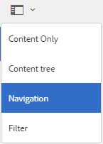

# Sammlungen auf Markenportal freigeben {#share-collections-bp}

AEM Assets Brand Portal-Administratoren können Sammlungen oder Smart-Sammlungen für autorisierte Benutzer freigeben oder deren Freigabe aufheben. Bearbeiter können nur die Sammlungen anzeigen und freigeben, die sie selbst erstellt haben, die für sie freigegeben wurden oder die als „Öffentlich“ festgelegt sind. Bearbeiter können jedoch eine öffentliche Sammlung nicht in eine nicht öffentliche Sammlung ändern.

>[!NOTE]
>
>Editors cannot change a public collection to a non-public collection and, therefore, do not have **Public Collection** check box available in **Collection Settings** dialog.

## Freigeben von Sammlungen {#share-collection}

Gehen Sie wie folgt vor, um eine Sammlung freizugeben:

1. Klicken Sie links auf das Überlagerungssymbol und wählen Sie dann **Navigation**.

   

1. From the siderail on the left, click **Collections**.

   

1. Führen Sie in der Konsole **Sammlungen** einen der folgenden Schritte aus:

   * Bewegen Sie den Mauszeiger über die Sammlung, die Sie freigeben möchten. Klicken Sie in den verfügbaren Schnellzugriff-Miniaturansichten der Sammlung auf das Symbol **Einstellungen**.
   

   * Wählen Sie die Sammlung aus, die Sie freigeben möchten. From the toolbar at the top, click **Settings**.
   

1. In the **Collection Settings** dialog box, select the users or groups with whom you want to share the collection and select the role for a user or a group to match their global role. Weisen Sie zum Beispiel die Rolle „Bearbeiter“ einem globalen Bearbeiter und die Rolle „Betrachter“ einem globalen Betrachter zu.

   Alternatively, to make the collection available to all users irrespective of their group membership and role, make it public by selecting the **Public Collection** check box.

   >[!NOTE]
   >
   >Sie können festlegen, dass Nicht-Administrator-Benutzer Sammlungen nicht als „Öffentlich“ festlegen können, um zu verhindern, dass eine große Anzahl öffentlicher Sammlungen erstellt wird. Auf diese Weise wird Systemspeicherplatz eingespart. Organizations can disable the **Allow public collections creation** configuration from **General** settings available in admin tools panel.

   

   Editors cannot change a public collection to a non-public collection and, therefore, do not have **Public Collection** check box available in **Collection Settings** dialog.

   

1. Click **Add**, and then **Save**. Die Sammlung wird für die ausgewählten Benutzer freigegeben.

   >[!NOTE]
   >
   >Die Rolle der Benutzer legt fest, welchen Zugriff sie auf die Assets und Ordner in der Sammlung erhalten. Wenn ein Benutzer keinen Zugriff auf Assets hat, wird eine leere Sammlung für den Benutzer freigegeben. Die Rolle der Benutzer legt außerdem fest, welche Aktionen ihnen für die Sammlung zur Verfügung stehen.

## Freigabe von Sammlungen aufheben {#unshare-a-collection}

Gehen Sie wie folgt vor, um die Freigabe einer zuvor freigegebenen Sammlung aufzuheben:

1. Wählen Sie in der Konsole **Sammlungen** die Sammlung aus, deren Freigabe Sie aufheben möchten.

   In the toolbar, click **Settings**.

   

1. On the **Collection Settings** dialog box, under **Members**, click the **x** symbol next to users or groups to remove them from the list of users you shared the collection with.

   

1. Klicken Sie in der Warnmeldung auf **Bestätigen**, um das Aufheben der Freigabe zu bestätigen.

   Klicken Sie auf **Speichern**.

1. Melden Sie sich bei Brand Portal mit den Anmeldeinformationen des Benutzers an, den Sie aus der freigegebenen Liste entfernt haben. Die Sammlung wird aus der Konsole **Sammlungen** entfernt.
