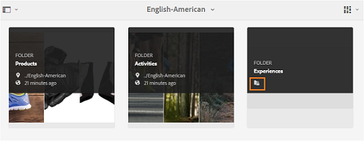
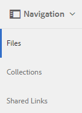

# Freigeben von Ordnern in Brand Portal {#share-folders}

Assets müssen in Brand Portal aus einer vorkonfigurierten Experience Manager-Autoreninstanz veröffentlicht werden, da Brand Portal die Asset-Erfassung nicht unterstützt.

## Workflow zur Ordnerfreigabe in Brand Portal {#folder-sharing-workflow-in-brand-portal}

Nachfolgend werden der Ordnerfreigabe-Workflow und der Benutzerzugriff beschrieben:

* Standardmäßig werden alle aus Experience Manager Assets in Brand Portal veröffentlichten Ordner nur für den Brand Portal-Administrator angezeigt, wenn sie bei der Konfiguration der Replikation nicht als „Öffentlich“ gekennzeichnet sind.
* Der Administrator nutzt die Konsole **[!UICONTROL Ordnereigenschaften]**, um einen Ordner für ausgewählte Benutzer oder Gruppen freizugeben. Nur Benutzer oder Gruppen, für die der Ordner freigegeben ist, können den Ordner sehen, nachdem sie sich bei Brand Portal angemeldet haben. Der Ordner ist für andere Benutzer nicht sichtbar.
* Der Administrator kann auch festlegen, dass ein Ordner öffentlich zugänglich gemacht wird, und zwar durch das Kontrollkästchen **[!UICONTROL Öffentlicher Ordner]** in den **[!UICONTROL Ordnereigenschaften]**. Ein öffentlicher Ordner ist für alle Benutzer sichtbar.

* Unabhängig von Benutzerrollen und -berechtigungen sehen Benutzerinnen und Benutzer bei der Anmeldung bei Brand Portal alle öffentlichen Ordner und die Ordner, die direkt für sie oder für eine Gruppe, zu der sie gehören, freigegeben sind. Private Ordner oder Ordner, die für andere Benutzer freigegeben sind, sind nicht für alle Benutzer sichtbar.

### Freigeben von Ordnern für Benutzergruppen in Brand Portal {#sharing-folders-with-user-groups-on-brand-portal}

Die Zugriffsrechte für die Assets eines Ordners hängen von den Zugriffsrechten für den jeweiligen übergeordneten Ordner ab, unabhängig von den Einstellungen der untergeordneten Ordner. [ACLs](https://experienceleague.adobe.com/en/docs/experience-manager-65/content/security/security) in AEM steuern dieses Verhalten, wobei untergeordnete Ordner die ACLs von den jeweiligen übergeordneten Ordnern erben. Angenommen, Ordner A enthält Ordner B, der Ordner C enthält. Dann hat eine Benutzergruppe (oder Benutzer) mit Zugriffsrechten für Ordner A dieselben Zugriffsrechte für Ordner B und Ordner C. Ordner B ist der untergeordnete Ordner von A und Ordner C erbt seine ACLs, und Ordner C ist der untergeordnete Ordner von B und erbt seine ACLs.

Ebenso haben Benutzergruppen (oder Benutzer) mit Zugriffsberechtigungen nur für Ordner B die gleichen Zugriffsberechtigungen für Ordner C, aber nicht für Ordner A. Adobe empfiehlt, Inhalte so zu organisieren, dass die am häufigsten angezeigten Assets in untergeordneten Ordnern platziert werden, sodass der Zugriff von den untergeordneten Ordnern bis zum Stammordner beschränkt werden kann.

### Veröffentlichen von öffentlichen Ordnern {#public-folder-publish}

Benutzende ohne Administratorrechte (z. B. Bearbeiter und Betrachter) können nur dann auf Assets zugreifen, die aus AEM Assets in Brand Portal veröffentlicht wurden, wenn **[!UICONTROL Option „Öffentlicher Ordner Publish]** während der Brand Portal-Replikationskonfiguration aktiviert wurde.

Wenn die Option **[!UICONTROL Öffentlichen Ordner - Publish]** deaktiviert ist, müssen Administratoren diese Assets mithilfe der Freigabefunktion speziell für Benutzende ohne Administratorrechte freigeben.

>[!NOTE]
>
>Die Option **[!UICONTROL Veröffentlichung eines öffentlichen Ordners]** ist ab AEM-Version 6.3.2.1 verfügbar.

## Zugriff auf freigegebene Ordner {#access-to-shared-folders}

In der folgenden Matrix werden die Zugriffsrechte und Rechte zum Freigeben oder Aufheben der Freigabe von Assets für verschiedene Benutzerrollen erläutert:

|               | Zugriff auf alle Ordner, die aus AEM Assets in Brand Portal veröffentlicht wurden | Zugriff auf freigegebene Ordner | Freigeben oder Aufheben der Freigabe von Ordnerrechten |
|---------------|-----------|-----------|------------|
| Administrator | Ja | Ja | Ja |
| Bearbeiter | Nein* | Ja, nur wenn für sie oder für die Gruppe, zu der sie gehören, freigegeben. | Ja, nur für die Ordner, die für die Benutzer oder deren Gruppe freigegeben wurden |
| Betrachter | Nein* | Ja, nur wenn für sie oder für die Gruppe, zu der sie gehören, freigegeben. | Nein |
| Gastbenutzer | Nein* | Ja, nur wenn für sie oder für die Gruppe, zu der sie gehören, freigegeben. | Nein |

>[!NOTE]
>
>Standardmäßig ist die Option **[!UICONTROL Öffentlichen Ordner veröffentlichen]** bei der Konfiguration der Replikation von Brand Portal mit der AEM-Autoreninstanz deaktiviert. Wenn die Option aktiviert ist, sind die in Brand Portal veröffentlichten Ordner standardmäßig allen Benutzenden (auch Benutzern ohne Administratorrechte) zugänglich.

### Zugriff von Benutzern ohne Administratorrechte auf freigegebene Ordner {#non-admin-user-access-to-shared-folders}

Benutzer ohne Administratorrechte können nur auf die Ordner zugreifen, die in Brand Portal für sie freigegeben sind. Wie diese Ordner jedoch beim Anmelden im Portal angezeigt werden, hängt von den Einstellungen der Konfiguration **[!UICONTROL Ordnerhierarchie aktivieren]** ab.

**Wenn die Konfiguration deaktiviert ist**

Benutzer ohne Administratorrechte können alle für sie freigegebenen Ordner auf der Landingpage sehen, wenn sie sich bei der Brand Portal anmelden.

**Wenn die Konfiguration aktiviert ist**

Benutzer ohne Administratorrechte sehen die Ordnerstruktur (beginnend mit dem Stammordner) und die freigegebenen Ordner, die in ihren jeweiligen übergeordneten Ordnern angeordnet sind, wenn sie sich bei der Brand Portal anmelden.

Diese übergeordneten Ordner sind virtuelle Ordner, für die keine Aktionen ausgeführt werden können. Sie können diese virtuellen Ordner an einem Sperrsymbol erkennen.

Im Gegensatz zu freigegebenen Ordnern sind keine Aktionsaufgaben zu sehen, wenn Sie den Mauszeiger auf die Ordner bewegen oder sie in der **[!UICONTROL Kartenansicht]** auswählen. Die Schaltfläche **[!UICONTROL Überblick]** wird bei der Auswahl eines virtuellen Ordners in **[!UICONTROL Spaltenansicht]** und **[!UICONTROL Listenansicht]** angezeigt.

>[!NOTE]
>
>Beachten Sie, dass das Standardminiaturbild der virtuellen Ordner das Miniaturbild des ersten freigegebenen Ordners ist.

   

## Freigeben von Ordnern {#how-to-share-folders}

Führen Sie folgende Schritte aus, um einen Ordner in Brand Portal für Benutzer freizugeben:

1. Klicken Sie links auf das Überlagerungssymbol und wählen Sie dann **[!UICONTROL Navigation]**.

   

1. Wählen Sie in der Seitenleiste auf der linken Seite die Option **[!UICONTROL Dateien]**.

   

1. Wählen Sie in der Brand Portal-Benutzeroberfläche den Ordner aus, den Sie freigeben möchten.

   

1. Klicken Sie oben in der Symbolleiste auf **[!UICONTROL Freigeben]**.

   

   Die [!UICONTROL Ordnereigenschaften] wird angezeigt.

   

1. Geben **[!UICONTROL in der]** „Ordnereigenschaften“ den Ordnertitel im Feld **[!UICONTROL Ordnertitel]** an, wenn den Benutzern der Standardname nicht angezeigt werden soll.
1. Wählen Sie aus der Liste **[!UICONTROL Benutzer hinzufügen]** den Benutzer oder die Gruppe aus, für den/die Sie den Ordner freigeben möchten, und klicken Sie auf **[!UICONTROL Hinzufügen]**.
Um den Ordner nur für Gastbenutzer und keine anderen Benutzer freizugeben, wählen Sie **[!UICONTROL Anonyme Benutzer]** aus dem Dropdown-Menü **[!UICONTROL Mitglieder]**.

   

   >[!NOTE]
   >
   >Um den Ordner allen Benutzern unabhängig von ihrer Gruppenzugehörigkeit und -rolle zur Verfügung zu stellen, machen Sie ihn öffentlich, indem Sie das Kontrollkästchen **[!UICONTROL Öffentlicher Ordner]** aktivieren.

1. Klicken Sie, falls nötig, auf **[!UICONTROL Miniatur ändern]**, um das Miniaturbild für den Ordner zu ändern.
1. Klicken Sie auf **[!UICONTROL Speichern]**.

1. Um auf den freigegebenen Ordner zuzugreifen, melden Sie sich bei Brand Portal mit den Anmeldeinformationen des Benutzers an, für den Sie den Ordner freigegeben haben. Überprüfen Sie den freigegebenen Ordner in der Benutzeroberfläche.

## Aufheben der Freigabe von Ordnern {#unshare-the-folders}

Gehen Sie wie folgt vor, um die vormalige Freigabe eines Ordners aufzuheben:

1. Wählen Sie in der Brand Portal-Benutzeroberfläche den Ordner aus, dessen Freigabe Sie aufheben möchten.

   

1. Klicken Sie oben in der Symbolleiste auf **[!UICONTROL Freigeben]**.
1. Klicken Sie in der Konsole **[!UICONTROL Ordnereigenschaften]** unter **[!UICONTROL Mitglieder]** auf das **[!UICONTROL x]**-Symbol neben einem Benutzer um diesen aus der Liste der Benutzer zu entfernen, für die Sie den Ordner freigegeben haben.

   

1. Klicken Sie in der Warnmeldung auf **[!UICONTROL Bestätigen]**, um das Aufheben der Freigabe zu bestätigen.
Klicken Sie auf **[!UICONTROL Speichern]**.

1. Melden Sie sich bei Brand Portal mit den Anmeldeinformationen des Benutzers an, den Sie aus der freigegebenen Liste entfernt haben. Der Ordner ist in der Brand Portal-Oberfläche für den Benutzer nicht mehr verfügbar.
