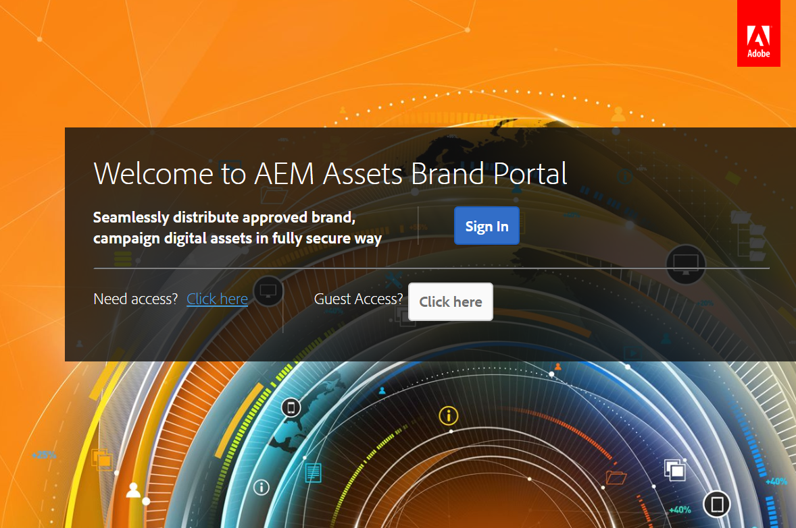

# Überblick über Experience Manager Assets Brand Portal {#overview-of-aem-assets-brand-portal}

Als Marketing-Experte müssen Sie manchmal mit Channel-Partnern und internen Geschäftsbenutzern zusammenarbeiten, um relevante digitale Inhalte für Kunden zu erstellen, zu verwalten und schnell bereitzustellen. Die zeitnahe Bereitstellung relevanter Inhalte für die gesamte Customer Journey ist ein wichtiger Faktor für Nachfragegenerierung, Konversionen, Interaktionen und Kundenloyalität.

Die Entwicklung von Lösungen, die die effiziente und sichere Freigabe von Dingen wie genehmigten Markenlogos, Kampagnen-Assets oder Produkt-Shots mit Teams, Partnern und Wiederverkäufern unterstützen, stellt jedoch eine Herausforderung dar. Um in diesem Prozess sowohl Effizienz als auch Sicherheit zu gewährleisten, ist eine sorgfältige Planung und Ausführung erforderlich.

**Adobe Experience Manager (AEM) Assets Brand Portal** konzentriert sich auf die Notwendigkeit der Zusammenarbeit des Marketing-Experten mit den global verteilten Brand Portal-Benutzern durch die Bereitstellung von Funktionen zur Asset-Verteilung und zum Asset-Beitrag.

Mit der Asset-Verteilung können Sie genehmigte Kreativ-Assets abrufen, kontrollieren und sicher und geräteübergreifend an externe Parteien und interne Geschäftsbenutzer verteilen. Der Asset-Beitrag ermöglicht es den Brand Portal-Benutzenden jedoch, Assets in Brand Portal hochzuladen und in Experience Manager Assets zu veröffentlichen, ohne Zugriff auf die Autorenumgebung zu benötigen. Die Beitragsfunktion wird als **Asset-Beschaffung in Brand Portal** bezeichnet. Zusammengenommen verbessert sie die gesamte Brand Portal-Erfahrung bei der Verteilung von Assets und den Beiträgen der Brand Portal-Benutzer (externen Agenturen/Teams), beschleunigt die Markteinführung von Assets und verringert das Risiko von Nichteinhaltung und unbefugtem Zugriff.
Siehe [Asset-Beschaffung in Brand Portal](brand-portal-asset-sourcing.md).

Die browserbasierte Portalumgebung ermöglicht das einfache Hochladen, Durchsuchen, Suchen, Anzeigen einer Vorschau und Exportieren von Assets in genehmigten Formaten.

## Konfigurieren von Experience Manager Assets mit Brand Portal {#configure-brand-portal}

Die Konfiguration von Adobe Experience Manager Assets mit Brand Portal bietet Benutzern von Brand Portal Funktionen zur Asset-Veröffentlichung, Asset-Verteilung und Mitarbeit an Assets.

>[!NOTE]
>
>Die Konfiguration von Experience Manager Assets mit Brand Portal wird von Experience Manager Assets as a Cloud Service sowie Experience Manager Assets 6.3 und höher unterstützt.

>[!IMPORTANT]
>
> * Brand Portal befindet sich im Wartungsmodus. Alle neuen Produktinnovationen sind auf [Content Hub](https://experienceleague.adobe.com/de/docs/experience-manager-cloud-service/content/assets/content-hub/product-overview) verfügbar.
> * Wenn Sie Brand Portal noch aktivieren müssen, wenden Sie sich mit Details zu Ihrem Anwendungsfall und anderen spezifischen Anforderungen an Ihren Adobe-Support-Mitarbeiter.
> * Brand Portal ist nicht verfügbar mit [Assets Prime](https://experienceleague.adobe.com/en/docs/experience-manager-cloud-service/content/assets/assets-prime) oder [Assets Ultimate](https://experienceleague.adobe.com/de/docs/experience-manager-cloud-service/content/assets/assets-ultimate-overview). Bestehende Assets as a Cloud Service-Kunden, die bereits Zugriff auf Brand Portal haben, können diese jedoch auch weiterhin verwenden, wenn sie zu Assets Ultimate wechseln.

<!--Experience Manager Assets as a Cloud Service is automatically configured with Brand Portal by activating Brand Portal from the Cloud Manager. The activation workflow creates the required configurations at the backend and activates Brand Portal on the same IMS org as of the Experience Manager Assets as a Cloud Service instance.-->

Experience Manager Assets (On-Premise und Managed Service) wird jedoch manuell mit Brand Portal mithilfe von Adobe Developer Console konfiguriert, wodurch ein Adobe Identity Management Services (IMS)-Token zur Autorisierung des Brand Portal-Mandanten abgerufen wird.

Weitere Informationen finden Sie unter [Konfigurieren von Experience Manager Assets mit Brand Portal](../using/configure-aem-assets-with-brand-portal.md).

## Benutzerrollen in Brand Portal {#Personas}

Brand Portal unterstützt die folgenden Benutzerrollen:

* Gastbenutzer
* Betrachter
* Bearbeiter
* Administrator

Die folgende Tabelle enthält die Aufgaben, die Benutzer mit diesen Rollen ausführen können:

|  | **Durchsuchen** | **Suchen** | **Download** | **Freigeben von Ordnern** | **Freigeben von Sammlungen** | **Freigeben von Assets als Link** | **Zugriff auf Admin-Tools** |
|--- |--- |--- |--- |--- |--- |--- |--- |
| **Gastbenutzer** | ✓* | ✓* | ✓* | x | x | x | x |
| **Betrachter** | ✓ | ✓ | ✓ | x | x | x | x |
| **Bearbeiter** | ✓ | ✓ | ✓ | ✓ | ✓ | ✓ | x |
| **Administrator** | ✓ | ✓ | ✓ | ✓ | ✓ | ✓ | ✓ |

>[!NOTE]
>
>Gastbenutzer können nur Assets durchsuchen, auf Assets zugreifen oder nach Assets suchen, die sich in öffentlichen Ordnern und Sammlungen befinden.

<!--
&#42; Viewer users can access and download the public assets shared with them, and can add these assets to create their own collections.

>[!NOTE]
>
>There is a known issue that the share link for collections is currently visible to the viewer users. The viewer users does not have the privilege to add users to create a share link. This issue will be fixed in the upcoming release, the option to share link for the collections will not be available to the viewer users.
-->

### Gastbenutzer {#guest-user}

Experience Manager Assets Brand Portal ermöglicht den [Gastzugang](#request-access-to-brand-portal) zu Brand Portal. Ein Gastbenutzer benötigt keine Anmeldeinformationen, um das Portal aufzurufen, und hat Zugriff auf die öffentlichen Ordner (und Sammlungen). Als Gastbenutzer können Sie Asset-Details durchsuchen und eine vollständige Asset-Ansicht von Mitgliedern öffentlicher Ordner und Sammlungen anzeigen. Sie können öffentliche Assets suchen, herunterladen und zur Sammlung [!UICONTROL Lightbox] hinzufügen.

Die Gastsitzung verhindert jedoch, dass Sammlungen und gespeicherte Suchen erstellt werden, und gibt sie weiter frei. Benutzende in einer Gastsitzung können nicht auf Einstellungen für Ordner und Sammlungen zugreifen und keine Assets als Link freigeben. Diese Aufgaben kann ein Gastbenutzer ausführen:

* [Öffentliche Assets durchsuchen und darauf zugreifen](browse-assets-brand-portal.md)

* [Nach öffentlichen Assets suchen](brand-portal-searching.md)

* [Öffentliche Assets herunterladen](brand-portal-download-assets.md)

* [Assets zu [!UICONTROL Lightbox] hinzufügen](brand-portal-light-box.md#add-assets-to-lightbox)

Weitere Informationen finden Sie unter [Gastzugang zu Brand Portal](../using/guest-access.md).

### Betrachter {#viewer}

In der [!DNL Admin Console] definierter Brand Portal-Benutzer, der Zugriff auf Brand Portal mit der Rolle „Betrachter“ hat. Ein Benutzer mit dieser Rolle kann sich bei Brand Portal anmelden und auf zulässige Ordner, Sammlungen und Assets zugreifen. Der Benutzer kann außerdem Assets durchsuchen, als Vorschau anzeigen, herunterladen und exportieren (ursprüngliche oder bestimmte Ausgabedarstellungen), Kontoeinstellungen konfigurieren sowie Assets suchen. Diese Aufgaben kann eine Person mit der Rolle „Betrachter“ ausführen:

* [Durchsuchen von Assets](browse-assets-brand-portal.md)

* [Suchen nach Assets](brand-portal-searching.md)

* [Herunterladen von Assets](brand-portal-download-assets.md)

### Bearbeiter {#editor}

Benutzende mit der Rolle „Bearbeiter“ können alle Aufgaben ausführen, die der Rolle „Betrachter“ zur Verfügung stehen. Darüber hinaus kann ein Editor die Dateien und Ordner anzeigen, die ein Administrator freigibt. Benutzende mit der Rolle „Bearbeiter“ können außerdem Inhalte (Dateien, Ordner und Sammlungen) für andere Benutzende freigeben.

Neben den Aufgaben, die ein Betrachter ausführen kann, stehen dem Bearbeiter folgende Aufgaben zur Verfügung:

* [Freigeben von Ordnern](brand-portal-sharing-folders.md)

* [Freigeben von Sammlungen](brand-portal-share-collection.md)

* [Freigeben von Assets als Link](brand-portal-link-share.md)

### Administrator {#administrator}

Zu den Administratoren gehören Benutzer, die in der [!UICONTROL Admin Console als Systemadministrator oder Brand Portal-Produktadministrator markiert &#x200B;]. Administratoren können Systemadministratoren und Benutzer hinzufügen und entfernen, Vorgaben definieren, E-Mails an Benutzer senden sowie Portalnutzung und Speicherberichte anzeigen.

>[!NOTE]
>
>In Brand Portal hat ein Benutzer mit der Rolle „Support-Administrator“ in der [!UICONTROL Admin Console] dieselben Berechtigungen wie ein Systemadministrator.

Ein Administrator kann alle Aufgaben ausführen, die ein Bearbeiter ausführen kann. Im Folgenden finden Sie die zusätzlichen Aufgaben, die ein Administrator ausführen kann:

* [Verwalten von Benutzern, Gruppen und Benutzerrollen](brand-portal-adding-users.md)
* [Anpassen von Hintergrund, Seitenkopfzeilen und E-Mails](brand-portal-branding.md)
* [Verwenden benutzerdefinierter Suchfacetten](brand-portal-search-facets.md)
* [Verwenden eines Metadatenschemas](brand-portal-metadata-schemas.md)
* [Anwenden von Bildvorgaben oder dynamischen Ausgabedarstellungen](brand-portal-image-presets.md)
* [Arbeiten mit Berichten](brand-portal-reports.md)

Zusätzlich zu den oben genannten Aufgaben stehen AEM Assets-Autoren folgende Aufgaben zur Verfügung:

* [Konfigurieren von AEM Assets mit Brand Portal](../using/configure-aem-assets-with-brand-portal.md)
* [Veröffentlichen von Ordnern in Brand Portal](https://experienceleague.adobe.com/de/docs/experience-manager-65/content/assets/brandportal/brand-portal-publish-folder)
* [Veröffentlichen von Sammlungen in Brand Portal](https://experienceleague.adobe.com/de/docs/experience-manager-65/content/assets/brandportal/brand-portal-publish-collection)

## Alternativer Alias für Brand Portal-URL {#tenant-alias-for-portal-url}

Ab Brand Portal 6.4.3 können Unternehmen für jede vorhandene URL ihres Brand Portal-Mandanten eine alternative (Alias-)URL verwenden. Die Alias-URL kann erstellt werden, indem ein alternatives Präfix in die URL eingefügt wird.\
Wenn der Mandantenname mehr als 32 Zeichen umfasst, muss ein Mandantenalias erstellt werden.
Beachten Sie, dass nur das Präfix der Brand Portal-URL angepasst werden kann und nicht die gesamte URL. Für eine Organisation mit der vorhandenen Domain `geomettrix.brand-portal.adobe.com` kann beispielsweise auf Anfrage die Domain `geomettrixinc.brand-portal.adobe.com` erstellt werden.

Die AEM-Autoreninstanz kann jedoch nur mit [ Mandanten-ID-URL ](../using/configure-aem-assets-with-brand-portal.md) nicht mit der (alternativen) Mandantenalias-URL konfiguriert werden.

>[!NOTE]
>
>Um einen Alias für den Mandantennamen in einer vorhandenen Portal-URL zu erhalten, müssen Unternehmen den Kunden-Support kontaktieren und eine Anfrage zur Erstellung eines neuen Mandantenalias stellen. Überprüfen Sie zunächst, ob der Alias verfügbar ist, und erstellen Sie dann den Alias, um diese Anfrage zu verarbeiten.
>
>Um den alten Alias zu ersetzen oder zu löschen, muss der gleiche Prozess befolgt werden.

## Anfordern von Zugriff auf Brand Portal {#request-access-to-brand-portal}

Benutzer können über den Anmeldebildschirm Zugriff auf Brand Portal anfragen. Diese Anfragen werden an Brand Portal-Administratoren gesendet, die über die [!UICONTROL Adobe Admin Console] den Zugriff für Benutzer gewähren. Sobald der Zugriff gewährt wurde, erhalten die Benutzenden eine Benachrichtigungs-E-Mail.

Gehen Sie wie folgt vor, um Zugriff anzufragen:

1. Wählen Sie auf der Anmeldeseite von Brand Portal **[!UICONTROL Hier klicken]** neben **[!UICONTROL Benötigen Sie Zugriff?]**. Um jedoch einer Gastsitzung beizutreten, wählen Sie **[!UICONTROL Hier klicken]** neben **[!UICONTROL Gastzugang?]**.

   

   Die Seite [!UICONTROL Zugriff anfragen] wird geöffnet.

1. Um Zugriff auf das Brand Portal eines Unternehmens anzufragen, benötigen Sie eine gültige [!UICONTROL Adobe ID], [!UICONTROL Enterprise ID] oder [!UICONTROL Federated ID].

   Melden Sie sich auf der Seite [!UICONTROL Zugriff anfordern] mit Ihrer ID an (Szenario 1) oder erstellen Sie eine [!UICONTROL Adobe ID] (Szenario 2):

   ![[!UICONTROL Zugriff anfordern]](assets/bplogin_request_access_2.png)

   **Szenario 1**

   1. Wenn Sie bereits eine [!UICONTROL Adobe ID], [!UICONTROL Enterprise ID] oder [!UICONTROL Federated ID] haben, klicken Sie auf **[!UICONTROL Anmelden]**.
Die [!UICONTROL Anmeldeseite] wird geöffnet.

   1. Geben Sie Ihre [!UICONTROL Adobe ID]-Anmeldeinformationen ein und klicken Sie auf **[!UICONTROL Anmelden]**.

      

   Sie werden zur Seite [!UICONTROL Zugriff anfordern] weitergeleitet.

   **Szenario 2**

   1. Wenn Sie noch keine [!UICONTROL Adobe ID] haben, erstellen Sie die ID, indem Sie auf der Seite **[!UICONTROL Zugriff anfordern]** auf [!UICONTROL Adobe ID anfordern] klicken.
Die [!UICONTROL Anmeldeseite] wird geöffnet.
   1. Klicken Sie auf **[!UICONTROL Adobe ID anfordern]**.
Die [!UICONTROL Anmeldeseite] wird geöffnet.
   1. Geben Sie Ihren Vornamen und Nachnamen, E-Mail-Adresse und Passwort ein.
   1. Wählen Sie **[!UICONTROL Anmelden]** aus.

      

   Sie werden zur Seite [!UICONTROL Zugriff anfordern] weitergeleitet.

1. Auf der nächsten Seite werden der Name des aktuellen Benutzers und die E-Mail-Adresse angezeigt, die zum Anfordern des Zugriffs genutzt werden. Geben Sie einen Kommentar für den Administrator ein und klicken Sie dann auf **[!UICONTROL Übermitteln]**.

   

## Produkt-Administratoren gewähren Zugriff {#grant-access-to-brand-portal}

Brand Portal-Produkt-Administratoren erhalten die Zugriffsanforderungen im Brand Portal-Benachrichtigungsbereich und per E-Mail ins Postfach.

Um den Zugriff zu gewähren, müssen Produktadministratoren auf die entsprechende Benachrichtigung im Brand Portal-Benachrichtigungsbereich und dann auf **[!UICONTROL Zugriff gewähren]** klicken.
Alternativ können Produkt-Administratoren dem in der E-Mail mit der Zugriffsanfrage angegebenen Link folgen, um die Adobe [!UICONTROL Admin Console] aufzurufen und den Benutzer zur entsprechenden Produktkonfiguration hinzuzufügen.

Sie werden zur Homepage der [Adobe [!UICONTROL Admin Console]](https://adminconsole.adobe.com/enterprise/overview) weitergeleitet. Verwenden Sie die Adobe [!UICONTROL Admin Console], um Benutzende zu erstellen und diese Produktprofilen (ehemals „Produktkonfigurationen„) zuzuweisen, die in Brand Portal als Gruppen angezeigt werden. Weitere Informationen zum Hinzufügen von Benutzern in der [!UICONTROL Admin Console] finden Sie unter [Hinzufügen von Benutzern](brand-portal-adding-users.md#add-a-user) (befolgen Sie Schritte 4 bis 7, um einen Benutzer hinzuzufügen).

## Brand Portal-Sprachen {#brand-portal-language}

Sie können die Brand Portal-Sprache in den Adobe [!UICONTROL Experience Cloud-Einstellungen ändern].

Gehen Sie wie folgt vor, um die Sprache zu ändern:

1. Wählen Sie im oberen Menü [!UICONTROL Benutzer] > [!UICONTROL Profil bearbeiten] aus.

   

1. Experience Cloud Wählen Sie auf der Seite 0&rbrace; eine Sprache aus dem Dropdown[!UICONTROL Menü &#x200B;]Sprache“ aus.

## Wartungsbenachrichtigung in Brand Portal {#brand-portal-maintenance-notification}

Bevor Brand Portal planmäßig zur Wartung heruntergefahren wird, wird nach dem Anmelden bei Brand Portal eine Benachrichtigung als Banner angezeigt. Beispiel für eine Benachrichtigung:

Sie können diese Benachrichtigung schließen und Brand Portal weiterhin verwenden. Diese Benachrichtigung erscheint bei jeder neuen Sitzung.

## Versions- und Systeminformationen {#release-and-system-information}

* [Neuerungen](whats-new.md)
* [Versionshinweise](brand-portal-release-notes.md)
* [Unterstützte Dateiformate](brand-portal-supported-formats.md)

## Verwandte Ressourcen {#related-resources}

<!--
* [Adobe Customer Support]()
-->

* [AEM-Foren](https://experienceleaguecommunities.adobe.com/t5/adobe-experience-manager/ct-p/adobe-experience-manager-community)
