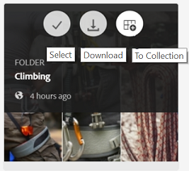

# Durchsuchen von Assets in Brand Portal {#browsing-assets-on-brand-portal}

Experience Manager Assets Brand Portal bietet verschiedene Funktionen und Benutzeroberflächenelemente, die das Durchsuchen von Ressourcen, Navigieren in Asset-Hierarchien und Suchen nach Assets mithilfe verschiedener Anzeigeoptionen erleichtern.

Das Experience Manager-Logo in der Symbolleiste am oberen Rand erleichtert Admin-Benutzern den Zugriff auf den Admin-Tools-Bereich.

Die Leistenauswahl oben links in der Dropdown-Liste von Brand Portal, um Optionen anzuzeigen, mit denen Sie zu Asset-Hierarchien navigieren, Ihre Suche optimieren und Ressourcen anzeigen können.

Sie können Assets in allen verfügbaren Ansichten (Karte, Spalten und Liste) im Ansichtsselektor von Brand Portal anzeigen, darin navigieren und auswählen.

## Anzeigen und Auswählen von Ressourcen {#viewing-and-selecting-resources}

Anzeige, Navigation und Auswahl sind grundsätzlich in allen Ansichten gleich. Je nach verwendeter Ansicht kommt es aber zu geringfügigen Abweichungen beim Umgang.

Sie können Ihre Ressourcen in jeder der verfügbaren Ansichten anzeigen, darin navigieren und sie (für weitere Aktionen) auswählen:

* Spaltenansicht
* Kartenansicht
* Listenansicht

### Kartenansicht

In der Kartenansicht werden Informationskarten für jedes Element auf der aktuellen Ebene angezeigt. Diese Karten enthalten die folgenden Details:

* eine visuelle Darstellung des Assets bzw. Ordners
* Typ
* Titel
* Name
* Datum und Uhrzeit der Veröffentlichung des Assets in Brand Portal aus AEM
* Größe
* Dimensionen

Sie können in der Hierarchie nach unten navigieren, indem Sie auf die Karten klicken (vermeiden Sie dabei die Schnellaktionen), und über die Breadcrumbs [ der Kopfzeile wieder nach oben ](https://experienceleague.adobe.com/en/docs/experience-manager-65/content/sites/authoring/essentials/basic-handling).

#### Kartenansicht für Benutzer ohne Administratorrechte

Karten von Ordnern in der Kartenansicht zeigen Benutzern ohne Administratorrechte (Bearbeitern, Betrachtern und Gastbenutzern) Informationen zur Ordnerhierarchie an. Mit dieser Funktion erfahren die Benutzer den Speicherort der Ordner, auf die sie zugreifen, in Bezug auf die übergeordnete Hierarchie.

Informationen zur Ordnerhierarchie sind besonders hilfreich, um Ordner mit Namen zu unterscheiden, die anderen Ordnern ähneln, die von einer anderen Ordnerhierarchie freigegeben wurden. Wenn Benutzende ohne Administratorrechte die Ordnerstruktur der für sie freigegebenen Assets nicht kennen, scheinen Assets/Ordner mit ähnlichen Namen verwirrend zu sein.

* Die auf den entsprechenden Karten angezeigten Pfade werden so gekürzt, dass sie zu den Kartengrößen passen. Benutzer können den vollständigen Pfad jedoch als QuickInfo sehen, indem sie den Mauszeiger über den abgeschnittenen Pfad bewegen.

**Option „Überblick“ zur Anzeige der Asset-Eigenschaften**

Die Option Überblick steht Benutzern ohne Administratorrechte (Bearbeitern, Betrachtern, Gastbenutzern) zur Verfügung, um Asset-Eigenschaften ausgewählter Assets/Ordner anzuzeigen. Die Option „Überblick“ finden Sie an folgenden Stellen:

* Klicken Sie in der Symbolleiste oben auf ein Asset/einen Ordner.
* Wählen Sie in der Dropdown-Liste bei der Auswahl der Leistenauswahl aus.

Bei Auswahl der Option **[!UICONTROL Überblick]** bei ausgewähltem Asset/Ordner können die Benutzer den Titel, den Pfad und den Zeitpunkt der Asset-Erstellung sehen. Wohingegen die Benutzer bei Auswahl der Option Überblick auf der Asset-Detailseite die Metadaten des Assets sehen können.

#### Anzeigeeinstellungen in der Kartenansicht

Das **[!UICONTROL Anzeigeeinstellungen]** wird geöffnet, indem Sie **[!UICONTROL Anzeigeeinstellungen]** in der Ansichtsauswahl auswählen. Damit können Sie die Größe der Asset-Miniaturansichten in der Kartenansicht ändern. Auf diese Weise können Sie Ihre Ansicht personalisieren und die Anzahl der angezeigten Miniaturen steuern.

### Listenansicht

In der Listenansicht werden Informationen für jede Ressource auf der aktuellen Ebene aufgelistet. Die Listenansicht enthält die folgenden Details:

* Miniaturbild von Assets
* Name
* Titel
* Gebietsschema
* Typ
* Dimension
* Größe
* Bewertung
* Ordnerpfad, der die Asset-Hierarchie anzeigt
* Datum der Veröffentlichung des Assets in Brand Portal

Mit der Spalte Pfad können Sie den Asset-Speicherort in der Ordnerhierarchie einfach identifizieren. Sie können in der Hierarchie nach unten navigieren, indem Sie auf den Ressourcennamen klicken, und mithilfe der [Breadcrumbs in der Kopfzeile](https://experienceleague.adobe.com/en/docs/experience-manager-65/content/sites/authoring/essentials/basic-handling) wieder nach oben navigieren.

<!--
Comment Type: draft lastmodifiedby="mgulati" lastmodifieddate="2018-08-17T03:12:05.096-0400" type="annotation">Removed:- "Selecting assets in list view To select all items in the list, use the checkbox at the upper left of the list. When all items in the list are selected, this check box appears checked. To deselect all, click the checkbox. When only some items are selected, it appears with a minus sign. To select all, click the checkbox. To deselect all, click the checkbox again. You can change the order of items using the dotted vertical bar at the far right of each item in the list. Click the vertical selection bar and drag the item to a new position in the list."
 -->

### Anzeigeeinstellungen in der Listenansicht

In der Listenansicht wird das Asset **[!UICONTROL Name]** standardmäßig als erste Spalte angezeigt. Darüber hinaus werden weitere Informationen wie der **[!UICONTROL Titel]**, das **[!UICONTROL Gebietsschema]**, der **[!UICONTROL Typ]**, die **[!UICONTROL Dimensionen]**, die **[!UICONTROL Größe]**, die **[!UICONTROL Bewertung]** und der Veröffentlichungsstatus des Assets angezeigt. Sie können jedoch die anzuzeigenden Spalten über die **[!UICONTROL Anzeigeeinstellungen]** auswählen.

### Spaltenansicht

Verwenden Sie die Spaltenansicht, um in einem Inhaltsbaum durch eine Reihe kaskadierender Spalten zu navigieren. Diese Ansicht hilft Ihnen, die Asset-Hierarchie zu visualisieren und in ihr zu navigieren.

Wenn Sie eine Ressource in der ersten Spalte (ganz links) auswählen, werden untergeordnete Ressourcen in der zweiten Spalte rechts angezeigt. Wenn Sie eine Ressource in der zweiten Spalte auswählen, werden die untergeordneten Ressourcen in der dritten Spalte rechts angezeigt usw.

Sie können in der Baumstruktur nach oben und unten navigieren. Klicken Sie auf den Ressourcennamen oder den Pfeil rechts neben dem Ressourcennamen.

* Der Ressourcenname und der Pfeil werden beim Klicken hervorgehoben.
* Durch Tippen oder Klicken auf die Miniaturansicht wird die Ressource ausgewählt.
* Wenn diese Option aktiviert ist, wird ein Häkchen auf der Miniatur eingeblendet und der Ressourcenname hervorgehoben.
* Die Details der ausgewählten Ressource werden in der letzten Spalte angezeigt.

Wenn ein Asset in der Spaltenansicht ausgewählt wird, wird in der letzten Spalte eine visuelle Darstellung des Assets zusammen mit den folgenden Details angezeigt:

* Titel
* Name
* Dimensionen
* Datum und Uhrzeit der Veröffentlichung des Assets in Brand Portal aus AEM
* Größe
* Typ
* Option „Weitere Details“, die mit der Detailseite des Assets übereinstimmt

<!--
Comment Type: draft

<h3>Selecting Resources</h3>
-->

<!--
Comment Type: draft

Selecting a specific resource depends on a combination of the view and the device:

-->

<!--
Comment Type: draft

<table border="1" cellpadding="1" cellspacing="0" width="100%">
<tbody>
<tr>
<td> </td>
<td>Select</td>
<td>Deselect</td>
</tr>
<tr>
<td>Column View  </td>
<td>
<ul>
<li>Desktop:  Mouseover, then use the check mark quick action</li>
<li>Mobile device:  Tap the thumbnail</li>
</ul> </td>
<td>
<ul>
<li>Desktop:  Click the thumbnail</li>
<li>Mobile device:  Tap the thumbnail</li>
</ul> </td>
</tr>
<tr>
<td>Card View  </td>
<td>
<ul>
<li>Desktop:  Mouseover, then use the check mark quick action</li>
<li>Mobile device:  Tap-and-hold the card</li>
</ul> </td>
<td>
<ul>
<li>Desktop:  Click the card</li>
<li>Mobile device:  Tap the card</li>
</ul> </td>
</tr>
<tr>
<td>List View</td>
<td>
<ul>
<li>Desktop:  Mouseover, then use the check mark quick action</li>
<li>Mobile device:  Tap the thumbnail</li>
</ul> </td>
<td>
<ul>
<li>Desktop:  Click the thumbnail</li>
<li>Mobile device:  Tap the thumbnail</li>
</ul> </td>
</tr>
</tbody>
</table>
-->

<!--
Comment Type: draft

Deselecting All
-->

<!--
Comment Type: draft

In all cases, as you select items the count of the items selected is displayed at the upper right of the toolbar.

You can deselect all items and exit selection mode by clicking the X next to the count.

-->

<!--
Comment Type: draft

In all views, all items can be deselected by clicking escape on the keyboard if you are using a desktop device.

-->

## Inhaltsstruktur {#content-tree}

Verwenden Sie zusätzlich zu diesen Ansichten die Strukturansicht, um einen Drilldown der Asset-Hierarchie durchzuführen, während Sie die gewünschten Assets oder Ordner anzeigen und auswählen.

Um die Baumstrukturansicht zu öffnen, klicken Sie auf die Auswahlleiste oben links und wählen Sie **[!UICONTROL Inhaltsstruktur]** aus dem Menü aus.

Navigieren Sie in der Inhaltshierarchie zum gewünschten Asset.

## Asset-Details {#asset-details}

Auf der Asset-Detailseite können Sie ein Asset anzeigen, herunterladen, den Link des Assets freigeben, in eine Sammlung verschieben oder seine Eigenschaftsseite anzeigen. Außerdem können Sie nacheinander auf der Detailseite anderer Assets desselben Ordners navigieren.

Um die Metadaten des Assets oder seine verschiedenen Ausgabedarstellungen anzuzeigen, verwenden Sie die Leistenauswahl auf der Asset-Detailseite.

Sie können alle verfügbaren Ausgabedarstellungen des Assets auf der Seite mit den Asset-Details anzeigen und im Bedienfeld „Ausgabedarstellungen **[!UICONTROL eine Ausgabedarstellung]**, um sie in der Vorschau anzuzeigen.

<!-- removed as it is fixed in 2022.02.0 release
>[!CAUTION]
>
>(**Experience Manager Assets as a Cloud Service** only) The following known issues will be fixed in the upcoming release:
>
>The **[!UICONTROL Renditions]** panel does not list all the static renditions of the assets that are published to Brand Portal after December 16, 2021.
>
>The **[!UICONTROL Renditions]** panel lists the smart crop renditions of the asset, however, the user cannot preview or download the smart crop renditions.
-->

Um die Seite mit den Asset-Eigenschaften zu öffnen **[!UICONTROL verwenden Sie die Option Eigenschaften (p)]** in der oberen Leiste.

Sie können auch eine Liste aller zugehörigen Assets (Quelle oder abgeleitete Assets in AEM) auf der Seite „Eigenschaften“ eines Assets anzeigen, da die Asset-Beziehung auch von AEM in Brand Portal veröffentlicht wird.
