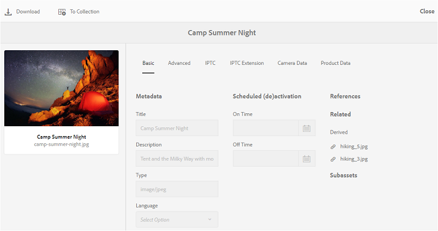

# Durchsuchen von Assets in Brand Portal {#browsing-assets-on-brand-portal}

Experience Manager Assets Brand Portal bietet verschiedene Funktionen und Elemente der Benutzeroberfläche, die das Durchsuchen von Ressourcen, Navigieren in Asset-Hierarchien und Suchen nach Assets mithilfe verschiedener Anzeigeoptionen erleichtern.

Das Experience Manager-Logo in der Symbolleiste am oberen Rand erleichtert Admin-Benutzern den Zugriff auf den Admin Tools-Bereich.

Die Schienenauswahl oben links in Brand Portal zeigt Optionen zum Navigieren in Asset-Hierarchien, Optimieren der Suche und Anzeigen von Ressourcen an.

Sie können Assets in einer der verfügbaren Ansichten (Karte, Spalte und Liste) in der Ansichtsauswahl von Brand Portal anzeigen, navigieren und auswählen.

## Anzeigen und Auswählen von Ressourcen {#viewing-and-selecting-resources}

Anzeige, Navigation und Auswahl sind grundsätzlich in allen Ansichten gleich. Je nach verwendeter Ansicht kommt es aber zu geringfügigen Abweichungen beim Umgang.

Sie können Ihre Ressourcen in einer der verfügbaren Ansichten anzeigen, durch sie navigieren und sie auswählen (für weitere Aktionen):

* Spaltenansicht
* Kartenansicht
* Listenansicht

### Kartenansicht

In der Kartenansicht werden Informationskarten für jedes Element auf der aktuellen Ebene angezeigt. Diese Karten enthalten die folgenden Details:

* eine visuelle Darstellung des Assets bzw. Ordners
* Typ
* Titel
* Name
* Datum und Uhrzeit der Veröffentlichung des Assets in Brand Portal von AEM
* Größe
* Dimensionen

Sie können in der Hierarchie nach unten navigieren, indem Sie auf die Karten klicken (vermeiden Sie dabei die Schnellaktionen), oder über die [Breadcrumbs in der Kopfzeile](https://experienceleague.adobe.com/en/docs/experience-manager-65/content/sites/authoring/essentials/basic-handling) wieder nach oben navigieren.

#### Kartenansicht für Benutzer ohne Administratorrechte

Karten von Ordnern in der Kartenansicht zeigen Benutzern ohne Administratorrechte (Bearbeitern, Betrachtern und Gastbenutzern) Informationen zur Ordnerhierarchie an. Diese Funktion informiert die Benutzer über den Speicherort der Ordner, auf die sie zugreifen, in Bezug auf die übergeordnete Hierarchie.

Informationen zur Ordnerhierarchie sind besonders hilfreich, um die Ordner zu unterscheiden, deren Namen anderen Ordnern ähneln, die über eine andere Ordnerhierarchie freigegeben wurden. Wenn die Benutzer ohne Administratorrechte die Ordnerstruktur der für sie freigegebenen Assets nicht kennen, scheinen Assets/Ordner mit ähnlichen Namen verwirrend.

* Die auf den entsprechenden Karten angezeigten Pfade werden so gekürzt, dass sie zu den Kartengrößen passen. Benutzer können den vollständigen Pfad jedoch als QuickInfo anzeigen, indem sie den Mauszeiger über den verkürzten Pfad bewegen.

**Option „Überblick“ zur Anzeige der Asset-Eigenschaften**

Die Option &quot;Überblick&quot;steht Benutzern ohne Administratorrechte (Bearbeitern, Betrachtern, Gastbenutzern) zum Anzeigen von Asset-Eigenschaften ausgewählter Assets/Ordner zur Verfügung. Die Option „Überblick“ finden Sie an folgenden Stellen:

* In der Symbolleiste oben bei Auswahl eines Assets/Ordners.
* Wählen Sie in der Dropdown-Liste die Schienenauswahl aus.

Wenn Sie die Option **[!UICONTROL Überblick]** auswählen, während ein Asset/Ordner ausgewählt ist, können Benutzer den Titel, den Pfad und den Zeitpunkt der Asset-Erstellung sehen. Auf der Asset-Detailseite können Benutzer durch Auswahl der Option Übersicht die Metadaten des Assets sehen.

#### Anzeigeeinstellungen in der Kartenansicht

Das Dialogfeld **[!UICONTROL Anzeigeeinstellungen]** wird durch Auswahl von **[!UICONTROL Anzeigeeinstellungen]** in der Ansichtsauswahl geöffnet. Damit können Sie die Größe der Asset-Miniaturansichten in der Kartenansicht ändern. Auf diese Weise können Sie Ihre Ansicht personalisieren und die Anzahl der angezeigten Miniaturansichten steuern.

### Listenansicht

In der Listenansicht werden Informationen für jede Ressource auf der aktuellen Ebene aufgelistet. Die Listenansicht enthält die folgenden Details:

* Miniaturbild von Assets
* Name
* Titel
* Gebietsschema
* Typ
* Dimension
* Größe
* Bewertung
* Ordnerpfad, der die Asset-Hierarchie anzeigt
* Datum der Veröffentlichung des Assets in Brand Portal

Mit der Spalte &quot;Pfad&quot;können Sie den Asset-Speicherort in der Ordnerhierarchie leicht identifizieren. Sie können in der Hierarchie nach unten navigieren, indem Sie auf den Ressourcennamen klicken, und mithilfe der [Breadcrumbs in der Kopfzeile](https://experienceleague.adobe.com/en/docs/experience-manager-65/content/sites/authoring/essentials/basic-handling) wieder nach oben navigieren.

<!--
Comment Type: draft lastmodifiedby="mgulati" lastmodifieddate="2018-08-17T03:12:05.096-0400" type="annotation">Removed:- "Selecting assets in list view To select all items in the list, use the checkbox at the upper left of the list. When all items in the list are selected, this check box appears checked. To deselect all, click or tap the checkbox. When only some items are selected, it appears with a minus sign. To select all, click or tap the checkbox. To deselect all, click or tap the checkbox again. You can change the order of items using the dotted vertical bar at the far right of each item in the list. Click the vertical selection bar and drag the item to a new position in the list."
 -->

### Anzeigeeinstellungen in der Listenansicht

In der Listenansicht wird standardmäßig das Asset **[!UICONTROL Name]** als erste Spalte angezeigt. Darüber hinaus werden weitere Informationen wie der **[!UICONTROL Titel]**, das **[!UICONTROL Gebietsschema]**, der **[!UICONTROL Typ]**, die **[!UICONTROL Dimensionen]**, die **[!UICONTROL Größe]**, die **[!UICONTROL Bewertung]** und der Veröffentlichungsstatus des Assets angezeigt. Sie können jedoch die anzuzeigenden Spalten über die **[!UICONTROL Anzeigeeinstellungen]** auswählen.

### Spaltenansicht

Verwenden Sie die Spaltenansicht, um in einer Inhaltsstruktur durch eine Reihe kaskadierender Spalten zu navigieren. Diese Ansicht hilft Ihnen, die Asset-Hierarchie zu visualisieren und in ihr zu navigieren.

Bei Auswahl einer Ressource in der ersten (ganz links) Spalte werden untergeordnete Ressourcen in der zweiten Spalte rechts angezeigt. Wenn Sie eine Ressource in der zweiten Spalte auswählen, werden untergeordnete Ressourcen in der dritten Spalte rechts angezeigt usw.

Sie können im Baum nach oben und unten navigieren. Klicken Sie auf den Ressourcennamen oder den Pfeil rechts neben dem Ressourcennamen.

* Beim Tippen bzw. Klicken werden der Ressourcenname und der Pfeil hervorgehoben.
* Durch Tippen oder Klicken auf die Miniaturansicht wird die Ressource ausgewählt.
* Wenn diese Option aktiviert ist, wird ein Häkchen auf der Miniaturansicht angezeigt und der Ressourcenname wird hervorgehoben.
* Die Details der ausgewählten Ressource werden in der letzten Spalte angezeigt.

Wenn ein Asset in der Spaltenansicht ausgewählt ist, wird in der letzten Spalte eine visuelle Darstellung des Assets mit den folgenden Details angezeigt:

* Titel
* Name
* Dimensionen
* Datum und Uhrzeit der Veröffentlichung des Assets in Brand Portal von AEM
* Größe
* Typ
* Option &quot;Weitere Details&quot;auf der Detailseite des Assets

<!--
Comment Type: draft

<h3>Selecting Resources</h3>
-->

<!--
Comment Type: draft

Selecting a specific resource depends on a combination of the view and the device:

-->

<!--
Comment Type: draft

<table border="1" cellpadding="1" cellspacing="0" width="100%">
<tbody>
<tr>
<td> </td>
<td>Select</td>
<td>Deselect</td>
</tr>
<tr>
<td>Column View  </td>
<td>
<ul>
<li>Desktop:  Mouseover, then use the check mark quick action</li>
<li>Mobile device:  Tap the thumbnail</li>
</ul> </td>
<td>
<ul>
<li>Desktop:  Click the thumbnail</li>
<li>Mobile device:  Tap the thumbnail</li>
</ul> </td>
</tr>
<tr>
<td>Card View  </td>
<td>
<ul>
<li>Desktop:  Mouseover, then use the check mark quick action</li>
<li>Mobile device:  Tap-and-hold the card</li>
</ul> </td>
<td>
<ul>
<li>Desktop:  Click the card</li>
<li>Mobile device:  Tap the card</li>
</ul> </td>
</tr>
<tr>
<td>List View</td>
<td>
<ul>
<li>Desktop:  Mouseover, then use the check mark quick action</li>
<li>Mobile device:  Tap the thumbnail</li>
</ul> </td>
<td>
<ul>
<li>Desktop:  Click the thumbnail</li>
<li>Mobile device:  Tap the thumbnail</li>
</ul> </td>
</tr>
</tbody>
</table>
-->

<!--
Comment Type: draft

Deselecting All
-->

<!--
Comment Type: draft

In all cases, as you select items the count of the items selected is displayed at the upper right of the toolbar.

You can deselect all items and exit selection mode by clicking or tapping the X next to the count.

-->

<!--
Comment Type: draft

In all views, all items can be deselected by tapping escape on the keyboard if you are using a desktop device.

-->

## Inhaltsstruktur {#content-tree}

Verwenden Sie zusätzlich zu diesen Ansichten die Strukturansicht, um einen Drilldown der Asset-Hierarchie durchzuführen, während Sie die gewünschten Assets oder Ordner anzeigen und auswählen.

Um die Baumansicht zu öffnen, klicken Sie auf die Schienenauswahl oben links und wählen Sie die Struktur **[!UICONTROL Inhalt]** aus dem Menü aus.

Navigieren Sie in der Inhaltshierarchie zum gewünschten Asset.

## Asset-Details {#asset-details}

Auf der Asset-Detailseite können Sie ein Asset anzeigen, herunterladen, den Link des Assets freigeben, es in eine Sammlung verschieben oder die Eigenschaftenseite anzeigen. Außerdem können Sie auf der Detailseite anderer Assets desselben Ordners nacheinander navigieren.

Um die Metadaten des Assets anzuzeigen oder die verschiedenen Ausgabeformate anzuzeigen, verwenden Sie die Schienenauswahl auf der Asset-Detailseite.

Sie können alle verfügbaren Ausgabeformate des Assets auf der Asset-Detailseite anzeigen und eine Ausgabedarstellung aus dem Bedienfeld **[!UICONTROL Ausgabeformate]** auswählen, um eine Vorschau anzuzeigen.

<!-- removed as it is fixed in 2022.02.0 release
>[!CAUTION]
>
>(**Experience Manager Assets as a Cloud Service** only) The following known issues will be fixed in the upcoming release:
>
>The **[!UICONTROL Renditions]** panel does not list all the static renditions of the assets that are published to Brand Portal after December 16, 2021.
>
>The **[!UICONTROL Renditions]** panel lists the smart crop renditions of the asset, however, the user cannot preview or download the smart crop renditions.
-->

Öffnen Sie die Seite mit den Asset-Eigenschaften mit der Option **[!UICONTROL Eigenschaften (p)]** in der oberen Leiste.

Sie können auch eine Liste aller zugehörigen Assets (Quelle oder abgeleitete Assets in AEM) auf der Seite „Eigenschaften“ eines Assets anzeigen, da die Asset-Beziehung auch von AEM in Brand Portal veröffentlicht wird.
