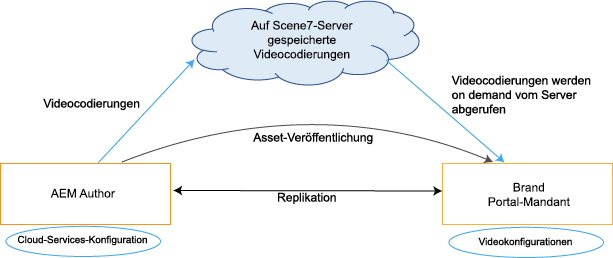
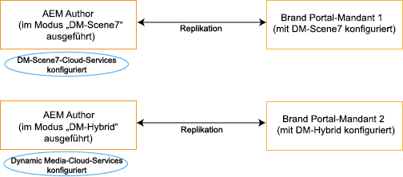

# Unterstützung für Dynamic Video in Brand Portal {#dynamic-video-support-on-brand-portal}

Profitieren Sie von einer Vorschau und adaptiven Wiedergabe von Videos in Brand Portal mit Dynamic Media-Unterstützung. Laden Sie auch die dynamischen Ausgabedarstellungen aus dem Portal und von freigegebenen Links herunter.
Brand Portal-Benutzer haben folgende Möglichkeiten:

* Vorschau von Videos auf der Seite mit Asset-Details, in der Kartenansicht und auf der Vorschauseite zur Link-Freigabe.
* Videokodierungen auf der Seite „Asset-Details“ abspielen.
* Zeigen Sie dynamische Ausgabedarstellungen auf der Registerkarte Ausgabedarstellungen auf der Seite mit den Asset-Details an.
* Laden Sie Videokodierungen und Ordner mit Videos herunter.

>[!NOTE]
>
>Um mit Videos zu arbeiten und sie in Brand Portal zu veröffentlichen, stellen Sie sicher, dass die Experience Manager-Autoreninstanz entweder im Dynamic Media Hybrid-Modus oder im Dynamic Media **[!DNL Scene7]**-Modus eingerichtet ist.

Um Videos in einer Vorschau anzeigen, diese wiederzugeben und herunterzuladen, stellt Brand Portal die beiden folgenden Konfigurationen für Administratoren bereit:

* [Dynamic Media Hybrid-Konfiguration](#configure-dm-hybrid-settings)
Wenn die Experience Manager-Autoreninstanz im Modus „Dynamic Media - Hybrid“ ausgeführt wird.
* [Dynamic Media [!DNL Scene7] configuration](#configure-dm-scene7-settings)
Wenn die Experience Manager-Autoreninstanz im Modus Dynamic Media - **[!DNL Scene7]** ausgeführt wird.
Legen Sie eine dieser Konfigurationen basierend auf den Konfigurationen fest, die Sie in Ihrer Experience Manager-Autoreninstanz festgelegt haben, mit der der Brand Portal-Mandant repliziert wird.

>[!NOTE]
>
>Dynamische Videos werden nicht für Brand Portal-Mandanten unterstützt, die in der Experience Manager-Autoreninstanz mit dem **[!UICONTROL Scene7 Connect]**-Ausführungsmodus konfiguriert sind.

## Wie wird Dynamic Video abgespielt? {#how-are-dynamic-videos-played}

Wenn Dynamic Media-Konfigurationen [Hybrid](../using/dynamic-video-brand-portal.md#configure-dm-hybrid-settings) oder [[!DNL Scene7]](../using/dynamic-video-brand-portal.md#configure-dm-scene7-settings)) auf Brand Portal eingerichtet sind, werden die dynamischen Ausgabedarstellungen vom **[!DNL Scene7]** abgerufen. Videokodierungen werden daher in einer Vorschau angezeigt und ohne Verzögerung und Qualitätsverluste wiedergegeben.

Das Brand Portal-Repository speichert keine Videokodierungen und ruft sie vom **[!DNL Scene7]** ab. Stellen Sie sicher, dass die Dynamic Media-Konfigurationen in der Adobe Experience Manager-Autoreninstanz und in Brand Portal identisch sind.

>[!NOTE]
>
>Video-Viewer und Viewer-Vorgaben werden in Brand Portal nicht unterstützt. Videos werden in den Standard-Viewern in Brand Portal als Vorschau angezeigt und abgespielt.

## Voraussetzungen {#prerequisites}

Um mit Dynamic Video in Brand Portal zu arbeiten, müssen Sie Folgendes sicherstellen:

* **Starten Sie Experience Manager Author im Dynamic Media-Modus**

  Starten Sie die Experience Manager-Autoreninstanz (mit der Brand Portal konfiguriert wird) entweder im [Dynamic Media - [!DNL Scene7] Modus](https://experienceleague.adobe.com/en/docs/experience-manager-65/content/assets/dynamic/config-dms7#enabling-dynamic-media-in-scene-mode) oder im [Dynamic Media - Hybridmodus](https://experienceleague.adobe.com/en/docs/experience-manager-65/content/assets/dynamic/config-dynamic) oder

* **Konfigurieren von Dynamic Media Cloud Services in der Experience Manager-Autoreninstanz**

  Legen Sie je nach Dynamic Media-Modus (Scene7-Modus oder Hybridmodus), auf dem Experience Manager Author ausgeführt wird, entweder [Dynamic Media Cloud Services ([!DNL Scene7]-Modus)](https://experienceleague.adobe.com/en/docs/experience-manager-65/content/assets/dynamic/config-dms7#configuring-dynamic-media-cloud-services) oder [Dynamic Media Cloud Services (Hybridmodus)](https://experienceleague.adobe.com/en/docs/experience-manager-65/content/assets/dynamic/config-dms7#configuring-dynamic-media-cloud-services) für Experience Manager Author unter **Tools** | **Cloud-Services** | **Dynamic Media**

* **Konfigurieren von Dynamic Media auf Brand Portal**

  Konfigurieren Sie basierend auf den Dynamic Media-Cloud-Konfigurationen in der Experience Manager-Autoreninstanz [Einstellungen für Dynamic Media](#configure-dm-hybrid-settings) oder [[!DNL Scene7] Einstellungen](#configure-dm-scene7-settings) über die Admin Tools von Brand Portal.

  Stellen Sie sicher, dass [separate Brand Portal-Mandanten](#separate-tenants) für Experience Manager-Autoreninstanzen verwendet werden, die in Dynamic Media konfiguriert sind - **[!UICONTROL Scene7]**-Modus und Dynamic Media-Hybrid-Modus. Wenn Sie die Funktionen von Dynamic Media **[!UICONTROL S7]** und Dynamic Media Hybrid verwenden, ist dieser Ansatz besonders wichtig.

* **Veröffentlichen von Ordnern mit auf Brand Portal angewendeten Videokodierungen**

  Wenden Sie [Videokodierungen](https://experienceleague.adobe.com/en/docs/experience-manager-65/content/assets/dynamic/video-profiles) an und veröffentlichen Sie den Ordner mit Rich-Media-Assets der Experience Manager-Autoreninstanz in Brand Portal.

* **Zulassungsliste der Egress-IPs in SPS, wenn die sichere Vorschau aktiviert ist**

  Wenn Sie Dynamic Media-**[!DNL Scene7]** verwenden (mit [sicherer Vorschau](https://experienceleague.adobe.com/en/docs/dynamic-media-classic/using/upload-publish/testing-assets-making-them-public) für ein Unternehmen), wird empfohlen, dass **[!DNL Scene7]** Unternehmensadministrator [&#x200B; die öffentlichen Ausgangs-IPs &#x200B;](https://experienceleague.adobe.com/en/docs/dynamic-media-classic/using/upload-publish/testing-assets-making-them-public#testing-the-secure-testing-service) die entsprechenden Regionen mithilfe der SPS-Flash-Benutzeroberfläche (**[!UICONTROL Scene7]** Publishing System) auf die Zulassungsliste setzt.

  Die Egress-IPs lauten wie folgt:

  | **Region** | **Egress-IP** |
  |--- |--- |
  | nicht vorhanden | 130.248.160.68, 20.94.203.130 |
  | EMEA | 185.34.189.3, 51.132.146.75 |
  | APAC | 63.140.44.54 |

  Informationen zur Zulassungsliste dieser Ausgangs-IPs finden Sie unter [Vorbereiten Ihres Kontos für einen sicheren Test-Service](https://experienceleague.adobe.com/en/docs/dynamic-media-classic/using/upload-publish/testing-assets-making-them-public#testing-the-secure-testing-service).

## Best Practices

Gehen Sie wie folgt vor, um sicherzustellen, dass dynamische Video-Assets erfolgreich aus Brand Portal als Vorschau angezeigt, wiedergegeben und von dort heruntergeladen werden (und über freigegebene Links):

### Separate Mandanten für den Modus „Dynamic Media - Scene7“ und den Modus „Dynamic Media - Hybrid“ {#separate-tenants}

Wenn Sie sowohl Funktionen des Modus „Dynamic Media – **[!DNL Scene7]**“ als auch des Modus „Dynamic Media – Hybrid“ verwenden, nutzen Sie verschiedene Brand Portal-Mandanten für Experience Manager-Autoreninstanzen, die mit dem Modus „Dynamic Media – **[!DNL Scene7]**“ und dem Modus „Dynamic Media – Hybrid“ konfiguriert wurden.

### Gleiche Konfigurationsdetails in der Experience Manager-Autoreninstanz und in Brand Portal

Stellen Sie sicher, dass die Konfigurationsdetails in Brand Portal und der **[!UICONTROL Experience Manager Cloud-Konfiguration]** identisch sind. Dieselben Konfigurationsdetails umfassen Folgendes:

* **[!UICONTROL Titel]**
* **[!UICONTROL Registrierungs-ID]**
* **[!UICONTROL Video-Service-URL]** im Modus **[!UICONTROL Dynamic Media – Hybrid]**
* **[!UICONTROL Titel]**
* Anmeldeinformationen (**[!UICONTROL E-Mail]** und Passwort)
* **[!UICONTROL Region]**
* **[!UICONTROL Firma]** im Modus „Dynamic Media – **[!DNL Scene7]**“

### Öffentliche Ausgangs-IPs für den Dynamic Media Scene7-Modus auf die Zulassungsliste setzen

Wenn Dynamic Media **[!UICONTROL Scene7]** mit [aktivierter sicherer Vorschau](https://experienceleague.adobe.com/en/docs/dynamic-media-classic/using/upload-publish/testing-assets-making-them-public) verwendet wird, um Video-Assets für Brand Portal bereitzustellen, richtet **[!UICONTROL Scene7]** einen dedizierten Image-Server für Staging-Umgebungen oder interne Anwendungen ein. Mit einer beliebigen Anforderung an diesen Server wird die IP-Ursprungsadresse geprüft. Wenn die eingehende Anforderung nicht in der Liste genehmigter IP-Adressen enthalten ist, wird eine Fehlerantwort zurückgegeben.
Der **[!UICONTROL Scene7]**-Unternehmensadministrator konfiguriert daher eine Liste genehmigter IP-Adressen für die **[!UICONTROL Secure Testing]**-Umgebung seines Unternehmens über die Flash-Benutzeroberfläche **[!UICONTROL SPS]** (Scene7 Publishing System). Stellen Sie sicher, dass die Egress-IP für Ihre jeweilige Region (siehe unten) in diese genehmigte Liste aufgenommen wird.
Informationen zur Zulassungsliste dieser Ausgangs-IPs finden Sie unter [Vorbereiten Ihres Kontos für einen sicheren Test-Service](https://experienceleague.adobe.com/en/docs/dynamic-media-classic/using/upload-publish/testing-assets-making-them-public#testing-the-secure-testing-service).
Die Egress-IPs lauten wie folgt:

| **Region** | **Egress-IP** |
|--- |--- |
| nicht vorhanden | 130.248.160.68, 20.94.203.130 |
| EMEA | 51.132.146.75, 130.248.244.202, 130.248.244.203, 130.248.244.204, 130.248.244.210, 130.248.244.211, 130.248.244.212 |
| APAC | 63.140.44.54 |

## Konfigurieren von Dynamic Media (Hybrid)-Einstellungen {#configure-dm-hybrid-settings}

Wenn die Experience Manager-Autoreninstanz im Dynamic Media Hybrid-Modus ausgeführt wird, konfigurieren Sie die Dynamic Media-Gateway-Einstellungen über die Kachel **[!UICONTROL Video]** im Admin-Tools-Bereich.

>[!NOTE]
>
>Die [Videokodierungsprofile](https://experienceleague.adobe.com/en/docs/experience-manager-65/content/assets/dynamic/video-profiles) werden nicht in Brand Portal veröffentlicht. Stattdessen werden sie vom Scene7 **[!UICONTROL Server]**. Stellen Sie daher sicher, dass die Konfigurationsdetails in Ihrer Experience Manager-Autoreninstanz mit denen von [Dynamic Media Cloud Services ([!DNL Scene7]-Modus)](https://experienceleague.adobe.com/en/docs/experience-manager-65/content/assets/dynamic/config-dms7#configuring-dynamic-media-cloud-services) identisch sind, damit Videokodierungen erfolgreich in Brand Portal wiedergegeben werden können.

So richten Sie Dynamic Media-Konfigurationen für Brand Portal-Mandanten ein:

1. Wählen Sie das Experience Manager-Logo aus, damit Sie über die Symbolleiste oben in Brand Portal auf die Admin-Tools zugreifen können.
1. Wählen Sie im Admin-Tools-Bereich die Kachel **[!UICONTROL Video]** aus.

   

   Die Seite **[!UICONTROL Konfiguration für Dynamic Media bearbeiten]** wird geöffnet.

   

1. Geben Sie die **[!UICONTROL Registrations-ID]** und **[!UICONTROL die Video Service-URL]** (DM-Gateway URL) an. Stellen Sie sicher, dass diese Details mit denen unter **[!UICONTROL Tools > Cloud Services]** in Ihrer Experience Manager-Autoreninstanz übereinstimmen.
1. Wählen Sie **Speichern** aus, um die Konfiguration zu speichern.

## Konfigurieren von Dynamic Media Scene7-Einstellungen {#configure-dm-scene7-settings}

Wenn die Experience Manager-Autoreninstanz im Dynamic Media-**[!UICONTROL Scene7]**-Modus ausgeführt wird, legen Sie über die Kachel **[!UICONTROL Dynamic Media-Konfiguration]** im Admin-Tools-Bereich die **[!UICONTROL Scene7]**-Servereinstellungen fest.

Gehen Sie wie folgt vor, um Dynamic Media **[!UICONTROL Scene7]**-Konfigurationen für Brand Portal-Mandanten einzurichten:

1. Wählen Sie das Experience Manager-Logo aus, damit Sie über die Symbolleiste oben in Brand Portal auf die Admin-Tools zugreifen können.

2. Wählen Sie im Admin-Tools-Bereich die Kachel **[!UICONTROL Dynamic Media-Konfiguration]** aus.

   ![DM [!UICONTROL Scene7]-Konfiguration in Brand Portal](assets/DMS7-Tile.png)

   **[!UICONTROL Seite „Dynamic Media]** Konfiguration bearbeiten“ wird angezeigt.

   

3. Geben Sie Folgendes an:

   * **[!UICONTROL Titel]**
   * Anmeldedaten (**[!UICONTROL E-Mail-ID]** und **[!UICONTROL Passwort]**) für den Zugriff auf den Scene7-Server
   * **[!UICONTROL Region]**

   Stellen Sie sicher, dass diese Werte mit den Werten in Ihrer Experience Manager-Autoreninstanz übereinstimmen.

4. Wählen Sie **[!UICONTROL Mit Dynamic Media verbinden]** aus.

5. Geben Sie den **[!UICONTROL Unternehmensnamen]** an und **[!UICONTROL speichern]** Sie die Konfiguration.

6. Wählen Sie **[!UICONTROL Zurücksetzen]** aus, um alle Änderungen zu löschen, das Kennwort zurückzusetzen und die Konfiguration auf den Standardstatus zurückzusetzen.

