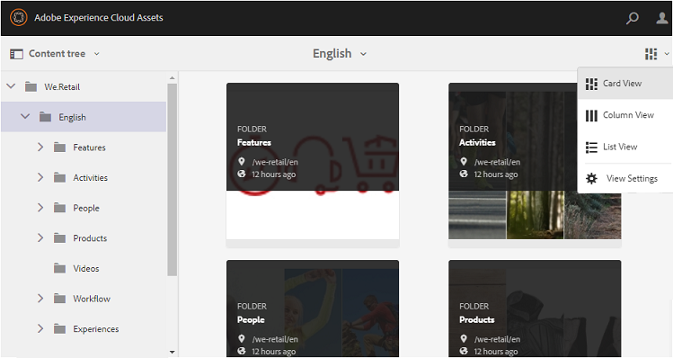

# Gastzugang für Brand Portal {#guest-access-to-brand-portal}

Experience Manager Assets Brand Portal ermöglicht den Gastzugang für das Portal. Ein Gastbenutzer benötigt keine Anmeldeinformationen, um das Portal aufzurufen, und hat Zugriff auf die öffentlichen Assets (und Sammlungen) des Portals. Benutzende in einer Gastsitzung können für die Dauer ihrer Sitzung Assets zu ihrer Lightbox (private Sammlung) hinzufügen und diese herunterladen, es sei denn, Gastbenutzende wählen die Option [[!UICONTROL Sitzung beenden]](#exit-guest-session) aus. Eine Gastbenutzersitzung bleibt für 15 Minuten aktiv.

Mit der Funktion „Gastzugriff“ können [&#x200B; genehmigte Assets schnell für &#x200B;](../using/brand-portal-sharing-folders.md#how-to-share-folders) vorgesehene Zielgruppe freigeben, ohne sie integrieren zu müssen. Ab Version 6.4.2 unterstützt Brand Portal mehrere gleichzeitige Gastbenutzer. Die Anzahl entspricht 10 % des Gesamtbenutzerkontingents pro Unternehmen. Durch die Gewährung von Gastzugriffen sparen Sie Zeit bei der Verwaltung und Aufnahme von Bewertungen von Benutzern, die eingeschränkte Funktionen in Brand Portal benötigen.\
Unternehmen können den Gastzugriff im Brand Portal-Konto des Unternehmens über die Option **[!UICONTROL Gastzugang zulassen]** in den Einstellungen **[!UICONTROL Zugriff]** im Admin-Tools-Bereich aktivieren bzw. deaktivieren.

<!--
Comment Type: annotation
Last Modified By: mgulati
Last Modified Date: 2018-08-17T10:42:59.879-0400
Removed the first para: "AEM Assets Brand Portal allows public users to enter the portal anonymously and have restricted access to the allowed public resources as guests. Organization users with guest role need not seek access and authentication from administrators."
-->

## Starten einer Gastsitzung {#begin-guest-session}

Um anonym in Brand Portal einzutreten, wählen Sie **[!UICONTROL Hier klicken]** entsprechend der **[!UICONTROL `Guest Access?`]** auf dem Brand Portal-Willkommensbildschirm aus. Geben Sie die Captcha-Sicherheitsprüfung ein, um Zugriff auf Brand Portal zu gewähren.

## Dauer der Gastsitzung {#guest-session-duration}

Eine Gastbenutzersitzung bleibt 15 Minuten aktiv.
Durch diesen Prozess wird der Status der **[!UICONTROL Lightbox]** für 15 Minuten ab der Startzeit der Sitzung beibehalten. Danach wird die aktuelle Gastsitzung neu gestartet, wodurch der Status der Lightbox verloren geht.

Beispiel: Ein Gastbenutzer meldet sich um 15:00 Uhr bei Brand Portal an und fügt der **[!UICONTROL Lightbox]** um 15:05 Uhr Assets zum Herunterladen hinzu. Wenn der Benutzer die Sammlung **[!UICONTROL Lightbox]** (oder ihre Assets) nicht vor 15:15 Stunden (innerhalb von 15 Minuten nach der Anmeldung) herunterlädt, muss er die Sitzung neu starten. Die **[!UICONTROL Lightbox]** ist leer, was bedeutet, dass die hochgeladenen Assets nicht mehr verfügbar sind, wenn die Sitzung verloren gegangen ist.

## Gleichzeitige Gastsitzungen zulässig {#concurrent-guest-sessions-allowed}

Die Zahl der gleichzeitigen Gastsitzungen ist auf 10 % des Gesamtbenutzerkontingents pro Organisation beschränkt. Das bedeutet, dass für eine Organisation mit einem Benutzerkontingent von 200 maximal 20 Gastbenutzer gleichzeitig arbeiten können. Dem 21. Benutzer wird der Zugriff verweigert und er kann nur einen Gastzugriff erhalten, wenn die Sitzung von einem der 20 aktiven Gastbenutzer abläuft.

>[!NOTE]
>
>Brand Portal sendet keine Benachrichtigung, wenn die Anzahl der lizenzierten Benutzer den vertraglich vereinbarten Wert (Kontingent) überschreitet. Außerdem schränkt es die Aktivitäten der lizenzierten Benutzer nicht ein.

## Gastbenutzerinteraktion mit Brand Portal {#guest-user-interaction-with-brand-portal}

### Navigation in der Gast-Benutzeroberfläche

Nach dem Aufruf von Brand Portal als Gastbenutzer können Benutzer alle [Assets und Ordner](../using/brand-portal-sharing-folders.md#sharefolders) sehen, die öffentlich oder ausschließlich für Gastbenutzer freigegeben wurden. Bei dieser Ansicht handelt es sich um die Ansicht „Nur Inhalte“, in der Assets in einem Karten-, Listen- oder Spaltenlayout angezeigt werden.

Wenn Administratoren [Ordnerhierarchie aktivieren](../using/brand-portal-general-configuration.md#main-pars-header-1621071021) sehen Gastbenutzer die Ordnerstruktur im Stammverzeichnis und in freigegebenen Ordnern innerhalb ihrer übergeordneten Ordner, wenn sie sich bei der Brand Portal anmelden.

Diese übergeordneten Ordner sind virtuelle Ordner, für die keine Aktionen ausgeführt werden können. Sie können diese virtuellen Ordner an einem Sperrsymbol erkennen.

Im Gegensatz zu freigegebenen Ordnern sind keine Aktionsaufgaben zu sehen, wenn Sie den Mauszeiger auf die Ordner bewegen oder sie in der **[!UICONTROL Kartenansicht]** auswählen. Die Schaltfläche **[!UICONTROL Überblick]** wird bei der Auswahl eines virtuellen Ordners in **[!UICONTROL Spaltenansicht]** und **[!UICONTROL Listenansicht]** angezeigt.

>[!NOTE]
>
>Das Standardminiaturbild der virtuellen Ordner ist das Miniaturbild des ersten freigegebenen Ordners.

   

Mit **[!UICONTROL Option]** Ansichtseinstellungen“ können Gastbenutzer Kartengrößen in der **[!UICONTROL Kartenansicht“ oder]** Spalten anpassen, die in der **[!UICONTROL angezeigt werden]**.

Mit **[!UICONTROL Inhaltsstruktur]** können Sie durch die Asset-Hierarchie navigieren.

Brand Portal bietet eine **[!UICONTROL Überblick]**-Option für Gastbenutzer zum Anzeigen **[!UICONTROL Asset-Eigenschaften]** ausgewählter Assets/Ordner. Die Option **[!UICONTROL Überblick]** finden Sie an folgenden Stellen:

* Klicken Sie in der Symbolleiste oben auf ein Asset oder einen Ordner.
* In der Dropdown-Liste des ausgewählten Leistenselektors.

Wenn Sie die Option **[!UICONTROL Überblick]** auswählen, während ein Asset oder Ordner ausgewählt ist, können Benutzer den Titel, den Pfad und den Zeitpunkt der Asset-Erstellung sehen. Wohingegen die Benutzer bei Auswahl der Option **[!UICONTROL Übersicht]** auf der Asset-Detailseite die Metadaten des Assets sehen können.

Die **[!UICONTROL Navigation]** in der linken Leiste ermöglicht das Navigieren von Dateien zu Sammlungen und zurück in der Gastsitzung, sodass Benutzer Assets in Dateien oder Sammlungen durchsuchen können.

Mit **[!UICONTROL Option]** Filter) können Gastbenutzer Asset-Dateien und Ordner mithilfe von vom Administrator festgelegten Sucheigenschaften filtern.

### Funktionen der Gastbenutzer

Gastbenutzer können auf öffentliche Assets in Brand Portal zugreifen und haben auch einige Einschränkungen, die nachfolgend näher beschrieben werden.

**Gastbenutzer können Folgendes tun**:

* Auf alle öffentlichen Ordner und Sammlungen zugreifen, die für alle Brand Portal-Benutzer gedacht sind.
* Durchsuchen Sie Mitglieder und die Detailseite und verfügen Sie über eine vollständige Asset-Ansicht der Mitglieder aller öffentlichen Ordner und Sammlungen.
* Assets in allen öffentlichen Ordnern und Sammlungen durchsuchen.
* Assets zur Lightbox-Sammlung hinzufügen. Diese Änderungen an der Sammlung bleiben für die Dauer der Sitzung bestehen.
* Assets direkt oder über die Lightbox-Sammlung herunterladen.

**Gastbenutzer können Folgendes nicht tun**:

* Sammlungen und gespeicherte Suchen erstellen oder diese weiter freigeben.
* Auf Einstellungen für Ordner und Sammlungen zugreifen.
* Assets als Links freigeben.

### Herunterladen von Assets in Gastsitzungen

Gastbenutzer können öffentlich oder ausschließlich für Gastbenutzer freigegebene Assets in Brand Portal herunterladen. Gastbenutzer können auch Assets zu **[!UICONTROL Lightbox]** (öffentliche Sammlung) hinzufügen und die **[!UICONTROL Lightbox]**-Sammlung herunterladen, bevor ihre Sitzung abläuft.

Verwenden Sie zum Herunterladen von Assets und Sammlungen das Symbol „Download“ an folgenden Stellen:

* Schnellzugriff-Miniaturansichten, die beim Bewegen des Mauszeigers über das Asset bzw. die Sammlung angezeigt werden
* Die Symbolleiste oben, die bei Auswahl des Assets bzw. der Sammlung angezeigt wird

Durch Auswahl **[!UICONTROL Option]** Download-Beschleunigung aktivieren[!UICONTROL &#x200B; im Dialogfeld &#x200B;]Download“ können Sie [die Download-Leistung verbessern](../using/accelerated-download.md).

## Beenden einer Gastsitzung {#exit-guest-session}

Beenden Sie die Gastsitzung durch Auswahl von **[!UICONTROL Sitzung beenden]** aus den in der Kopfzeile verfügbaren Optionen. Ist die für die Gastsitzung verwendete Browser-Registerkarte inaktiv, läuft die Sitzung automatisch nach 2 Stunden Inaktivität ab.

## Überwachen von Gastbenutzeraktivitäten {#monitoring-guest-user-activities}

Admins können die Gastbenutzerinteraktion mit dem Brand Portal überwachen. Die in Brand Portal erstellten Berichte können wichtige Einblicke in die Gastbenutzeraktivitäten liefern. Beispielsweise kann der Bericht **[!UICONTROL Herunterladen]** verwendet werden, um die Anzahl der von einem Gastbenutzer heruntergeladenen Assets zu verfolgen. **[!UICONTROL Benutzeranmeldungen]** -Bericht kann darüber informieren, wann sich der Gastbenutzer zuletzt beim Portal angemeldet hat und wie oft sich ein bestimmter Zeitraum angemeldet hat.
