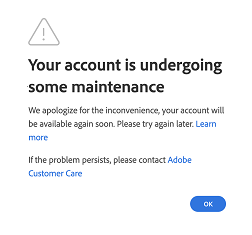
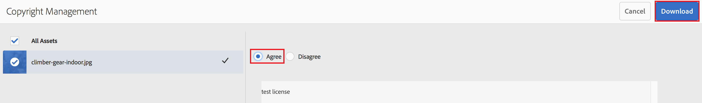
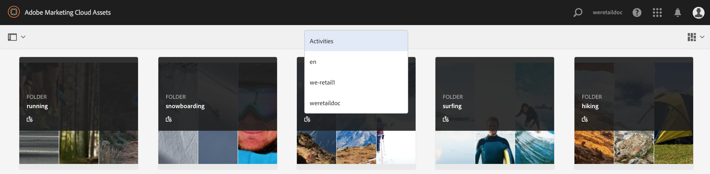

# Neue Funktionen in Experience Manager Assets Brand Portal {#what-s-new-in-aem-assets-brand-portal}

Mit Adobe Experience Manager Assets Brand Portal können Sie problemlos genehmigte Kreativ-Assets abrufen, kontrollieren und sicher an externe Parteien und interne Geschäftsbenutzer auf allen Geräten verteilen. Brand Portal ermöglicht eine effizientere Asset-Freigabe, schnellere Time-to-Market für Assets sowie verringerte Risiken von Nicht-Compliance und unbefugtem Zugriff. Adobe arbeitet daran, das Brand Portal-Gesamterlebnis zu verbessern. Nachfolgend erfahren Sie, welche Funktionen und Erweiterungen eingeführt werden.

## Änderungen in Version 2024.02.0 {#what-changed-in-February-2024}

Brand Portal 2024.02.0 ist eine interne Version, mit der die kritischen Probleme behoben werden. Siehe die neuesten [Brand Portal-Versionshinweise](brand-portal-release-notes.md).

## Änderungen in Version 2023.10.0 {#what-changed-in-October-2023}

Brand Portal 2023.10.0 ist eine interne Version, mit der die kritischen Probleme behoben werden. Siehe die neuesten [Brand Portal-Versionshinweise](brand-portal-release-notes.md).

## Änderungen in Version 2023.08.0 {#what-changed-in-August-2023}

Brand Portal 2023.08.0 ist eine interne Version, mit der die kritischen Probleme behoben werden. Siehe die neuesten [Brand Portal-Versionshinweise](brand-portal-release-notes.md).

## Änderungen in Version 2023.05.0 {#what-changed-in-May-2023}

Brand Portal 2023.05.0 ist eine interne Version, mit der die kritischen Probleme behoben werden. Siehe die neuesten [Brand Portal-Versionshinweise](brand-portal-release-notes.md).

## Änderungen in Version 2023.02.0 {#what-changed-in-February-2023}

Brand Portal 2023.02.0 ist eine interne Version, mit der die kritischen Probleme behoben werden. Siehe die neuesten [Brand Portal-Versionshinweise](brand-portal-release-notes.md).

## Änderungen in Version 2022.10.0 {#what-changed-in-October-2022}

Brand Portal 2022.10.0 ist eine interne Version, mit der die kritischen Probleme behoben werden. Siehe die neuesten [Brand Portal-Versionshinweise](brand-portal-release-notes.md).

## Änderungen in Version 2022.08.0 {#what-changed-in-August-2022}

Brand Portal 2022.08.0 ist eine interne Version, mit der die kritischen Probleme behoben werden. Siehe die neuesten [Brand Portal-Versionshinweise](brand-portal-release-notes.md).

## Änderungen in Version 2022.05.0 {#what-changed-in-May-2022}

Brand Portal führt jetzt automatisch alle zwölf Stunden Aufträge aus, um alle in AEM veröffentlichten Brand Portal-Assets zu löschen. Daher müssen Sie die Assets im Beitragsordner nicht manuell löschen, um die Ordnergröße unter dem Schwellenwert zu halten. Sie können den Status der automatisch ausgeführten Löschaufträge auch über die Option **[!UICONTROL Tools]** > **[!UICONTROL Asset-Beitragsstatus]** > **[!UICONTROL Löschberichte]** in Brand Portal überwachen. Der Bericht für einen Auftrag enthält die folgenden Details:

* Startzeit des Auftrags
* Endzeit des Auftrags
* Auftragsstatus
* Gesamtzahl der in einem Auftrag enthaltenen Assets
* Gesamtzahl der Assets, die erfolgreich in einem Auftrag gelöscht wurden
* Gesamtspeicher, der infolge der Auftragsausführung verfügbar gemacht wurde

Sie können auch einen Drilldown durchführen, um die Details der einzelnen Assets anzuzeigen, die in einem Löschauftrag enthalten sind. Details wie der Asset-Titel, die Größe, der Autor, der Löschstatus und die Löschzeit sind im Bericht enthalten.

Darüber hinaus enthält Brand Portal 2022.05.0 Fehlerbehebungen für kritische Probleme. Siehe die neuesten [Brand Portal-Versionshinweise](brand-portal-release-notes.md).

## Änderungen in Version 2022.02.0 {#what-changed-in-Feb-2022}

Brand Portal 2022.02.0 ist eine interne Version, mit der die kritischen Probleme behoben werden: Siehe die neuesten [Brand Portal-Versionshinweise](brand-portal-release-notes.md).

## Änderungen in Version 2021.10.0 {#what-changed-in-october-2021}

Brand Portal 2021.10.0 ist eine interne Version, mit der kritische Probleme behoben werden: Siehe die neuesten [Brand Portal-Versionshinweise](brand-portal-release-notes.md).

## Änderungen in Version 2021.08.0 {#what-changed-in-august-2021}

Brand Portal 2021.08.0 ist eine interne Version, in der Geschäftsprofile für Unternehmens- und Team-Kunden eingeführt werden, um Organisationen eine bessere Kontrolle über ihre Assets zu ermöglichen. Die Benutzer verfügen jetzt in den neuen und migrierten Organisationen über unternehmensspezifische Berechtigungen. Während der Migration werden alle bestehenden Adobe ID-Konten zu Business IDs migriert.

* Geschäfts-IDs nach der Migration an alle neuen und bestehenden Organisationen.
* Geschäfts-IDs erfordern keine spezifische Einrichtung, z. B. die Anforderung einer Domäne oder die Einrichtung einer SSO.
* Sie können Benutzer mit beliebigen E-Mail-Adressen hinzufügen, einschließlich öffentlicher E-Mail-Domains wie gmail.com oder outlook.com.

**Auswirkungen auf die Brand Portal-Benutzer**

Die Migration hat keine Auswirkungen auf Ihren vorhandenen Datensatz, Ihre Assets, Benutzer oder Einstellungen. Die einzige interne Änderung, die während der Migration vorgenommen wird, ist die Berechtigung Ihrer bestehenden Organisation für Geschäftsprofile.

>[!NOTE]
>
>Geschäftsprofile gelten derzeit für neue Organisationen, die nach dem 16. August 2021 erstellt werden.
>
>Bis zur Migration Ihrer Organisation können Sie weiterhin Adobe ID-, Enterprise ID- oder Federated ID-Typen verwenden, um auf die Organisation zuzugreifen.

### Referenzartikel {#reference-articles}

* [Einführung in Adobe-Profile](https://helpx.adobe.com/de/enterprise/kb/introducing-adobe-profiles.html)

* [Verwalten von Adobe-Profilen](https://helpx.adobe.com/de/enterprise/using/manage-adobe-profiles.html)

* [Aktualisierung des Anmeldeerlebnisses für Benutzer und Administratoren](https://helpx.adobe.com/de/enterprise/using/storage-for-business.html#new-admin-sign-in-exp)

* [Anmeldebeschränkung während der Migration](https://helpx.adobe.com/de/enterprise/kb/account-temporarily-unavailable.html)

* [Verwalten von Benutzern in der Admin Console](https://helpx.adobe.com/de/enterprise/using/manage-users-individually.html)

* [Verwalten von Produktprofilen für Enterprise-Benutzer](https://helpx.adobe.com/de/enterprise/using/manage-product-profiles.html#assign-users)

* [Domain-Vertrauen](https://helpx.adobe.com/enterprise/admin-guide.html/enterprise/using/set-up-identity.html#directory-trusting)

<!--   
### Add new users to T2E organization   {#add-users-to-T2E-org}

On adding a new user in Admin Console for a new or migrated T2E organization, the user will have to perform an additional step **Join Team** to get entitled to the T2E organization. 

The user is entitled only if the user chooses to **Join Team**, otherwise the user won't get access to the selected T2E organization in Brand Portal. 

>[!NOTE]
>
>The workflow is not applicable to the existing Brand Portal users.

### Additional screen while navigating to Admin Console   {#navigate-to-admin-console}

The administrators will have to perform an additional step of selecting the T2E organization while navigating from Brand Portal to Admin Console. The workflow applies on the new and migrated T2E organizations.   

Selection of the T2E organization is a one-time activity and is not required everytime the administrator navigates from Brand Portal to Admin Console.

1. Log in to a T2E organization in Brand Portal as administrator.
1. Go to **[!UICONTROL Tools]** > **[!UICONTROL Users]** > **[!UICONTROL Management]** and click on the link **[!UICONTROL Launch Admin Console]**. 

   Or, go to **[!UICONTROL Unified Shell]** > **[!UICONTROL Administration]** and click on the link **[!UICONTROL Launch Admin Console]**. 
1. Search the T2E organization to login to Admin Console.

   

### Restriction during migration of an organization   {#login-restriction}

When an organization is undergoing T2E migration, the users of that organization will not be able to login to Brand Portal. The following error message appears on the screen. However, the migration won't impact the active user session until the token expires. 

Once the migration is complete, the users can login to Brand Portal. The users will receive an email notification containing the entitlement changes. If the users are entitled to more than one organization, they will have to select the organization at the time of login. 
-->

<!--
For a new or migrated T2E orgnization, the users will have an organization specific entitlement. A user can have multiple entitlements with the same email id for different T2E organizations. 
-->

## Änderungen in Version 2021.06.0 {#what-changed-in-june-2021}

Brand Portal 2021.06.0 ist eine interne Version, mit der kritische Probleme behoben werden: Siehe die neuesten [Brand Portal-Versionshinweise](brand-portal-release-notes.md).

## Änderungen in Version 2021.02.0 {#what-changed-in-feb-2021}

Brand Portal 2021.02.0 verbessert AEM Assets as a Cloud Service mit dem Aktivierungs-Workflow und der Asset-Beschaffung-Funktion. Außerdem wird das Download-Erlebnis für Assets verbessert und es werden wichtige Fehlerbehebungen hinzugefügt. Damit können die Administratoren auch das Standard-Download-Verhalten von Ordnern, Sammlungen und den Massen-Download von Assets auf Mandantenebene konfigurieren. Der **[!UICONTROL Verwendungsbericht]** in Brand Portal wurde auch geändert und spiegelt nun die aktiven Brand Portal-Benutzer wider.

### Aktivieren von Brand Portal in AEM Assets as a Cloud Service {#bp-automation-on-cloud-service}

AEM Assets as a Cloud Service kann jetzt eine vorkonfigurierte Brand Portal-Instanz enthalten. Der Cloud Manager-Benutzer kann Brand Portal auf der AEM Assets as a Cloud Service-Instanz aktivieren.

Früher wurde AEM Assets as a Cloud Service manuell mit Brand Portal über Adobe Developer Console konfiguriert.

Der Cloud Manager-Benutzer Trigger den Aktivierungs-Workflow, der die erforderlichen Konfigurationen im Backend erstellt und Brand Portal auf derselben IMS-Organisation wie die AEM Assets-as a Cloud Service Instanz aktiviert.

So aktivieren Sie Brand Portal auf Ihrer AEM Assets as a Cloud Service-Instanz:

1. Melden Sie sich bei Adobe Cloud Manager an und gehen Sie zu **[!UICONTROL Umgebungen]**.
1. Wählen Sie die Umgebungen (einzeln) aus der Liste aus. Sobald Sie die Umgebung gefunden haben, die mit Brand Portal verbunden ist, klicken Sie auf die Schaltfläche **[!UICONTROL Brand Portal aktivieren]**, um den Aktivierungs-Workflow zu starten.
1. Sobald der Brand Portal-Mandant aktiviert ist, ändert sich der Status in „Aktiviert“.

Siehe [Aktivieren von Brand Portal in AEM Assets as a Cloud Service](https://experienceleague.adobe.com/de/docs/experience-manager-cloud-service/content/assets/brand-portal/configure-aem-assets-with-brand-portal).

### Asset-Beschaffung in AEM Assets as a Cloud Service {#asset-sourcing-on-cloud-service}

Die Asset-Beschaffungsfunktion wird jetzt in AEM Assets as a Cloud Service unterstützt. Die Funktion ist standardmäßig für alle Cloud Service-Benutzer aktiviert. Die zulässigen Brand Portal-Benutzer können zur Asset-Beschaffung beitragen, indem sie neue Assets in die Beitragsordner hochladen und den Beitragsordner von Brand Portal in die AEM Assets-as a Cloud Service-Instanz veröffentlichen. Administratoren können Beiträge von Brand Portal-Benutzern überprüfen und genehmigen, bevor sie sie an andere Benutzer weiterleiten.

Zuvor war die Asset-Beschaffung nur in AEM Assets (On-Premise und Managed Service) verfügbar.

Siehe [Asset-Beschaffung in Brand Portal](https://experienceleague.adobe.com/de/docs/experience-manager-brand-portal/using/asset-sourcing-in-brand-portal/brand-portal-asset-sourcing).

### Asset-Download {#asset-download-setting}

Zusätzlich zu den vorhandenen **[!UICONTROL Download-Einstellungen]** können die Brand Portal-Administratoren jetzt die Einstellung **[!UICONTROL Asset-Download]** konfigurieren. Mit dieser Einstellung können die Administratoren das Standard-Download-Verhalten von Ordnern, Sammlungen und den Massen-Download von Assets (mehr als 20 Assets) auf Mandantenebene steuern.

<!--
Earlier, all the asset renditions were directly downloaded in a zip folder in case of folder, collection, and bulk download of assets. As the **[!UICONTROL Download]** dialog box is skipped for folders or collections, there was no mechanism to control the downloading behaviour of the assets. Due to this, the users were finding it difficut to search for a particular asset rendition from a folder containing huge bunch of downloaded renditions. 
-->

Zuvor wurden alle Asset-Ausgabedarstellungen direkt in einen ZIP-Ordner heruntergeladen. Das Dialogfeld **[!UICONTROL Download]** wurde für Ordner und Sammlungen übersprungen. Außerdem gab es keine Methode, um das Download-Verhalten der Assets zu steuern, wodurch es schwierig wurde, aus vielen Downloads nach einer bestimmten Ausgabedarstellung zu suchen.

Die Einstellung **[!UICONTROL Asset-Download]** bietet jetzt die Möglichkeit, beim Herunterladen von Ordnern, Sammlungen oder beim Massen-Download von Assets für jedes Asset einen eigenen Ordner zu erstellen.

Wenn die Einstellung **[!UICONTROL Asset-Download]** deaktiviert ist, werden die Ordner oder Sammlungen in einen ZIP-Ordner heruntergeladen, der alle Asset-Ausgabedarstellungen im selben Ordner enthält, mit Ausnahme des Downloads der Assets über den Freigabe-Link.

Melden Sie sich bei Ihrem Brand Portal-Mandanten als Administrator an und navigieren Sie zu **[!UICONTROL Tools]** > **[!UICONTROL Download]**. Administratoren können die Einstellung **[!UICONTROL Asset-Download]** aktivieren, um beim Herunterladen von Ordnern, Sammlungen und Massen-Download von Assets für jedes Asset einen separaten Ordner zu erstellen.

Siehe [Herunterladen von Assets aus Brand Portal](https://experienceleague.adobe.com/en/docs/experience-manager-brand-portal/using/download/brand-portal-download-assets).
<!--
### Download using Share link {#download-using-share-link}

The default behavior of downloading the assets using share link is now independent of the **[!UICONTROL Download Settings]**. A separate folder is created for each asset while downloading the assets using share link. 
-->

### Verwendungsbericht {#usage-report}

Der **[!UICONTROL Verwendungsbericht]** in Brand Portal wurde geändert, sodass er nur die aktiven Brand Portal-Benutzer widerspiegelt. Die Brand Portal-Benutzer, die keinem Produktprofil in der Admin Console zugewiesen sind, gelten als inaktive Benutzer und werden im **[!UICONTROL Verwendungsbericht]** nicht angezeigt.

Zuvor wurden sowohl aktive als auch inaktive Benutzer im Verwendungsbericht angezeigt.

## Änderungen in Version 2020.10.0 {#what-changed-in-oct-2020}

Brand Portal 2020.10.0 ist eine Version, die Verbesserungen vornimmt und sich auf die Vereinfachung des Download-Erlebnisses für Assets konzentriert und wichtige Fehlerbehebungen enthält. Mit der Verbesserung wird ein neuer und verbesserter Workflow für Asset-Downloads eingeführt, mit Optionen zum Ausschließen von Ausgabedarstellungen und direkten Downloads aus dem Bedienfeld **[!UICONTROL Ausgabedarstellungen]** . Sie ermöglicht außerdem die Konfiguration von Zugriffs- und Downloadrechten für bestimmte Benutzergruppen und ermöglicht die einfache Navigation zu Dateien, Sammlungen und freigegebenen Links von allen Brand Portal-Seiten aus. Siehe [Brand Portal-Versionshinweise](brand-portal-release-notes.md).

### Vereinfachtes Download-Erlebnis {#download-dialog}

Bisher wurden im Dialogfeld **[!UICONTROL Download]** mehrere Optionen angeboten, z. B. das Erstellen separater Ordner für jedes Asset, das Versenden von Assets per E-Mail, das Auswählen von Original-Assets und mehr. Diese Optionen waren für nicht technische oder neue Benutzer verwirrend, insbesondere beim Herunterladen mehrerer Assets oder Ordner. Außerdem konnte der Benutzer nicht alle Asset-Ausgabedarstellungen sehen oder eine bestimmte benutzerdefinierte oder dynamische Ausgabedarstellung ausschließen.

Das neue Dialogfeld **[!UICONTROL Download]** verallgemeinert den Asset-Auswahl- und Filterprozess, der es den Brand Portal-Benutzern erleichtert, beim Herunterladen der Asset-Ausgabedarstellungen effektive Entscheidungen zu treffen. Im Dialogfeld werden alle ausgewählten Assets und deren Ausgabedarstellungen abhänig von der [**[!UICONTROL Download]**](brand-portal-download-assets.md)-Konfiguration und den **[!UICONTROL Download]** -Einstellungen aufgeführt.

>[!NOTE]
>
>Für alle Benutzer ist jetzt standardmäßig **[!UICONTROL Schneller Download]** aktiviert. Vor dem Herunterladen der Assets aus Brand Portal muss IBM® Aspera Connect 3.9.9 (`https://www.ibm.com/docs/en/aspera-connect/3.9.9`) in der Browsererweiterung installiert sein.

<!--
If any of the **[!UICONTROL Custom Rendition]** or **[!UICONTROL System Rendition]** is enabled in the [**[!UICONTROL Download]**](brand-portal-download-assets.md) configuration and **[!UICONTROL Download]** settings are enabled for the group users, the new **[!UICONTROL Download]** dialog box appears with all the renditions of the selected assets or folders containing assets in a List View. 
-->

Im Dialogfeld **[!UICONTROL Download]** haben die Benutzer folgende Möglichkeiten:

* Anzeigen aller verfügbarer Ausgabedarstellungen eines Assets in der Download-Liste.
* Ausschließen von Ausgabedarstellungen der Assets, die nicht heruntergeladen werden müssen.
* Anwenden desselben Satzes von Ausgabedarstellungen auf alle ähnlichen Asset-Typen mit einem Klick.
* Anwenden unterschiedlicher Sätze von Ausgabedarstellungen auf unterschiedliche Asset-Typen.
* Erstellen Sie einen separaten Ordner für jedes Asset.
* Herunterladen ausgewählter Assets und ihrer Ausgabedarstellungen.

Der Download-Workflow ist konsistent für eigenständige Assets, mehrere Assets, Ordner mit Assets, lizenzierte oder nicht lizenzierte Assets und für den Download von Assets über einen Freigabe-Link. Siehe [Schritte zum Herunterladen von Assets aus Brand Portal](https://experienceleague.adobe.com/en/docs/experience-manager-brand-portal/using/download/brand-portal-download-assets).

### Schnellnavigation {#quick-navigation}

Zuvor war die Option zur Anzeige von **[!UICONTROL Dateien]**, **[!UICONTROL Sammlungen]** und **[!UICONTROL freigegebenen Links]** verborgen und erforderte jedes Mal mehrere Klicks, wenn der Benutzer zu einer anderen Ansicht wechseln wollte.

In Brand Portal 2020.10.0 können Benutzer von allen Brand Portal-Seiten mithilfe der Links für die Schnellnavigation mit nur einem Klick zu **[!UICONTROL Dateien]**, **[!UICONTROL Sammlungen]** und **[!UICONTROL geteilten Links]** navigieren.

### Verbessertes Dialogfeld „Ausgabedarstellungen“ {#rendition-panel}

Zuvor konnten Benutzer das Original-Asset uns eine Ausgabedarstellungen nur dann im Dialogfeld **[!UICONTROL Ausgabedarstellungen]** anzeigen, wenn die Option **[!UICONTROL Benutzerdefinierte Ausgabedarstellung]** bzw. **[!UICONTROL System-Ausgabedarstellung]** in der **[!UICONTROL Download]**-Konfiguration aktiviert war. Außerdem mussten die Benutzer alle Asset-Ausgabedarstellungen herunterladen, da kein Filter zum Ausschließen bestimmter benutzerdefinierter oder dynamischer Ausgabedarstellungen vorhanden war, die nicht erforderlich waren.

<!--
Earlier, if any of the custom or system renditions was enabled in the **[!UICONTROL Download]** settings, an additional **[!UICONTROL Download]** dialog box appeared on clicking the **[!UICONTROL Download]** button wherein the user had to manually select the set of renditions (original asset, custom renditions, dynamic renditions) to download.
There was no filter to exclude specific custom or dynamic renditions which were not required for download.
-->

In Brand Portal 2020.10.0 können Benutzer bestimmte Ausgabedarstellungen ausschließen und die ausgewählten Ausgabedarstellungen direkt [aus dem Bedienfeld Ausgabedarstellungen](brand-portal-download-assets.md#download-assets-from-asset-details-page) auf der Asset-Detailseite herunterladen, ohne das Dialogfeld **[!UICONTROL Download]** öffnen zu müssen.

<!-- 
In Brand Portal 2020.10.0, direct download and exclude renditions features are introduced in the **[!UICONTROL Renditions]** panel on the asset details page. All the renditions (original asset, custom renditions, dynamic renditions) under the rendition panel are now associated with a check box and are enabled by default. 

The user can clear the check boxes to exclude the renditions which are not required for download. And can click on the **[!UICONTROL Download]** button in the **[!UICONTROL Renditions]** panel to directly download the selected set of renditions in a zip folder without having to open the **[!UICONTROL Download]** dialog box.
-->

### Download-Einstellungen konfigurieren {#download-permissions}

Brand Portal-Administratoren können jetzt Einstellungen konfigurieren, damit Benutzergruppen neben den vorhandenen Konfigurationen für den **[!UICONTROL Download]** auch Original-Assets und/oder beide Ausgabeformate von der Asset-Detailseite anzeigen oder herunterladen können.

Melden Sie sich bei Ihrem Brand Portal-Mandanten als Administrator an und navigieren Sie zu **[!UICONTROL Tools]** > **[!UICONTROL Benutzer]**.

Navigieren Sie auf der Seite **[!UICONTROL Benutzerrollen]** zur Registerkarte **[!UICONTROL Gruppen]**, um die Ansicht und (oder) die Download-Einstellungen für die Benutzergruppen zu konfigurieren.

Früher konnte mit den Einstellungen lediglich eingeschränkt werden, welche Benutzergruppen das Original-Asset herunterladen konnten.

Auf der Registerkarte **[!UICONTROL Gruppen]** auf der Seite **[!UICONTROL Benutzerrollen]** können Administratoren die Anzeige- und Download-Einstellungen konfigurieren:

* Wenn die Optionen **[!UICONTROL Original herunterladen]** und **[!UICONTROL Ausgabedarstellungen herunterladen]** aktiviert sind, können Benutzer der ausgewählten Gruppe die Original-Assets anzeigen und herunterladen.
* Wenn beide Einstellungen deaktiviert sind, können Benutzer nur die Original-Assets anzeigen. Die Asset-Ausgabedarstellungen sind auf der Asset-Detailseite für Benutzer nicht sichtbar.
* Wenn nur die Einstellung **[!UICONTROL Original herunterladen]** aktiviert ist, können Benutzer nur die Original-Assets auf der Asset-Detailseite anzeigen und von dort herunterladen.
* Wenn nur die Einstellung **[!UICONTROL Ausgabedarstellungen herunterladen]** aktiviert ist, können Benutzer das Original-Asset anzeigen, aber nicht herunterladen. Benutzer können jedoch die Asset-Ausgabedarstellungen anzeigen und herunterladen.

Siehe [Konfigurieren des Asset-Downloads](https://experienceleague.adobe.com/en/docs/experience-manager-brand-portal/using/download/brand-portal-download-assets#configure-download-permissions).

>[!NOTE]
>
>Wenn ein Benutzer mehreren Gruppen hinzugefügt wird und eine dieser Gruppen über Einschränkungen verfügt, gelten die Einschränkungen für den Benutzer.

<!--
>Restrictions to access the original asset and their renditions do not apply to administrators even if they are members of restricted groups.
 >
 >The users can always download assets and their renditions from the repository using a `curl` request even if the download configurations are turned-off.
 >
-->

## Änderungen in Version 6.4.7 {#what-changed-in-647}

Brand Portal 6.4.7 führt den Dokument-Viewer ein, verbessert die Leistung beim Herunterladen von Assets und enthält wichtige Fehlerbehebungen. Siehe die neuesten [Brand Portal-Versionshinweise](brand-portal-release-notes.md).

<!--
Brand Portal 6.4.7 release brings in the Document Viewer, leverages the Brand Portal administrators to configure asset download, and centers top customer requests. See latest [Brand Portal Release Notes](brand-portal-release-notes.md).
-->

### Dokument-Viewer {#doc-viewer}

Der Dokument-Viewer verbessert das PDF-Anwendererlebnis. Er bietet beim Anzeigen von PDF-Dateien in Brand Portal ein ähnliches Erlebnis wie Adobe Document Cloud.

Zuvor standen begrenzte Optionen zum Anzeigen der PDF-Dateien zur Verfügung.

Brand Portal-Benutzer können den Dokument-Viewer verwenden, um Seiten und Lesezeichen anzuzeigen, Text zu suchen, ein- und auszuzoomen und durch Seiten zu navigieren. Sie können zu einer bestimmten Seite wechseln, an ein Fenster oder einen Bildschirm anpassen und die Sichtbarkeit der Symbolleiste umschalten.

>[!NOTE]
>
>Das Anzeigeerlebnis für andere Dokumentenformate bleibt unverändert.

### Download-Erlebnis {#download-configurations}

Der Asset-Download-Prozess wurde überarbeitet und bietet ein vereinfachtes Anwendererlebnis beim [Herunterladen von Assets aus Brand Portal](brand-portal-download-assets.md).

Dem bestehenden Workflow zum Herunterladen von Assets aus Brand Portal folgt zwangsläufig das Erscheinungsbild eines Dialogfelds &quot;**[!UICONTROL Download]**&quot;, in dem mehrere Download-Optionen zur Auswahl stehen.

In Brand Portal 6.4.7 können die Brand Portal-Administratoren die Einstellungen für das Asset **[!UICONTROL Download]** konfigurieren. Die folgenden Konfigurationen sind verfügbar:

* **[!UICONTROL Schneller Download]**
* **[!UICONTROL Benutzerdefinierte Ausgabedarstellungen]**
* **[!UICONTROL Systemausgabedarstellungen]**

Der Brand Portal-Administrator kann eine beliebige Kombination aktivieren, um den Asset-Download zu konfigurieren.

<!--In Brand Portal 6.4.7, fast download, custom renditions, and system renditions are the three configurations available.-->

* Wenn sowohl die Konfigurationen **[!UICONTROL Benutzerdefinierte Ausgabeformate]** als auch die Konfigurationen **[!UICONTROL Systemausgaben]** deaktiviert sind, werden die Original-Ausgabeformate der Assets ohne zusätzliches Dialogfeld heruntergeladen, wodurch die Download-Zeiten für die Brand Portal-Benutzer vereinfacht werden.

* Wenn eine der **[!UICONTROL benutzerdefinierten Ausgabeformate]** oder die **[!UICONTROL Systemwiedergabe]** aktiviert ist, wird das Dialogfeld **[!UICONTROL Download]** angezeigt und das Original-Asset zusammen mit den Asset-Ausgabeformaten heruntergeladen. Durch die Aktivierung der Konfiguration **[!UICONTROL Schneller Download]** wird der Download-Prozess beschleunigt.

Je nach Konfiguration bleibt der Download-Workflow für eigenständige Assets, mehrere Assets und Ordner mit Assets konstant. Sie enthält auch lizenzierte oder nicht lizenzierte Assets und das Herunterladen von Assets über einen Freigabe-Link.

## Änderungen in Version 6.4.6 {#what-changed-in-646}

In Brand Portal 6.4.6 wurde der Autorisierungskanal zwischen AEM Assets und Brand Portal geändert. Brand Portal wird jetzt von AEM Assets as a Cloud Service, AEM Assets 6.3 und höher unterstützt. In AEM Assets 6.3 und höher wurde Brand Portal zunächst über das alte OAuth-Gateway in der klassischen Benutzeroberfläche konfiguriert. Dieses Gateway verwendet den JWT-Token-Austausch, um ein IMS-Zugriffstoken zur Autorisierung abzurufen. AEM Assets wird jetzt mit Brand Portal über die Adobe-Entwicklerkonsole konfiguriert, die ein IMS-Token zur Authentifizierung Ihres Brand Portal-Mandanten abruft.

<!-- The steps to configure integration are different depending on your AEM version, and whether you are configuring for the first-time, or upgrading the existing integration:
-->

<!--
  
   | **AEM Version** |**New Integration** |**Upgrade Integration** |
|---|---|---|
| **AEM 6.5** |[Create new integration](../using/brand-portal-configure-integration-65.md) |[Upgrade existing integration](../using/brand-portal-configure-integration-65.md#upgrade-integration-65) | 
| **AEM 6.4** |[Create new integration](../using/brand-portal-configure-integration-64.md) |[Upgrade existing integration](../using/brand-portal-configure-integration-64.md#upgrade-integration-64) | 
| **AEM 6.3** |[Create new integration](../using/brand-portal-configure-integration-63.md) |[Upgrade existing integration](../using/brand-portal-configure-integration-63.md#upgrade-integration-63) | 
| **AEM 6.2** | | 

   -->

Die Schritte zum Konfigurieren von AEM Assets mit Brand Portal unterscheiden sich je nach Ihrer AEM-Version und abhängig davon, ob Sie zum ersten Mal eine Konfiguration durchführen oder die vorhandenen Konfigurationen aktualisieren:

<!--| **AEM Version** |**New Configuration** |**Upgrade Configuration** |
|---|---|---|
| **AEM 6.5 (6.5.4.0 and above)** |[Create configuration](../using/brand-portal-configure-integration-65.md) |[Upgrade configuration](../using/brand-portal-configure-integration-65.md#upgrade-integration-65) | 
| **AEM 6.4 (6.4.8.0 and above)** |[Create configuration](../using/brand-portal-configure-integration-64.md) |[Upgrade configuration](../using/brand-portal-configure-integration-64.md#upgrade-integration-64) | 
| **AEM 6.3 (6.3.3.8 and above)** |[Create configuration](../using/brand-portal-configure-integration-63.md) |[Upgrade configuration](../using/brand-portal-configure-integration-63.md#upgrade-integration-63) | 

-->

<!-- AEM Assets configuration with Brand Portal on Adobe I/O is supported on:
* AEM 6.5.4.0 and above
* AEM 6.4.8.0 and above
* AEM 6.3.3.8 and above -->

| **AEM-Version** | **Neue Konfiguration** | **Upgrade der Konfiguration** |
|---|---|---|
| **AEM Assets as a Cloud Service** | [Konfiguration erstellen](https://experienceleague.adobe.com/de/docs/experience-manager-cloud-service/content/assets/brand-portal/configure-aem-assets-with-brand-portal) | - |
| **AEM 6.5 (6.5.4.0 und höher)** | [Konfiguration erstellen](https://experienceleague.adobe.com/de/docs/experience-manager-65/content/assets/brandportal/configure-aem-assets-with-brand-portal) | [Upgrade der Konfiguration](https://experienceleague.adobe.com/en/docs/experience-manager-65/content/assets/brandportal/configure-aem-assets-with-brand-portal#upgrade-integration-65) |

>[!NOTE]
>
>Adobe empfiehlt, Ihre AEM-Instanz zu aktualisieren, um das neueste Service Pack zu verwenden.

Siehe [Brand Portal-Versionshinweise](brand-portal-release-notes.md).

Siehe [Häufig gestellte Fragen zu Brand Portal](brand-portal-faqs.md).

## Änderungen in Version 6.4.5 {#what-changed-in-645}

Mit Brand Portal 6.4.5 können externe Agenturen und Teams Inhalte in Brand Portal hochladen und in AEM Assets veröffentlichen, ohne Zugriff auf die Autorenumgebung zu benötigen. Diese Funktion wird als **[Asset-Beschaffung in Brand Portal](brand-portal-asset-sourcing.md)** bezeichnet und verbessert das Kundenerlebnis, indem eine bidirektionale Methode zur Verfügung gestellt wird, mit der Benutzer Assets beisteuern und für andere global verteilte Brand Portal-Benutzer freigeben können.

### Asset-Beschaffung in Brand Portal {#asset-sourcing-in-bp}

Mit der Asset-Beschaffung können AEM-Benutzer (Administratoren/Benutzer ohne Administratorrechte) neue Ordner mit der zusätzlichen Eigenschaft **Asset-Beitrag** erstellen, um sicherzustellen, dass die neu erstellten Ordner von Brand Portal-Benutzern für die Übermittlung von Assets nutzbar sind. Es wird automatisch ein Workflow Trigger, der zwei weitere Unterordner namens NEU und SHARED im neu erstellten Ordner **Beitrag** erstellt.

Der AEM lädt eine kurze und Grundlinien-Assets in den Ordner **SHARED** hoch. Sie definieren die Asset-Typen, die im Beitragsordner benötigt werden, und stellen sicher, dass die Brand Portal-Benutzer über die erforderlichen Referenzinformationen verfügen. Der Administrator kann aktiven Brand Portal-Benutzern anschließend Zugriff auf den Beitragsordner gewähren, bevor der neu erstellte **Beitragsordner** in Brand Portal veröffentlicht wird.

Nachdem der Benutzer den Inhalt zum Ordner **NEU** hinzugefügt hat, kann er den Beitragsordner wieder in der AEM Autorenumgebung veröffentlichen. Es kann einige Minuten dauern, bis der Import abgeschlossen ist und die neu veröffentlichten Inhalte in AEM Assets angezeigt werden.

Darüber hinaus bleiben alle vorhandenen Funktionen unverändert. Brand Portal-Benutzer können Assets aus dem Beitragsordner sowie aus anderen Ordnern anzeigen, suchen und herunterladen, für die sie über entsprechende Berechtigungen verfügen. Administratoren können außerdem den Beitragsordner freigeben, Eigenschaften ändern und Assets zu Sammlungen hinzufügen.

>[!NOTE]
>
>Die Asset-Beschaffung in Brand Portal wird ab AEM 6.5.2.0 unterstützt.
>
>Die Funktion wird in früheren Versionen AEM 6.3 und AEM 6.4 nicht unterstützt.

### Hochladen von Assets in den Beitragsordner {#upload-assets-in-bp}

Brand Portal-Benutzer mit entsprechender Berechtigung können einzelne Assets oder Ordner mit mehreren Assets (.zip-Datei) in den Beitragsordner hochladen. Ein Benutzer kann mehrere Assets in einen Asset-Beitragsordner hochladen. Es kann jedoch jeweils nur ein Ordner erstellt werden.

Brand Portal-Benutzer können nur Assets in den Unterordner **NEU** hochladen. Der Ordner **FREIGEGEBEN** dient zur Verteilung von Anforderungen und Grundlinien-Assets.

### Veröffentlichen von Beitragsordnern in AEM Assets {#publish-assets-to-aem}

Nachdem der Upload in den Ordner **NEU** abgeschlossen ist, können Brand Portal-Benutzer den Beitragsordner erneut in AEM veröffentlichen. Der Import und die Darstellung der in AEM Assets veröffentlichten Inhalte/Assets kann einige Minuten dauern. Siehe [Veröffentlichen von Beitragsordnern in AEM Assets](brand-portal-publish-contribution-folder-to-aem-assets.md).

## Änderungen in Version 6.4.4 {#what-changed-in-644}

Version 6.4.4 von Brand Portal konzentriert sich auf Verbesserungen der Textsuche und von Kunden häufig gewünschte Funktionen. Siehe die neuesten [Brand Portal-Versionshinweise](brand-portal-release-notes.md).

### Verbesserungen bei der Suche

Ab Brand Portal 6.4.4 wird die Suche nach Textteilen im Eigenschaftsprädikat im Filterbereich unterstützt. Um die Suche nach Textteilen zu ermöglichen, aktivieren Sie im Suchformular im Eigenschaftsprädikat die Option **Teilsuche**.

Lesen Sie weiter, um mehr über die Suche nach Textteilen und Suche mit Platzhalter zu erfahren.

#### Suche nach Satzteilen {#partial-phrase-search}

Sie können jetzt nach Assets suchen, indem Sie nur einen Teil des gesuchten Satzes, d. h. ein oder zwei Wörter, im Filterbereich angeben.

**Anwendungsfall**
Die Suche nach Satzteilen ist hilfreich, wenn Sie sich nicht sicher sind, wie die genaue Wortfolge im gesuchten Satz lautet.

Beispiel: Wenn Ihr Suchformular in Brand Portal das Eigenschaftsprädikat für Teilsuche nach einem Asset-Titel anwendet, werden nach Angabe des Begriffs **Lager** alle Assets mit dem Wort „Lager“ im Titelsatz zurückgegeben.

#### Suche mit Platzhalter {#wildcard-search}

Die Brand Portal ermöglicht die Verwendung des Sternchens (&#42;) mit einem Teil eines Wortes in Ihrer Suchabfrage.

Wenn Sie sich nicht sicher sind, welche Wörter im gesuchten Satz enthalten sind, können Sie eine Suche mit Platzhalter verwenden, um die Lücken in der Suchabfrage zu füllen.

Wenn Sie beispielsweise **klettern&#42;** angeben, werden alle Assets zurückgegeben, deren Titelphrase Wörter enthält, die mit den Zeichen **klettern** beginnen, wenn das Suchformular in Brand Portal das Eigenschaftsprädikat für die Teilsuche nach Asset-Titel verwendet.

Auch gilt Folgendes:

* Durch die Angabe von **&#42;klettern** werden alle Assets zurückgegeben, deren Titelphrase Wörter enthält, die mit den Zeichen **klettern** enden.

* Durch die Angabe von **&#42;klettern&#42;** werden alle Assets zurückgegeben, deren Titelphrase Wörter enthält, die die Zeichen **klettern** enthalten.

>[!NOTE]
>
>Wenn Sie das Kontrollkästchen **Teilsuche** aktivieren, wird standardmäßig **Groß-/Kleinschreibung ignorieren** ausgewählt.

## Änderungen in Version 6.4.3 {#what-changed-in}

Brand Portal 6.4.3 führt einen alternativen Alias für Zugriffs-URLs, eine neue Ordnerhierarchie und Verbesserungen bei der Videounterstützung ein. Außerdem werden geplante Veröffentlichungen von AEM Author in Brand Portal eingeführt, betriebliche Verbesserungen vorgenommen und Kundenanfragen beantwortet.

### Ordnerhierarchienavigation für Benutzer ohne Administratorrechte

Administratoren können jetzt konfigurieren, wie Ordner für Benutzer ohne Administratorrechte (Bearbeiter, Betrachter und Gastbenutzer) bei der Anmeldung angezeigt werden. Die Konfiguration [Ordnerhierarchie aktivieren](../using/brand-portal-general-configuration.md) wird in den **Allgemeinen Einstellungen** im Admin-Tools-Bereich hinzugefügt. Wenn die Konfiguration:

* **aktiviert** ist, dann ist die Ordnerstruktur, die vom Stammordner beginnt, für Benutzerinnen und Benutzer ohne Administratorrechte sichtbar. Dadurch erhalten sie ein Navigationserlebnis, das dem von Admins ähnelt.
* **deaktiviert** ist, werden auf der Landingpage nur die freigegebenen Ordner angezeigt.

Wenn die Funktion [Ordnerhierarchie aktivieren](../using/brand-portal-general-configuration.md) aktiviert ist, können Sie besser zwischen verschiedenen Ordnern mit demselben Namen unterscheiden, die über verschiedene Hierarchien freigegeben werden. Bei der Anmeldung sehen Nicht-Administratoren nun die virtuellen übergeordneten (und untergeordneten) Ordner der freigegebenen Ordner.

Die freigegebenen Ordner sind in den jeweiligen Verzeichnissen in virtuellen Ordnern organisiert. Sie können diese virtuellen Ordner an einem Sperrsymbol erkennen.

Das Standardminiaturbild der virtuellen Ordner ist das Miniaturbild des ersten freigegebenen Ordners.

### Suchen in einer bestimmten Ordnerhierarchie oder einem bestimmten Pfad

Das Prädikat **Pfadbrowser** wird in das Suchformular eingeführt, um die Suche nach Assets in einem bestimmten Verzeichnis zu ermöglichen. Der Standardsuchpfad der Sucheigenschaft für den Pfad-Browser lautet `/content/dam/mac/<tenant-id>/`. Dieser kann durch Bearbeiten des Standardsuchformulars konfiguriert werden.

* Administratoren können über den Pfad-Browser zu einem beliebigen Verzeichnis in Brand Portal navigieren.
* Nicht-Administratoren können über den Pfad-Browser nur zu den Ordnern navigieren, die für sie freigegeben sind, und wieder zurück zu den übergeordneten Ordnern.

  Zum Beispiel wird `/content/dam/mac/<tenant-id>/folderA/folderB/folderC` für einen Nicht-Administrator freigegeben. Der Benutzer kann mithilfe des Pfad-Browsers innerhalb von OrdnerC nach Assets suchen. Dieser Benutzer kann auch zu OrdnerB und OrdnerA navigieren (da es sich um übergeordnete Elemente des OrdnerC handelt, der für den Benutzer freigegeben ist).

Sie können die Asset-Suche nun in einem bestimmten Ordner einschränken, zu dem Sie navigiert sind, anstatt die Einschränkung angefangen beim Stammordner anzuwenden.

Beachten Sie, dass die Suche in diesen Ordnern nur Suchergebnisse aus Assets zurückgibt, die für den Benutzer freigegeben wurden.

### Unterstützung von Dynamic Media Video-Ausgabedarstellungen

Benutzer, deren AEM Autoreninstanz sich im Dynamic Media-Hybridmodus befindet, können die Dynamic Media-Ausgabeformate zusätzlich zu den Originalvideodateien in der Vorschau anzeigen und herunterladen.

Um die Vorschau und den Download von Dynamic Media-Ausgabeformaten für bestimmte Mandantenkonten zu aktivieren, geben Administratoren eine **Dynamic Media-Konfiguration** an. Dieser Schritt enthält die Videodienst-URL und die Registrierungs-ID in der Konfiguration **Video** im Admin Tools-Bereich.

Dynamic Media-Videos können in der Vorschau angezeigt werden für:

* Asset-Detailseite
* Kartenansicht des Assets
* Vorschauseite zur Link-Freigabe

Dynamic Media-Videocodierungen können hier heruntergeladen werden:

* Brand Portal
* Freigegebener Link

### Geplante Veröffentlichung in Brand Portal

Der Veröffentlichungs-Workflow für Assets (und Ordner) aus einer Autoreninstanz von AEM 6.4.2.0 in Brand Portal kann für einen späteren Zeitpunkt mit Datum und Uhrzeit geplant werden.

Entsprechend können veröffentlichte Assets zu einem späteren Zeitpunkt aus dem Portal entfernt werden, indem der Workflow zum Rückgängigmachen der Veröffentlichung in Brand Portal geplant wird.

### Konfigurierbarer Mandantenalias in URL

Unternehmen können ihre Portal-URL anpassen, indem sie ein alternatives Präfix in der URL verwenden. Um einen Alias für den Mandantennamen in der vorhandenen Portal-URL zu erhalten, müssen sich Unternehmen an den Support wenden.

Beachten Sie, dass nur das Präfix der Brand Portal-URL angepasst werden kann und nicht die gesamte URL.\
Für eine Organisation mit der vorhandenen Domäne **geomettrix.brand-portal.adobe.com** kann beispielsweise auf Anfrage die Domäne **geomettrixinc.brand-portal.adobe.com** erstellt werden.

Die AEM-Autoreninstanz kann jedoch nur mit der Mandanten-ID-URL und nicht mit der (alternativen) Mandanten-Alias-URL [konfiguriert](https://experienceleague.adobe.com/de/docs/experience-manager-65/content/assets/brandportal/configure-aem-assets-with-brand-portal) werden.

Unternehmen können ihre Branding-Anforderungen erfüllen, indem sie ihre Portal-URL anpassen, anstatt die von Adobe bereitgestellte URL beizubehalten.

### Verbesserungen des Download-Erlebnisses

Die Version bietet ein vereinfachtes Download-Erlebnis mit einer geringeren Anzahl an Klicks und Warnungen auf:

* Entscheidung, dass nur die Ausgabedarstellungen heruntergeladen werden (und nicht die Original-Assets).
* Herunterladen der Assets, wenn der Zugriff auf die Original-Ausgabedarstellungen eingeschränkt ist.

## Änderungen in Version 6.4.2 {#what-changed-in-1}

Brand Portal 6.4.2 verfügt über Funktionen, die den Anforderungen von Unternehmen hinsichtlich der Asset-Verteilung gerecht werden und so eine globale Reichweite über den Gastzugang und schnellere Downloads ermöglichen. Darüber hinaus bietet es verbesserte Kontrolle durch neue Admin-Konfigurationen, einen hinzugefügten Bericht und behandelt Kundenanfragen.

### Gastzugang

AEM Brand Portal ermöglicht den Gastzugang für das Portal. Ein Gastbenutzer benötigt keine Anmeldeinformationen, um das Portal aufzurufen, und kann auf alle öffentlichen Ordner und Sammlungen zugreifen und diese herunterladen. Gastbenutzer können Assets zu ihrer Lightbox (private Sammlung) hinzufügen und diese herunterladen. Sie können auch die Smart Tag-Suche und die von Admins festgelegten Sucheigenschaften anzeigen. In der Gastsitzung können Benutzerinnen und Benutzer keine Sammlungen und gespeicherten Suchen erstellen oder diese weitergeben, nicht auf Einstellungen für Ordner und Sammlungen zugreifen und keine Assets als Links teilen.

In einer Organisation sind mehrere gleichzeitige Gastsitzungen zulässig, die jedoch auf 10 % des Gesamtbenutzerkontingents pro Organisation beschränkt sind.

Eine Gastsitzung bleibt für zwei Stunden aktiv. Infolgedessen wird der Status der Lightbox auch bis zwei Stunden nach Beginn der Sitzung beibehalten. Nach zwei Stunden muss die Gastsitzung neu gestartet werden, d. h. der Lightbox-Status geht verloren.

### Beschleunigte Downloads

Brand Portal-Benutzer können IBM® Aspera Connect-basierte schnelle Downloads anwenden, um eine bis zu 25-fache Geschwindigkeit zu erzielen und unabhängig von ihrem Standort auf der ganzen Welt einen nahtlosen Download zu erzielen. Um die Assets schneller von Brand Portal oder über den freigegebenen Link herunterzuladen, müssen Benutzer die Option **Downloadbeschleunigung aktivieren** im Dialogfeld &quot;Herunterladen&quot;auswählen, sofern die Downloadbeschleunigung in ihrem Unternehmen aktiviert ist.

Um die IBM® Aspera-basierte Downloadbeschleunigung für die Organisation zu aktivieren, müssen Administratoren die Option **Downloadbeschleunigung aktivieren** (die standardmäßig deaktiviert ist) unter [Allgemeine Einstellungen](brand-portal-general-configuration.md#allow-download-acceleration) im Admin Tools-Bereich auswählen.

Voraussetzungen und Schritte zur Fehlerbehebung, um Asset-Dateien schneller von Brand Portal und freigegebenen Links herunterzuladen, finden Sie unter [Anleitung zur Beschleunigung von Downloads von Brand Portal](../using/accelerated-download.md#main-pars-header).

### Bericht „Benutzeranmeldungen“

Ein neuer Bericht zur Verfolgung von Benutzeranmeldungen wurde eingeführt. Der Bericht **Benutzeranmeldungen** bietet Organisationen die Möglichkeit, die delegierten Administratoren und andere Benutzer von Brand Portal zu überwachen und zu kontrollieren.

Der Bericht protokolliert die Anzeigenamen, E-Mail-IDs, Rollen (Admin, Betrachter, Bearbeiter, Gast), Gruppen, Angaben zur letzten Anmeldung, den Aktivitätsstatus und die Anzahl der Anmeldungen von jedem Benutzer seit der Bereitstellung von Brand Portal 6.4.2 bis zum Zeitpunkt der Berichterstellung. Admins können den Bericht als CSV-Datei exportieren. Zusammen mit anderen Berichten können Unternehmen mit dem Bericht Benutzeranmeldungen Benutzerinteraktionen mit genehmigten Markenressourcen genau überwachen und so die Konformität mit den Compliance-Büros des Unternehmens sicherstellen.

### Zugriff auf die Original-Ausgabedarstellungen

Administratoren können den Zugriff auf Originalbilddateien beschränken und Zugriff auf Ausgabeformate mit niedriger Auflösung für den Download über Brand Portal oder freigegebene Links gewähren. Dieser Zugriff kann auf Benutzergruppenebene über die Registerkarte Gruppen auf der Seite Benutzerrollen gesteuert werden.

* Standardmäßig sind alle Benutzer berechtigt, Original-Ausgabedarstellungen herunterzuladen, da die Option „Zugriff auf Original“ für alle aktiviert ist.
* Administratoren müssen die entsprechenden Kontrollkästchen deaktivieren, um zu verhindern, dass eine Gruppe von Benutzern auf die Original-Ausgabeformate zugreift.
* Wenn eine Benutzerin oder ein Benutzer mehreren Gruppen angehört, aber nur eine der Gruppen über Einschränkungen verfügt, gelten die Einschränkungen generell für diese Person.
* Die Einschränkungen gelten jedoch nicht für Admins, auch wenn sie Mitglieder von eingeschränkten Gruppen sind.
* Die Berechtigungen des Benutzers, der Assets als Link freigibt, gelten auch für die Benutzer, die die Assets über die freigegebenen Links herunterladen.

### Ordnerhierarchiepfad in Karten- und Listenansichten

Auf den Karten von Ordnern in der Kartenansicht werden für Benutzer ohne Administratorrechte (Bearbeiter, Betrachter und Gastbenutzer) jetzt Informationen zur Ordnerhierarchie angezeigt. Diese Funktion informiert Benutzer über den Speicherort der Ordner, auf die sie zugreifen, in Bezug auf die übergeordnete Hierarchie.

Informationen zur Ordnerhierarchie sind besonders hilfreich, um die Ordner zu unterscheiden. Das heißt, Ordner, deren Namen anderen Ordnern ähneln, die von einer anderen Ordnerhierarchie freigegeben werden. Wenn die Benutzer ohne Administratorrechte die Ordnerstruktur der für sie freigegebenen Assets nicht kennen, scheinen Assets/Ordner mit ähnlichen Namen verwirrend.

* Die auf den entsprechenden Karten angezeigten Pfade werden so gekürzt, dass sie zu den Kartengrößen passen. Benutzer können den vollständigen Pfad jedoch als QuickInfo anzeigen, indem sie den Mauszeiger über den verkürzten Pfad bewegen.

Die Listenansicht zeigt allen Benutzern von Brand Portal einen Ordnerpfad der Assets in einer Spalte an.

### Option „Überblick“ zur Anzeige der Asset-Eigenschaften

Brand Portal bietet Benutzern ohne Administratorrechte (Bearbeitern, Betrachtern, Gastbenutzern) die Option &quot;Überblick&quot;, mit der Sie die Asset-Eigenschaften ausgewählter Assets/Ordner anzeigen können. Die Option „Überblick“ finden Sie an folgenden Stellen:

1. In der Symbolleiste oben bei Auswahl eines Assets/Ordners.
2. Wählen Sie in der Dropdown-Liste die Schienenauswahl aus.

Bei Auswahl der Option Überblick können Benutzer bei ausgewähltem Asset/Ordner den Titel, den Pfad und den Zeitpunkt der Asset-Erstellung sehen. Auf der Asset-Detailseite können Benutzer durch Auswahl der Option Übersicht die Metadaten des Assets sehen.

## Neue Konfigurationen

Für Administratoren werden sechs neue Konfigurationen hinzugefügt, um die folgenden Funktionen für bestimmte Mandanten zu aktivieren oder zu deaktivieren:

* Zulassen des Gastzugangs
* Zulassen, dass Benutzende Zugriff auf Brand Portal anfordern
* Zulassen, dass Admins Assets in Brand Portal löschen
* Zulassen der Erstellung öffentlicher Sammlungen
* Zulassen der Erstellung öffentlicher Smart-Sammlungen
* Zulassen der Download-Beschleunigung

Die oben genannten Konfigurationen sind unter den Einstellungen Zugriff und Allgemein im Admin Tools-Bereich verfügbar.

### `Adobe I/O` Benutzeroberfläche zum Konfigurieren von oAuth-Integrationen

Ab Brand Portal 6.4.2 wird die alte OAuth-Oberfläche (`https://legacy-oauth.cloud.adobe.io/`) verwendet, um eine JWT-Anwendung zu erstellen, die die Konfiguration von OAuth-Integrationen ermöglicht, um eine AEM Assets-Integration mit Brand Portal zu ermöglichen. Zuvor wurde die Benutzeroberfläche zum Konfigurieren von OAuth-Integrationen unter `https://marketing.adobe.com/developer/` gehostet. Weitere Informationen zur Integration von AEM Assets mit Brand Portal, um Assets und Sammlungen in Brand Portal zu veröffentlichen, finden Sie unter [Konfigurieren der Integration von AEM Assets mit Brand Portal](https://experienceleague.adobe.com/de/docs/experience-manager-65/content/assets/brandportal/configure-aem-assets-with-brand-portal).

## Verbesserungen der Suche

Administratoren können die Eigenschaftsprädikate so konfigurieren, dass nicht zwischen Groß- und Kleinschreibung unterschieden wird, indem sie das aktualisierte Eigenschaftsprädikat verwenden, das eine Prüfung zum Ignorieren der Groß-/Kleinschreibung enthält. Diese Option ist für Eigenschaftsprädikat und Eigenschaftsprädikat mit mehreren Werten verfügbar.\
Die Suche, bei der nicht zwischen Groß- und Kleinschreibung unterschieden wird, ist jedoch vergleichsweise langsamer als die Standardsuche nach Eigenschaftsprädikat. Wenn es im Suchfilter zu viele Prädikate gibt, bei denen nicht zwischen Groß- und Kleinschreibung unterschieden wird, kann sich die Suche verlangsamen. Adobe empfiehlt die umsichtige Verwendung der Suche, bei der nicht zwischen Groß- und Kleinschreibung unterschieden wird.

## Änderungen in Version 6.4.1 {#what-changed-in-2}

Brand Portal 6.4.1 ist eine Plattform-Upgrade-Version. Es enthält verschiedene neue Funktionen und wichtige Verbesserungen wie Browsen, Suchen und Leistungsverbesserungen.

### Erweiterte Funktionen zum Durchsuchen

* Mit der neuen Leiste &quot;Inhaltsstruktur&quot;können Benutzer schnell in einer Asset-Hierarchie navigieren.

* Neue Tastaturbefehle, z. B. _(p)_ für die Navigation zur Eigenschaftsseite, _(e)_ für die Bearbeitung und _(Strg+c)_ für Kopiervorgänge.
* Verbessertes Scrollen, verzögertes Laden in der Karten- und Listenansicht zum Durchsuchen einer großen Anzahl von Assets.
* Verbesserte Kartenansicht mit Unterstützung für Karten unterschiedlicher Größe basierend auf der Anzeigeeinstellung.

* In der Kartenansicht wird jetzt ein Datums-/Zeitstempel angezeigt, wenn Sie den Mauszeiger über die Datumsbeschriftung bewegen.

* Erweiterte Spaltenansicht mit **Mehr Details** unter den Asset-Momentaufnahmen, mit der Sie zur Detailseite eines Assets navigieren können.

* In der Listenansicht werden nun standardmäßig die Dateinamen der Assets in der ersten Spalte angezeigt. Außerdem werden Informationen zu Gebietsschema, Asset-Typ, Dimensionen, Größe, Bewertung und Veröffentlichung angezeigt. Neue **Anzeigeeinstellungen** können verwendet werden, um die Detailanzeige in der Listenansicht zu konfigurieren.

* Verbesserte Darstellung von Asset-Details mit der Möglichkeit, mit neuen Navigationsschaltflächen zwischen den Assets hin und her zu navigieren und die Anzahl der Assets anzuzeigen.

* Neue Funktion zur Vorschau von Audiodateien, die von AEM auf der Detailseite des Assets hochgeladen wurden.
* Neue zugehörige Assets-Funktion, die in den Asset-Eigenschaften bereitgestellt wird. Zugehörige Assets, die aus AEM in Brand Portal veröffentlicht werden, unterhalten jetzt ihre Beziehungen, wobei Links zu diesen zugehörigen Assets auf der Eigenschaftenseite verfügbar sind.
* Es wurde eine neue Konfiguration eingeführt, um Nicht-Administratoren daran zu hindern, öffentliche Sammlungen zu erstellen. Unternehmen können mit dem Support-Team zusammenarbeiten, um diese Funktion für bestimmte Konten zu konfigurieren.

### Verbesserungen der Suche

* Neue Funktion hinzugefügt, um nach der Navigation zu einem Suchergebnis-Eintrag an dieselbe Position in den Suchergebnissen zurückzukehren, ohne die Suchabfrage neu starten zu müssen.
* Eine neue Anzahl von Suchergebnissen, die die Anzahl der Suchergebnisse anzeigt, wurde bereitgestellt.
* Mit dem verbesserten Suchfilter für Dateitypen können Sie jetzt Suchergebnisse nach bestimmten MIME-Typen wie .jpg, .png und .psd filtern, anstatt nur nach allgemeinen Kategorien wie Bildern, Dokumenten und Multimedia.
* Erweiterte Suchfilter für Sammlungen mit genauen Zeitstempeln anstelle der bisherigen Zeitschieberegler-Funktion.
* Es wurden neue Filter für den Zugriffstyp eingeführt, um nach öffentlichen und nicht öffentlichen Sammlungen zu suchen.

### Download-Optimierungen

* Eine einzelne große Datei wird direkt heruntergeladen, ohne eine ZIP-Datei zu erstellen, wodurch Geschwindigkeit und Durchsatz verbessert werden.
* Die Download-Grenze pro Dateigröße für die Linkfreigabe-Funktion beträgt **1** GB.

* Benutzende können jetzt festlegen, dass nur die benutzerdefinierten und Original-Dateien heruntergeladen werden, und vordefinierte Ausgabedarstellungen beim Herunterladen von Assets aus Brand Portal oder über die Link-Freigabe-Funktion verhindert werden.

### Performance-Steigerung

* Bis zu 100 % höhere Asset-Download-Geschwindigkeit.
* Bis zu 40 % schnellere Reaktion bei der Asset-Suche.
* Bis zu 40 % bessere Browser-Leistung.

**Hinweis**: Die genannten Verbesserungen entsprechen den im Labor durchgeführten Tests.

### Erweiterte Berichterstellungsfunktionen

**Bericht zur Link-Freigabe eingeführt**
Ein neuer Bericht wurde eingeführt, der Informationen zu freigegebenen Links bereitstellt. Der Bericht Linkfreigabe listet alle URLs zu den Assets auf, die für interne und externe Benutzer freigegeben wurden. Er wird für Benutzer in der gesamten Organisation im angegebenen Zeitrahmen angezeigt. Sie informiert auch darüber, wann, von wem und wann der Link freigegeben wurde.

**Der Einstiegspunkt für den Zugriff auf den Nutzungsbericht wurde geändert**
Der Nutzungsbericht ist jetzt mit anderen Berichten konsolidiert und kann jetzt über die Konsole &quot;Asset-Berichte&quot;angezeigt werden. Um die Konsole &quot;Asset-Berichte&quot;zu erreichen, navigieren Sie im Admin Tools-Bereich zu **Berichte erstellen/verwalten** .

**Verbessertes Benutzererlebnis für die Berichterstellung**
Die Berichtsoberfläche in Brand Portal wurde intuitiver und gibt Unternehmen mehr Kontrolle. Administratoren können nicht mehr nur verschiedene Berichte erstellen, sondern auch zuvor generierte Berichte erneut aufrufen und diese herunterladen oder löschen, da sie in Brand Portal gespeichert sind.

Alle Berichte können durch das Hinzufügen oder Entfernen standardmäßiger Spalten angepasst werden. Darüber hinaus können den Berichten „Download”, „Ablauf“ und „Veröffentlichen“ benutzerdefinierte Spalten hinzugefügt werden, um deren Granularität zu steuern.

### Verbesserte Admin-Tools

Die Eigenschaftsauswahl in den Admin Tools für Metadaten, Suche und Berichte mit Typvorgabe- und Browserfunktionen wurde verbessert, um das Administratorerlebnis zu vereinfachen.

### Weitere Verbesserungen

* Assets, das von AEM 6.3.2.1 und 6.4 in Brand Portal veröffentlicht wurde, kann jetzt öffentlich verfügbar gemacht werden, indem Sie im Dialogfeld AEM Assets Brand Portal-Replikation das Kontrollkästchen Öffentlicher Ordner Publish aktivieren.

* Administratoren werden über E-Mails zu Zugriffsanfragen benachrichtigt, mit Ausnahme der Benachrichtigungen im Brand Portal-Benachrichtigungsbereich, wenn ein Benutzer Zugriff auf Brand Portal angefordert hat.

## Änderungen in Version 6.3.2 {#what-changed-in-3}

Brand Portal 6.3.2 enthält neue und erweiterte Funktionen, die die wichtigsten Kundenanfragen erfüllen und eine allgemeine Performance-Steigerung bringen.

### Anfordern von Zugriff auf Brand Portal {#request-access-to-brand-portal}

Benutzer können jetzt Zugriff auf Brand Portal anfordern. Eine entsprechende neue **Funktion** steht im Brand Portal-Anmeldebildschirm zur Verfügung.

Je nachdem, ob Benutzende über eine Adobe ID verfügen oder eine Adobe ID erstellen müssen, können sie dem entsprechenden Workflow folgen, um eine Anfrage abzusenden. Brand Portal-Produktadministratoren erhalten solche Anfragen in ihrem Benachrichtigungsbereich und gewähren Zugriff über die Adobe Admin Console.

Weitere Informationen finden Sie unter [Anfordern von Zugriff auf Brand Portal](../using/brand-portal.md#requestaccesstobrandportal).

### Erweiterung des Berichts über heruntergeladene Assets {#enhancement-in-the-assets-downloaded-report}

Der Bericht zu heruntergeladenen Assets enthält jetzt die Anzahl der Asset-Downloads pro Benutzerin bzw. Benutzer innerhalb des angegebenen Datums- und Zeitbereichs. Benutzer können diesen Bericht im .csv -Format herunterladen, um Daten wie die Download-Gesamtanzahl für ein lizenziertes Asset zu kompilieren.

Weitere Informationen finden Sie in den Schritten 3 und 6 in [Erstellen und Verwalten zusätzlicher Berichte](../using/brand-portal-reports.md#createandmanageadditionalreports).

### Wartungsbenachrichtigung in Brand Portal {#brand-portal-maintenance-notification}

Brand Portal zeigt nun einige Tage vor einer bevorstehenden Wartungsaktivität ein entsprechendes Benachrichtigungsbanner an. Beispiel für eine Benachrichtigung:

Weitere Informationen finden Sie in der [Brand Portal-Wartungsbenachrichtigung](https://experienceleague.adobe.com/de/docs/experience-manager-brand-portal/using/introduction/brand-portal).

### Erweiterungen für lizenzierte Assets, die über die Funktion „Asset-Freigabe“ freigegeben werden {#enhancement-for-licensed-assets-shared-using-the-link-share-feature}

Beim Herunterladen lizenzierter Assets mit der Funktion „Asset-Freigabe“ werden Sie jetzt aufgefordert, der Lizenzvereinbarung für diese Assets zuzustimmen.

Weitere Informationen finden Sie in Schritt 12 unter [Freigeben von Assets als Link](../using/brand-portal-link-share.md#shareassetsasalink).

### Erweiterung der Funktion zur Benutzerauswahl {#user-picker-enhancement}

Die Funktion zur Benutzerauswahl wurde jetzt verbessert, um den Anforderungen von Kunden mit großen Benutzerzahlen gerecht zu werden.

### Experience Cloud-Branding-Änderungen {#experience-cloud-branding-changes}

Brand Portal ist jetzt mit dem neuen Adobe Experience Cloud-Branding konform.

## Änderungen in Version 6.3.1 {#what-changed-in-4}

Brand Portal 6.3.1 enthält neue und erweiterte Funktionen, die die Abstimmung von Brand Portal mit AEM verbessern.

### Aktualisierte Benutzeroberfläche {#upgraded-user-interface}

Um das Brand Portal-Benutzererlebnis an AEM anzupassen, wechselt Adobe zur Coral 3-Benutzeroberfläche. Durch diese Änderung wird die allgemeine Benutzerfreundlichkeit, einschließlich Navigation und Darstellung, verbessert.

#### Erweiterte Funktionen für die Navigation {#enhanced-navigational-experience}

* Schnellzugriff auf Admin-Tools über das neue Adobe-Logo:

* Produktnavigation über eine Überlagerung:

* Schnellnavigation zu übergeordneten Ordnern:

* Schnellsuche und Navigation zu den erforderlichen Inhalten und Tools:

### Erweiterte Funktionen zum Durchsuchen {#enhanced-browsing-experience}

* Neue Spaltenansicht zum Durchsuchen verschachtelter Ordner:

 

* In der Liste der Assets in einem Ordner wird das zuletzt hochgeladene Asset oben angezeigt.

### Erweiterte Funktionen zum Suchen {#enhanced-search-experience}

* Die neue Omnisearch-Funktion ermöglicht mithilfe automatischer Vorschläge beim Eingeben der Suchschlüsselwörter den schnellen Zugriff auf relevante Inhalte, Funktionen oder Tags. Omnisearch ist für alle Suchfunktionen verfügbar:

* Sie können auch Suchfilter zur Omni-Suche hinzufügen, damit Sie Ihre Suche weiter eingrenzen und beschleunigen können.

* Dank der neuen auf Asset-Bewertungen basierenden Suche können Sie anhand der in AEM Assets veröffentlichten Bewertungen (sofern verfügbar) nach Assets suchen.
* Die neue Suchfunktion für mehrere Werte akzeptiert die Eingabe mehrerer Suchbegriffe mit dem Operator UND, um die Suche nach Assets zu beschleunigen.
* Mit der neuen Suchoptimierungsfunktion können Sie die Suchrelevanz verbessern, sodass bestimmte Assets oben in den Suchergebnissen angezeigt werden.
* Mit der neuen pfadbasierten Suchfunktion können Sie den Pfad zu einem verschachtelten Ordner angeben, um Assets in diesem Ordner suchen zu können.

#### Neue Smart-Tag-basierte Suche {#new-smart-tags-based-search}

Wenn Bilder mit Smart-Tags aus AEM Assets in Brand Portal veröffentlicht werden, können Sie in Brand Portal anhand der Smart-Tag-Namen als Suchschlüsselwörter nach diesen Bildern suchen. Diese Funktion ist nur für Dateien verfügbar.

### Erweiterte Funktionen für Downloads {#enhanced-downloading-experience}

Nach dem Herunterladen eines verschachtelten Ordners können Sie die ursprüngliche Ordnerhierarchie beibehalten. Die Assets in einem verschachtelten Ordner können in einem einzigen Ordner heruntergeladen werden. Das Heruntergeladen in separaten Ordnern ist nicht mehr erforderlich.

### Verbesserte Leistung {#improved-performance}

Die Erweiterungen der Funktionen zum Durchsuchen, Suchen und Herunterladen verbessern die Brand Portal-Leistung erheblich.

### Neues Digital Rights Management für Assets {#new-digital-rights-management-for-assets}

Admins können das Ablaufdatum und die Ablaufzeit für Assets festlegen, bevor sie sie freigeben. Nach Ablauf eines Assets ist es für Personen mit Rechten zum Anzeigen und zum Bearbeiten noch sichtbar, kann aber nicht heruntergeladen werden. Wenn ein Asset abläuft, erhalten Admins eine Benachrichtigung.

### Erweiterte Asset-Sortierung {#enhanced-asset-sorting}

Die Asset-Sortierung in einem Ordner in der Listenansicht ist nicht mehr auf die Anzahl der Assets beschränkt, die auf der ersten Seite angezeigt werden. Stattdessen werden alle Assets sortiert, unabhängig davon, ob sie auf der ersten Seite angezeigt werden.

### Erweitertes Reporting {#reporting-capabilities}

Administratoren können drei Typen von heruntergeladenen, abgelaufenen und veröffentlichten Berichten erstellen und verwalten. Die Möglichkeit, die Spalten in einem Bericht zu konfigurieren und die Berichte als CSV-Datei zu exportieren, besteht ebenfalls.

### Zusätzliche Metadaten {#additional-metadata}

Brand Portal 6.3.1 führt zusätzliche Metadaten ein, die auch in AEM Assets 6.3 enthalten sind. Die Metadaten, die auf der Seite „Asset-Eigenschaften“ angezeigt werden, können mit dem Metadatenschema-Editor festlegt werden. Asset-Metadaten sind nicht für Benutzer sichtbar, die Assets als Freigabe über einen externen Link erhalten und die Assets nur mithilfe der Linkfreigabe-URL in der Vorschau anzeigen sowie herunterladen können.

### Weitere Funktionen für Administratoren {#additional-capabilities-for-administrators}

* Vor der Fertigstellung der Anpassungen am Hintergrundbild des Anmeldebildschirms können Admins eine Vorschau der Änderungen anzeigen.

* Nachdem ein Administrator neue Benutzer hinzugefügt hat, werden diese automatisch in Brand Portal aufgenommen, ohne Einladungen annehmen zu müssen.

### Neue Veröffentlichungsfunktionen in AEM Assets 6.3 {#new-publishing-capabilities-in-aem-assets}

* AEM-Administratoren können Metadatenschemata mit AEM 6.3 SP 1-CFP 1 (6.3.1.1) aus AEM Assets in Brand Portal veröffentlichen, die im vierten Quartal 2017 verfügbar sind.

* AEM-Administratoren können mithilfe von AEM 6.2 SP1-CFP7 und AEM 6.3 SP 1-CFP 1 (6.3.1.1) alle Tags aus AEM Assets in Brand Portal veröffentlichen.

* Sie können aus AEM Assets Sammlungen und Assets veröffentlichen, die Tags (einschließlich Smart-Tags) enthalten. Sie können dann durch Verwenden dieser Tags als Schlüsselwörter für die Suche in Brand Portal nach diesen Assets oder Sammlungen suchen.
